# Sistema de Gestão Hospitalar (SGH)
## Documento de Modelagem e Projeto de Sistema

| Campo | Valor |
|---|---|
| **Projeto** | Sistema de Gestão Hospitalar — controle de pacientes, atendimentos, filas, medicamentos e exames |
| **Documento** | Especificação de requisitos, modelagem de dados e projeto arquitetural |
| **Versão** | 1.0 |
| **Data** | 18 de agosto de 2026 |
| **Natureza** | Trabalho acadêmico / Trabalho de Conclusão de Curso |
| **Stack de referência** | Laravel 13 · PHP 8.3+ · MySQL 8.4 · Livewire 4 |

---

## Sumário

1. [Introdução](#1-introdução)
2. [Atores e perfis de acesso](#2-atores-e-perfis-de-acesso)
3. [Requisitos](#3-requisitos)
4. [Modelagem de casos de uso](#4-modelagem-de-casos-de-uso)
5. [Modelo de dados](#5-modelo-de-dados)
6. [Máquina de estados do atendimento](#6-máquina-de-estados-do-atendimento)
7. [Módulo Triagem, Fila e Priorização](#7-módulo-triagem-fila-e-priorização)
8. [Módulo QR Code e Pulseira de Identificação](#8-módulo-qr-code-e-pulseira-de-identificação)
9. [Módulo Prontuário e Evolução](#9-módulo-prontuário-e-evolução)
10. [Módulo Medicamentos](#10-módulo-medicamentos)
11. [Módulo Clínica e Exames](#11-módulo-clínica-e-exames)
12. [Portal do Paciente](#12-portal-do-paciente)
13. [Arquitetura de software](#13-arquitetura-de-software)
14. [Segurança, LGPD e conformidade](#14-segurança-lgpd-e-conformidade)
15. [Estratégia de testes](#15-estratégia-de-testes)
16. [Roadmap de implementação](#16-roadmap-de-implementação)
17. [Referências](#17-referências)
- [Apêndice A — Script completo de criação do banco de dados](#apêndice-a--script-completo-de-criação-do-banco-de-dados)

---

# 1. Introdução

## 1.1 Contextualização

Unidades de urgência e emergência convivem com um problema estrutural: o paciente é
identificado, classificado, encaminhado, medicado e examinado por profissionais
diferentes, em momentos diferentes, e cada etapa tende a gerar seu próprio registro
isolado — uma ficha de papel na recepção, uma planilha da triagem, um caderno de
aprazamento na enfermagem, um sistema separado no laboratório.

Dessa fragmentação decorrem três classes de falha bem documentadas na literatura de
segurança do paciente:

| Falha | Origem | Consequência |
|---|---|---|
| **Erro de identificação** | Paciente identificado verbalmente ou por leito | Medicação, exame ou procedimento no paciente errado |
| **Perda de rastreabilidade** | Registro clínico disperso em suportes distintos | Impossibilidade de reconstruir a linha do tempo do atendimento |
| **Fila opaca** | Ordem de atendimento não auditável | Paciente grave aguardando atrás de paciente leve; conflito com acompanhantes |

O sistema proposto ataca as três atacando a raiz comum: **um identificador único e
permanente por paciente, materializado em QR Code, ao qual todo evento clínico é
obrigatoriamente vinculado.**

## 1.2 Objetivos

### 1.2.1 Objetivo geral

Modelar e projetar um sistema de informação que centralize o gerenciamento hospitalar
de pacientes, atendimentos, filas por profissional, prontuário, medicamentos e exames,
utilizando identificação por QR Code e pulseira de priorização, com área de
acompanhamento em modo consulta para o próprio paciente.

### 1.2.2 Objetivos específicos

| # | Objetivo específico |
|---|---|
| OE-01 | Especificar o cadastro único de paciente com geração automática de credencial de acesso |
| OE-02 | Definir o esquema de identificação por QR Code permanente e a impressão de pulseira colorida por prioridade |
| OE-03 | Modelar o histórico de atendimentos com separação clara entre episódios finalizados e em andamento |
| OE-04 | Projetar o mecanismo de fila por profissional com priorização clínica e balanceamento de carga |
| OE-05 | Modelar a máquina de estados do atendimento e sua propagação para o portal do paciente |
| OE-06 | Especificar o prontuário eletrônico com garantia de imutabilidade e trilha de auditoria |
| OE-07 | Modelar o ciclo prescrição → aprazamento → administração de medicamentos |
| OE-08 | Modelar o ciclo solicitação → coleta → execução → laudo → liberação de exames |
| OE-09 | Definir a arquitetura de software, o modelo de permissões e os controles de conformidade com a LGPD |

## 1.3 Escopo

### 1.3.1 Dentro do escopo

- Cadastro de pacientes com dados pessoais, documentos e sintomas de entrada
- Geração automática de usuário de acesso do paciente no ato do cadastro
- QR Code único e permanente vinculado ao cadastro do paciente
- Impressão de pulseira com dados de identificação, QR Code e cor de prioridade
- Cadastro de profissionais (médicos, enfermeiros, técnicos, recepção, laboratório)
- Abertura, acompanhamento e encerramento de atendimentos
- Triagem com classificação de risco e atribuição de cor de pulseira
- Fila de atendimento por profissional, com ordenação por prioridade clínica
- Painel do profissional com sua fila atribuída
- Máquina de estados do atendimento com histórico de transições
- Prontuário eletrônico: anamnese, diagnóstico, evolução, prescrição, observações
- Catálogo e controle de medicamentos comuns e injetáveis
- Registro de administração de medicamentos com dose, data, hora e responsável
- Catálogo de exames, solicitação, execução, laudo e liberação de resultado
- Portal do paciente em modo estritamente somente-leitura
- Busca de paciente e atendimento ativo por leitura de QR Code
- Trilha de auditoria de todas as operações sobre dado clínico

### 1.3.2 Fora do escopo (delimitação)

Registrar explicitamente o que **não** será construído é parte da qualidade da
modelagem — evita escopo indefinido na banca e na implementação.

| Item excluído | Justificativa |
|---|---|
| Faturamento TISS / convênios | Domínio próprio, com padrão ANS específico; não contribui aos objetivos |
| Integração com RNDS / interoperabilidade FHIR | Alta complexidade regulatória; indicada como trabalho futuro |
| Gestão de estoque e compras de farmácia | O sistema controla *administração*, não *suprimento* |
| Agendamento ambulatorial eletivo | O foco é fluxo de urgência/emergência |
| Módulo de internação, censo de leitos e centro cirúrgico | Extensão natural, fora do escopo desta versão |
| PACS / imagens DICOM | O sistema armazena o laudo textual e anexos, não o *pixel data* |
| Assinatura digital ICP-Brasil (certificação SBIS/CFM NGS2) | Requisito de produção; discutido na §14, não implementado |
| Aplicativo móvel nativo | O portal do paciente é responsivo (web) |

## 1.4 Premissas e restrições

**Premissas**

| # | Premissa |
|---|---|
| P-01 | O hospital dispõe de rede local e ao menos uma impressora térmica de pulseiras |
| P-02 | Todo paciente recebe pulseira antes de ser encaminhado para atendimento |
| P-03 | Profissionais possuem dispositivo com câmera (leitor) para ler o QR Code |
| P-04 | O paciente pode não portar CPF na entrada (atendimento de urgência não pode ser bloqueado por isso) |
| P-05 | Existe um responsável técnico que assume a comissão de revisão de prontuário |

**Restrições**

| # | Restrição |
|---|---|
| R-01 | O CPF é o login do paciente e a data de nascimento é a senha inicial (requisito do cliente) |
| R-02 | O paciente tem acesso exclusivamente de leitura; nenhuma operação de escrita lhe é permitida |
| R-03 | O QR Code é permanente: não muda entre atendimentos, nem se a pulseira for reimpressa |
| R-04 | Registro clínico assinado não pode ser alterado nem excluído fisicamente |
| R-05 | O sistema deve operar em navegador, sem instalação em estação de trabalho |

> **Nota crítica sobre R-01.** Usar CPF como login e data de nascimento como senha é
> um requisito funcional legítimo do ponto de vista de usabilidade — o paciente idoso
> ou em sofrimento não vai criar senha forte no balcão — mas é uma fragilidade de
> segurança relevante, porque ambos os dados são semipúblicos e o espaço de busca da
> senha é minúsculo. A §12.2 faz a análise quantitativa desse risco e propõe um
> conjunto de mitigações que preserva o requisito. **Essa discussão é um dos pontos
> de maior valor argumentativo do trabalho: mostra capacidade de atender ao
> requisito e simultaneamente avaliá-lo criticamente.**

## 1.5 Glossário

| Termo | Definição |
|---|---|
| **Atendimento** | Episódio assistencial completo, da entrada à alta. Unidade central de agregação do sistema |
| **Aprazamento** | Definição dos horários em que cada dose de uma prescrição deve ser administrada |
| **Classificação de risco** | Ato de atribuir gravidade clínica ao paciente na triagem, resultando em cor de prioridade |
| **CNS** | Cartão Nacional de Saúde, identificador do cidadão no SUS |
| **Episódio** | Sinônimo de atendimento |
| **Evolução** | Registro cronológico da mudança do quadro clínico durante o atendimento |
| **Manchester** | Protocolo de classificação de risco em cinco níveis identificados por cor |
| **NGS1 / NGS2** | Níveis de Garantia de Segurança da certificação SBIS/CFM para sistemas de registro eletrônico em saúde |
| **Prescrição** | Ordem médica de administrar um medicamento. Distinta da administração |
| **Prontuário** | Conjunto de todos os registros clínicos de um paciente, atravessando todos os seus atendimentos |
| **Pulseira** | Identificador físico vestido pelo paciente, contendo dados de identificação, QR Code e cor de prioridade |
| **S-RES** | Sistema de Registro Eletrônico em Saúde (terminologia SBIS/CFM) |
| **SOAP** | Estrutura de nota clínica: Subjetivo, Objetivo, Avaliação, Plano |
| **Token de pulseira** | Cadeia opaca impressa no QR Code, que resolve para o paciente sem expor dados pessoais |
| **Triagem** | Etapa de avaliação inicial que produz a classificação de risco |

---

# 2. Atores e perfis de acesso

## 2.1 Atores do sistema

| Ator | Tipo | Descrição | Interação principal |
|---|---|---|---|
| **Recepcionista** | Primário | Realiza cadastro, imprime pulseira, abre atendimento | Cadastro e admissão |
| **Enfermeiro de triagem** | Primário | Classifica risco, registra sinais vitais, define cor da pulseira | Triagem |
| **Médico** | Primário | Atende, registra prontuário, prescreve, solicita exames, dá alta | Prontuário e conduta |
| **Enfermeiro assistencial** | Primário | Administra medicamentos, registra evolução de enfermagem | Execução da prescrição |
| **Técnico de enfermagem** | Primário | Administra medicamentos sob supervisão, coleta material | Execução da prescrição |
| **Profissional de laboratório / imagem** | Primário | Executa exame, insere laudo, libera resultado | Ciclo do exame |
| **Paciente** | Primário | Consulta seu próprio acompanhamento | Portal (somente leitura) |
| **Administrador do sistema** | Primário | Gerencia usuários, perfis, catálogos e parâmetros | Configuração |
| **Auditor / responsável técnico** | Primário | Consulta trilha de auditoria; não edita dado clínico | Auditoria |
| **Impressora de pulseiras** | Secundário | Sistema externo que materializa a pulseira | Impressão |
| **Serviço de autenticação** | Secundário | Valida credenciais e sessões | Login |

## 2.2 Hierarquia de atores

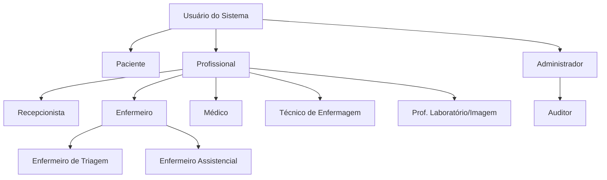

> **Decisão de modelagem.** `Paciente` e `Profissional` são *especializações de
> usuário*, não tipos de usuário separados. Isso permite um único mecanismo de
> autenticação, um único log de auditoria e — importante — trata corretamente o caso
> real em que **um profissional do hospital é atendido como paciente**. O modelo de
> dados (§5) implementa isso com a tabela `usuario` e duas tabelas de perfil
> (`paciente`, `profissional`) referenciando-a, em uma relação de herança por tabela
> de classe.

## 2.3 Matriz de permissões (RBAC)

Legenda: **C** criar · **R** ler · **U** atualizar · **D** excluir (logicamente) · **—** sem acesso

| Recurso | Recep. | Enf. Triagem | Enf. Assist. | Téc. Enf. | Médico | Lab. | Paciente | Admin |
|---|---|---|---|---|---|---|---|---|
| Cadastro de paciente | C R U | R | R | R | R U | R | R (só o seu) | C R U D |
| Reset de senha do paciente | U | — | — | — | — | — | U (a sua) | U |
| Impressão de pulseira | C | C | C | — | C | — | — | C |
| Abertura de atendimento | C | C | — | — | C | — | — | C |
| Triagem / classificação de risco | — | C R U | R | R | R U | — | R (só o seu) | R |
| Reclassificação de risco | — | C | C | — | C | — | — | R |
| Fila — visualizar todas | R | R | R | R | R | — | — | R |
| Fila — atribuir/remanejar paciente | U | U | — | — | U | — | — | U |
| Status do atendimento | R | U | U | U | U | U¹ | R (só o seu) | R |
| Prontuário — nota médica | — | — | R | — | C R | — | R (só o seu) | R |
| Prontuário — evolução de enfermagem | — | C R | C R | C R | R | — | R (só o seu) | R |
| Prontuário — retificação | — | U² | U² | — | U² | — | — | R |
| Prescrição de medicamento | — | — | R | R | C R U | — | R (só o seu) | R |
| Administração de medicamento | — | C R | C R | C R | R | — | R (só o seu) | R |
| Catálogo de medicamentos | R | R | R | R | R | — | — | C R U D |
| Solicitação de exame | — | — | R | — | C R | R | R (só o seu) | R |
| Execução / laudo de exame | — | — | R | — | R | C R U | — | R |
| Liberação de resultado | — | — | — | — | U | U | R (só o seu) | R |
| Catálogo de exames | R | R | R | R | R | R | — | C R U D |
| Trilha de auditoria | — | — | — | — | — | — | — | R |
| Gestão de usuários e perfis | — | — | — | — | — | — | — | C R U D |

¹ Restrito às transições relacionadas a exame (`AGUARDANDO_EXAME` → `EM_EXAME`).
² Retificação **não** sobrescreve: cria um novo registro que aponta para o retificado (§9.3).

**Regra transversal de acesso ao dado clínico.** Nenhum profissional acessa prontuário
de paciente ao qual não esteja vinculado por atendimento ativo ou histórico, exceto
mediante *quebra de sigilo justificada* — acesso liberado com registro obrigatório de
motivo em auditoria. Isso é o padrão "break-the-glass", exigível pela LGPD sob o
princípio da necessidade (art. 6º, III).

---

# 3. Requisitos

## 3.1 Requisitos funcionais

### Módulo 1 — Cadastro e identificação de pacientes

| ID | Requisito | Prioridade |
|---|---|---|
| RF-01 | Cadastrar paciente com nome completo, nome social, CPF, CNS, data de nascimento, sexo, nome da mãe, telefone, endereço e contato de emergência | Essencial |
| RF-02 | Calcular e exibir a idade do paciente dinamicamente a partir da data de nascimento | Essencial |
| RF-03 | Validar o dígito verificador do CPF e impedir cadastro duplicado do mesmo CPF | Essencial |
| RF-04 | Permitir cadastro de paciente **sem CPF** (não identificado / urgência), com identificação provisória e posterior vinculação | Essencial |
| RF-05 | Registrar os sintomas apresentados na entrada, em texto livre e por seleção de queixa principal codificada | Essencial |
| RF-06 | Gerar automaticamente, no ato do cadastro, um usuário de acesso do paciente com CPF como login e data de nascimento como senha inicial | Essencial |
| RF-07 | Exigir troca de senha do paciente no primeiro acesso | Essencial |
| RF-08 | Gerar, no ato do cadastro, um QR Code único e permanentemente vinculado ao paciente | Essencial |
| RF-09 | Buscar paciente por nome, CPF, CNS, data de nascimento ou código de pulseira | Essencial |
| RF-10 | Permitir unificação de cadastros duplicados, preservando o histórico de ambos | Desejável |
| RF-11 | Manter registro de alergias e condições crônicas do paciente, exibidas de forma destacada em qualquer tela do atendimento | Essencial |

### Módulo 2 — Pulseira de identificação

| ID | Requisito | Prioridade |
|---|---|---|
| RF-12 | Disponibilizar, na tela de cadastro, a ação "Imprimir Pulseira" | Essencial |
| RF-13 | Permitir a escolha da cor da pulseira conforme a prioridade/urgência do atendimento | Essencial |
| RF-14 | Imprimir a pulseira contendo nome, data de nascimento, idade, iniciais do sexo, número do atendimento, data/hora de admissão, cor de prioridade e QR Code | Essencial |
| RF-15 | Registrar cada impressão de pulseira (quem, quando, qual cor, qual motivo) | Essencial |
| RF-16 | Permitir reimpressão da pulseira mantendo o **mesmo** QR Code | Essencial |
| RF-17 | Exibir alerta visual na pulseira quando o paciente possuir alergia registrada | Desejável |

### Módulo 3 — Atendimentos e histórico

| ID | Requisito | Prioridade |
|---|---|---|
| RF-18 | Exibir, na área de Atendimentos do paciente, todos os atendimentos anteriores, separados entre finalizados e em andamento | Essencial |
| RF-19 | Criar novo atendimento a partir da área de Atendimentos do paciente | Essencial |
| RF-20 | Impedir a existência de mais de um atendimento em andamento por paciente na mesma unidade | Essencial |
| RF-21 | Gerar número de atendimento sequencial e legível (ex.: `2026-000148`) | Essencial |
| RF-22 | Exibir a linha do tempo consolidada do atendimento (todos os eventos em ordem cronológica) | Essencial |
| RF-23 | Registrar o desfecho do atendimento (alta, encaminhamento, internação, evasão, óbito) | Essencial |

### Módulo 4 — Triagem, fila e priorização

| ID | Requisito | Prioridade |
|---|---|---|
| RF-24 | Registrar triagem com sinais vitais (PA, FC, FR, SpO₂, temperatura, glicemia, dor 0–10) | Essencial |
| RF-25 | Atribuir classificação de risco em cinco níveis por cor, conforme protocolo de Manchester | Essencial |
| RF-26 | Selecionar o médico ou enfermeiro responsável ao criar o atendimento, considerando a fila de cada profissional | Essencial |
| RF-27 | Exibir, na tela de atribuição, quais profissionais estão disponíveis, quantos pacientes aguardam com cada um e a ordem da fila | Essencial |
| RF-28 | Sugerir automaticamente o profissional com menor carga ponderada | Desejável |
| RF-29 | Apresentar ao profissional um painel com a fila de pacientes atribuídos, contendo nome, cor da pulseira, horário de entrada, posição na fila e status | Essencial |
| RF-30 | Ordenar a fila por prioridade clínica e, dentro da mesma prioridade, por horário de entrada | Essencial |
| RF-31 | Permitir reclassificação de risco durante a espera, com reordenação imediata da fila | Essencial |
| RF-32 | Permitir transferência de paciente entre filas de profissionais, com registro de justificativa | Essencial |
| RF-33 | Sinalizar visualmente pacientes que excederam o tempo-alvo de espera de sua cor | Essencial |
| RF-34 | Atualizar o painel de fila sem recarga manual da página | Desejável |

### Módulo 5 — Status do atendimento

| ID | Requisito | Prioridade |
|---|---|---|
| RF-35 | Permitir ao profissional responsável alterar o status do atendimento entre: Aguardando atendimento, Em atendimento, Aguardando exame, Em exame, Aguardando medicação, Em observação, Finalizado | Essencial |
| RF-36 | Validar as transições de status conforme a máquina de estados definida, recusando transições inválidas | Essencial |
| RF-37 | Vincular cada alteração de status ao atendimento específico, registrando autor, data/hora e observação | Essencial |
| RF-38 | Propagar a alteração de status para a área de acompanhamento do paciente | Essencial |
| RF-39 | Calcular o tempo de permanência em cada status | Desejável |

### Módulo 6 — Leitura de QR Code

| ID | Requisito | Prioridade |
|---|---|---|
| RF-40 | Permitir ao profissional localizar o cadastro e o atendimento atual do paciente por leitura do QR Code da pulseira | Essencial |
| RF-41 | Exigir autenticação do profissional antes de resolver o QR Code para dados clínicos | Essencial |
| RF-42 | Registrar toda leitura de QR Code em auditoria (quem leu, quando, qual paciente) | Essencial |
| RF-43 | Direcionar o paciente que lê seu próprio QR Code para a tela de login do portal | Essencial |
| RF-44 | Exibir confirmação de identidade em duas etapas antes de ações críticas iniciadas por QR Code (administração de medicamento, coleta de exame) | Essencial |

### Módulo 7 — Prontuário eletrônico

| ID | Requisito | Prioridade |
|---|---|---|
| RF-45 | Registrar nota clínica estruturada em formato SOAP (subjetivo, objetivo, avaliação, plano) | Essencial |
| RF-46 | Registrar hipótese diagnóstica e diagnóstico definitivo com código CID-10 | Essencial |
| RF-47 | Registrar evolução do atendimento em entradas cronológicas | Essencial |
| RF-48 | Registrar observações e condutas em texto livre | Essencial |
| RF-49 | Impedir alteração e exclusão física de registro clínico já assinado | Essencial |
| RF-50 | Permitir retificação de registro por adendo, mantendo o registro original visível e marcado como retificado | Essencial |
| RF-51 | Exibir o prontuário consolidado do paciente atravessando todos os seus atendimentos | Essencial |
| RF-52 | Exportar o prontuário do atendimento em PDF | Desejável |

### Módulo 8 — Controle de medicamentos

| ID | Requisito | Prioridade |
|---|---|---|
| RF-53 | Cadastrar medicamentos no catálogo, classificando-os por via de administração, incluindo comuns (oral, tópico) e injetáveis (IV, IM, SC) | Essencial |
| RF-54 | Marcar medicamentos como de alta vigilância ("medicamentos potencialmente perigosos") | Essencial |
| RF-55 | Registrar prescrição de medicamento com dose, unidade, via, frequência, duração e observações | Essencial |
| RF-56 | Gerar o aprazamento (horários previstos) a partir da frequência prescrita | Desejável |
| RF-57 | Registrar a administração contendo medicamento, dose administrada, data, horário e profissional responsável | Essencial |
| RF-58 | Registrar administração **não realizada** com o motivo (recusa do paciente, indisponibilidade, jejum, suspensão médica) | Essencial |
| RF-59 | Bloquear administração quando o medicamento constar na lista de alergias do paciente, exigindo confirmação explícita com justificativa | Essencial |
| RF-60 | Exibir a aprazamento do turno como checklist de tarefas ao enfermeiro | Desejável |
| RF-61 | Impedir registro de administração de dose já administrada (dupla checagem) | Essencial |

### Módulo 9 — Clínica e exames

| ID | Requisito | Prioridade |
|---|---|---|
| RF-62 | Cadastrar catálogo de exames por tipo (laboratorial, imagem, gráfico) com preparo necessário | Essencial |
| RF-63 | Registrar solicitação de exame vinculada ao atendimento, com indicação clínica e caráter (rotina, urgente) | Essencial |
| RF-64 | Registrar coleta/execução do exame com data, hora e profissional | Essencial |
| RF-65 | Registrar resultado com valores, unidade, faixa de referência e laudo textual | Essencial |
| RF-66 | Anexar arquivos ao resultado (PDF, imagem) | Desejável |
| RF-67 | Controlar a liberação do resultado, distinguindo "resultado inserido" de "resultado liberado ao paciente" | Essencial |
| RF-68 | Sinalizar resultado com valor crítico ao médico solicitante | Desejável |
| RF-69 | Manter todo o histórico de exames vinculado ao atendimento e ao paciente | Essencial |

### Módulo 10 — Portal do paciente

| ID | Requisito | Prioridade |
|---|---|---|
| RF-70 | Autenticar o paciente com CPF e senha | Essencial |
| RF-71 | Restringir o portal a operações de leitura; nenhuma criação, edição ou exclusão | Essencial |
| RF-72 | Exibir a situação atual do atendimento e a posição na fila | Essencial |
| RF-73 | Exibir a evolução registrada do atendimento em linguagem acessível | Essencial |
| RF-74 | Exibir os medicamentos administrados, com data, hora e dose | Essencial |
| RF-75 | Exibir os exames solicitados, os realizados e os resultados **liberados** | Essencial |
| RF-76 | Exibir o histórico de atendimentos anteriores do paciente | Essencial |
| RF-77 | Não exibir ao paciente registro clínico marcado como sigiloso pelo médico | Essencial |

### Módulo 11 — Administração e auditoria

| ID | Requisito | Prioridade |
|---|---|---|
| RF-78 | Gerenciar usuários profissionais, com registro de conselho de classe (CRM, COREN) e especialidade | Essencial |
| RF-79 | Controlar disponibilidade do profissional (em plantão, ausente, indisponível) | Essencial |
| RF-80 | Registrar em trilha de auditoria imutável toda operação de leitura e escrita sobre dado clínico | Essencial |
| RF-81 | Registrar acesso "quebra de sigilo" com justificativa obrigatória | Essencial |
| RF-82 | Emitir indicadores operacionais: tempo médio de espera por cor, tempo porta-atendimento, atendimentos por profissional | Desejável |

## 3.2 Requisitos não funcionais

| ID | Categoria | Requisito | Métrica de aceitação |
|---|---|---|---|
| RNF-01 | Desempenho | Resolução do QR Code para a tela do paciente | ≤ 1,5 s no percentil 95 |
| RNF-02 | Desempenho | Carga do painel de fila com 200 pacientes ativos | ≤ 2 s no percentil 95 |
| RNF-03 | Desempenho | Atualização do painel de fila | ≤ 10 s de defasagem |
| RNF-04 | Disponibilidade | Sistema disponível 24×7 | ≥ 99,5 % mensal |
| RNF-05 | Confiabilidade | Nenhuma perda de registro clínico confirmado ao usuário | Toda escrita clínica em transação |
| RNF-06 | Segurança | Tráfego sempre cifrado | TLS 1.3 obrigatório; HSTS ativo |
| RNF-07 | Segurança | Senhas nunca armazenadas em texto claro | Hash Argon2id |
| RNF-08 | Segurança | Proteção contra força bruta no portal do paciente | Bloqueio progressivo; ver §12.3 |
| RNF-09 | Segurança | Sessão do paciente expira por inatividade | 15 min |
| RNF-10 | Segurança | Sessão do profissional expira por inatividade | 30 min |
| RNF-11 | Auditabilidade | Trilha de auditoria não removível pela aplicação | Sem `UPDATE`/`DELETE` concedidos na tabela |
| RNF-12 | Privacidade | Dados de saúde tratados como dado pessoal sensível | LGPD art. 5º, II e art. 11 |
| RNF-13 | Retenção | Prontuário retido pelo prazo legal | ≥ 20 anos do último registro (Lei 13.787/2018, art. 6º) |
| RNF-14 | Usabilidade | Ação crítica alcançável em poucos passos | ≤ 3 cliques da tela do atendimento |
| RNF-15 | Usabilidade | Interface legível em condição de urgência | Contraste AA (WCAG 2.2); cor **nunca** como único indicador |
| RNF-16 | Acessibilidade | Navegação por teclado em todo o fluxo assistencial | Sem dependência de mouse |
| RNF-17 | Compatibilidade | Navegadores suportados | Chrome, Edge e Firefox nas duas últimas versões |
| RNF-18 | Portabilidade | Operação em desktop e tablet | Layout responsivo ≥ 768 px |
| RNF-19 | Manutenibilidade | Cobertura de testes automatizados na camada de domínio | ≥ 80 % de linhas |
| RNF-20 | Rastreabilidade | Todo registro clínico identifica autor, data/hora e origem | Campos obrigatórios não nulos |
| RNF-21 | Integridade | Data/hora dos eventos clínicos gerada pelo servidor | Nunca pelo cliente |
| RNF-22 | Contingência | Fluxo degradado em caso de indisponibilidade | Pulseira impressa continua identificando o paciente offline |

> **RNF-15 merece destaque.** O sistema usa cor como linguagem central (a pulseira).
> Cerca de 8 % dos homens têm alguma forma de discromatopsia. Toda cor de prioridade
> deve vir acompanhada de **rótulo textual e ícone** — na tela e na pulseira impressa.
> Um enfermeiro daltônico não pode depender de distinguir laranja de vermelho.

## 3.3 Regras de negócio

| ID | Regra |
|---|---|
| RN-01 | O CPF, quando informado, é único no sistema |
| RN-02 | A idade **não é armazenada**; é derivada da data de nascimento no momento da consulta |
| RN-03 | O QR Code do paciente é gerado uma única vez e nunca é alterado nem reaproveitado |
| RN-04 | O usuário de acesso do paciente é criado na mesma transação do cadastro do paciente |
| RN-05 | A senha inicial do paciente é a data de nascimento no formato `DDMMAAAA`, armazenada apenas como hash |
| RN-06 | Enquanto o paciente não trocar a senha inicial, o portal permite exclusivamente a tela de troca de senha |
| RN-07 | Um paciente pode ter no máximo um atendimento com status diferente de `FINALIZADO` por unidade |
| RN-08 | Todo atendimento nasce no status `AGUARDANDO_TRIAGEM` |
| RN-09 | A cor da pulseira reflete a classificação de risco vigente do atendimento; ao reclassificar, exige-se reimpressão |
| RN-10 | A ordenação da fila é: (1) nível de prioridade, (2) horário de entrada na fila. Nunca por ordem de chegada isolada |
| RN-11 | Paciente classificado como Vermelho não entra em fila: é encaminhado imediatamente e o atendimento vai a `EM_ATENDIMENTO` |
| RN-12 | Somente o profissional responsável pelo atendimento, ou um supervisor, altera o status do atendimento |
| RN-13 | Transições de status obedecem estritamente à máquina de estados da §6; qualquer outra é recusada |
| RN-14 | `FINALIZADO` é estado terminal: exige desfecho registrado e não admite transição de saída |
| RN-15 | Toda transição de status gera registro em `atendimento_status_historico`, jamais sobrescrevendo o anterior |
| RN-16 | Registro clínico assinado é imutável; correção se dá por adendo referenciando o original |
| RN-17 | Exclusão de dado clínico é sempre lógica (`deleted_at`), nunca física |
| RN-18 | Prescrição só é criada por profissional com perfil médico ativo e conselho válido |
| RN-19 | Administração de medicamento exige prescrição vigente e não suspensa |
| RN-20 | A mesma dose aprazada não pode ser administrada duas vezes |
| RN-21 | Administração de medicamento presente na lista de alergias do paciente é bloqueada, liberável só com justificativa registrada |
| RN-22 | Medicamento de alta vigilância exige dupla checagem: dois profissionais identificados no registro |
| RN-23 | A dose administrada é registrada como valor efetivo, podendo divergir da prescrita — a divergência é sinalizada, não impedida |
| RN-24 | Resultado de exame só é visível ao paciente após liberação explícita |
| RN-25 | Resultado com valor crítico gera notificação ao médico solicitante e não pode ser liberado ao paciente antes da ciência médica |
| RN-26 | O paciente acessa exclusivamente dados de atendimentos nos quais ele é o titular |
| RN-27 | O paciente nunca executa operação de escrita, exceto a troca da própria senha |
| RN-28 | Acesso de profissional a paciente sem vínculo assistencial exige justificativa e é registrado como quebra de sigilo |
| RN-29 | Data e hora de todo evento clínico são atribuídas pelo servidor em UTC e apresentadas no fuso da unidade |
| RN-30 | Cadastro sem CPF recebe identificação provisória; a vinculação posterior ao CPF real preserva todo o histórico |

## 3.4 Matriz de rastreabilidade (extrato)

| RF | Caso de uso | Entidades envolvidas |
|---|---|---|
| RF-01, RF-06, RF-08 | UC-01 Cadastrar paciente | `usuario`, `paciente`, `paciente_credencial` |
| RF-12 – RF-16 | UC-02 Imprimir pulseira | `paciente`, `atendimento`, `pulseira_impressao` |
| RF-19 – RF-21 | UC-03 Abrir atendimento | `atendimento`, `unidade` |
| RF-24, RF-25 | UC-04 Realizar triagem | `triagem`, `classificacao_risco`, `atendimento` |
| RF-26 – RF-30 | UC-05 Atribuir à fila | `fila_item`, `profissional`, `profissional_disponibilidade` |
| RF-35 – RF-38 | UC-06 Alterar status | `atendimento`, `atendimento_status_historico` |
| RF-40 – RF-44 | UC-07 Ler QR Code | `paciente`, `atendimento`, `auditoria_log` |
| RF-45 – RF-51 | UC-08 Registrar prontuário | `registro_clinico`, `diagnostico` |
| RF-55 – RF-61 | UC-09 Prescrever e administrar | `prescricao`, `prescricao_item`, `aprazamento`, `administracao_medicamento` |
| RF-63 – RF-68 | UC-10 Ciclo do exame | `exame_solicitacao`, `exame_resultado`, `exame_resultado_item` |
| RF-70 – RF-77 | UC-11 Acompanhar atendimento (paciente) | todas, em modo leitura filtrado |

---

# 4. Modelagem de casos de uso

## 4.1 Diagrama de casos de uso

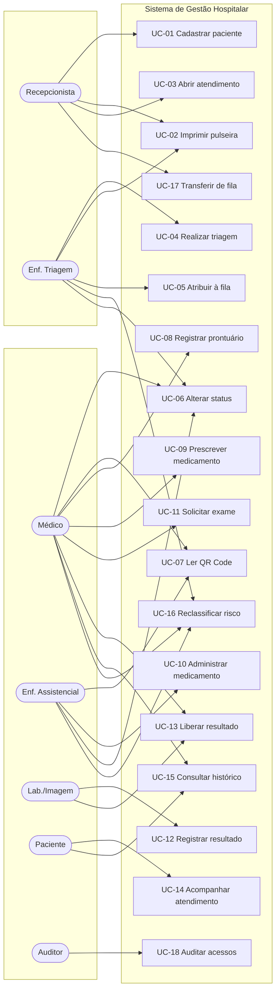

**Relacionamentos entre casos de uso**

| Origem | Tipo | Destino | Observação |
|---|---|---|---|
| UC-01 Cadastrar paciente | «include» | Gerar credencial de acesso | Sempre executado (RN-04) |
| UC-01 Cadastrar paciente | «include» | Gerar QR Code | Sempre executado (RN-03) |
| UC-03 Abrir atendimento | «extend» | UC-02 Imprimir pulseira | Opcional, mas recomendado no fluxo |
| UC-04 Realizar triagem | «include» | UC-05 Atribuir à fila | Exceto para classificação Vermelho (RN-11) |
| UC-05 Atribuir à fila | «include» | UC-06 Alterar status | Transição para `AGUARDANDO_ATENDIMENTO` |
| UC-07 Ler QR Code | «extend» | UC-08, UC-10, UC-12 | O QR Code é atalho de entrada para essas ações |
| UC-10 Administrar medicamento | «include» | Verificar alergia | Sempre executado (RN-21) |
| UC-16 Reclassificar risco | «include» | Reordenar fila | Consequência obrigatória (RF-31) |

## 4.2 Casos de uso expandidos

### UC-01 — Cadastrar paciente

| Campo | Conteúdo |
|---|---|
| **Ator principal** | Recepcionista |
| **Objetivo** | Registrar um paciente no sistema, criando sua credencial de acesso e seu identificador permanente |
| **Pré-condições** | Recepcionista autenticada com permissão de cadastro |
| **Pós-condições** | Paciente cadastrado; usuário de acesso criado; QR Code gerado; auditoria registrada |
| **Frequência** | Alta (cada novo paciente da unidade) |

**Fluxo principal**

1. A recepcionista aciona "Novo Paciente".
2. O sistema exibe o formulário de cadastro.
3. A recepcionista informa o CPF.
4. O sistema valida o dígito verificador e verifica a existência de cadastro prévio.
5. O sistema informa que o CPF é inédito e libera o restante do formulário.
6. A recepcionista informa nome completo, data de nascimento, sexo, nome da mãe, telefone, endereço e contato de emergência.
7. O sistema calcula e exibe a idade a partir da data de nascimento.
8. A recepcionista registra as alergias conhecidas e os sintomas apresentados na entrada.
9. A recepcionista confirma o cadastro.
10. O sistema, **em uma única transação**:
    a. persiste o registro do paciente;
    b. cria o usuário de acesso com login = CPF e senha inicial = data de nascimento (`DDMMAAAA`), marcada como `senha_provisoria = true`;
    c. gera o token de pulseira e o QR Code permanente;
    d. registra a operação na trilha de auditoria.
11. O sistema exibe a ficha do paciente com as ações "Imprimir Pulseira" e "Novo Atendimento".

**Fluxos alternativos**

| ID | Condição | Tratamento |
|---|---|---|
| A1 | CPF já cadastrado | O sistema exibe o cadastro existente e oferece "Abrir novo atendimento" em vez de duplicar. Se os dados divergirem, oferece atualização cadastral |
| A2 | Paciente sem CPF ou inconsciente | A recepcionista marca "Paciente não identificado". O sistema gera identificação provisória (`NI-2026-0031`), usa-a como login e exige data de nascimento estimada. O cadastro é marcado como pendente de regularização |
| A3 | Menor de idade | O sistema exige dados do responsável legal. A credencial de acesso é emitida no CPF do responsável |
| A4 | CPF com dígito verificador inválido | O sistema recusa e destaca o campo, sem permitir avanço |
| A5 | Data de nascimento no futuro ou idade > 130 anos | O sistema recusa por validação de domínio |

**Exceções**

| ID | Condição | Tratamento |
|---|---|---|
| E1 | Falha ao gerar o token de pulseira | Rollback integral da transação; nenhum paciente é criado parcialmente |
| E2 | Colisão de token (probabilisticamente desprezível) | Nova tentativa de geração, até 3 vezes; após isso, erro registrado |

---

### UC-05 — Atribuir paciente à fila de um profissional

| Campo | Conteúdo |
|---|---|
| **Ator principal** | Enfermeiro de triagem (ou recepcionista) |
| **Objetivo** | Colocar o atendimento na fila de um profissional, considerando a carga de cada um |
| **Pré-condições** | Atendimento existente com triagem concluída |
| **Pós-condições** | Item de fila criado; status = `AGUARDANDO_ATENDIMENTO`; painel do profissional atualizado |

**Fluxo principal**

1. Concluída a triagem, o sistema apresenta a tela de atribuição.
2. O sistema lista os profissionais **em plantão**, exibindo para cada um:
   - nome, categoria (médico/enfermeiro) e especialidade;
   - situação de disponibilidade (disponível / em atendimento / ausente);
   - quantidade de pacientes aguardando;
   - composição da fila por cor de prioridade (ex.: `1 laranja, 3 amarelos, 2 verdes`);
   - carga ponderada (§7.4) e tempo estimado de espera;
   - o paciente atualmente em atendimento, se houver.
3. O sistema destaca a sugestão automática: profissional de menor carga ponderada compatível com a especialidade requerida.
4. O ator seleciona o profissional.
5. O sistema calcula a posição de inserção conforme a ordenação por prioridade (RN-10).
6. O sistema exibe a posição resultante e, se houver *preterição* de pacientes já na fila, informa quantos serão ultrapassados.
7. O ator confirma.
8. O sistema cria o item de fila, altera o status para `AGUARDANDO_ATENDIMENTO`, registra a transição e emite o evento de atualização de painel.

**Fluxos alternativos**

| ID | Condição | Tratamento |
|---|---|---|
| A1 | Classificação Vermelho | Não há tela de atribuição. O sistema aciona o fluxo de emergência: notifica todos os médicos em plantão, cria o item de fila em posição 1 e move o atendimento direto para `EM_ATENDIMENTO` (RN-11) |
| A2 | Nenhum profissional em plantão | O sistema cria o item em uma "fila de espera geral", sem profissional atribuído, e alerta a coordenação |
| A3 | Especialidade requerida indisponível | O sistema permite atribuição a um clínico geral, com registro do desvio |
| A4 | Profissional selecionado com carga muito superior à média | O sistema exibe alerta de desbalanceamento e pede confirmação |

---

### UC-07 — Localizar paciente por leitura de QR Code

| Campo | Conteúdo |
|---|---|
| **Atores** | Médico, enfermeiro, técnico, profissional de laboratório |
| **Objetivo** | Alcançar o cadastro e o atendimento ativo do paciente sem digitação, reduzindo erro de identificação |
| **Pré-condições** | Profissional autenticado; pulseira legível |
| **Pós-condições** | Contexto do paciente carregado; leitura registrada em auditoria |

**Fluxo principal**

1. O profissional aciona o leitor de QR Code (câmera do dispositivo ou leitor dedicado).
2. O sistema captura o token da pulseira.
3. O sistema valida a assinatura HMAC do token (§8.2) e resolve o paciente.
4. O sistema verifica se o profissional autenticado tem vínculo assistencial com o paciente.
5. O sistema carrega a tela de contexto do atendimento ativo, exibindo em destaque: nome, idade, cor de prioridade, **alergias**, status atual e pendências (medicação aprazada, exame a coletar).
6. O sistema registra a leitura na trilha de auditoria (RF-42).

**Fluxos alternativos**

| ID | Condição | Tratamento |
|---|---|---|
| A1 | Paciente sem atendimento ativo | O sistema exibe o cadastro e o histórico, com a ação "Abrir novo atendimento" |
| A2 | Profissional sem vínculo assistencial | O sistema exibe apenas nome e alergias (mínimo necessário para segurança imediata) e solicita justificativa para acesso completo — quebra de sigilo (RN-28) |
| A3 | Token inválido, expirado ou adulterado | O sistema recusa a leitura, exibe "Pulseira não reconhecida" e registra a tentativa |
| A4 | Leitura feita por usuário não autenticado | O sistema não resolve dado clínico algum: redireciona para o login do portal do paciente (RF-43) |
| A5 | Duas pulseiras lidas em sequência rápida na mesma ação crítica | O sistema alerta risco de troca de paciente e exige reinício da confirmação |

---

### UC-10 — Administrar medicamento

| Campo | Conteúdo |
|---|---|
| **Atores** | Enfermeiro assistencial, técnico de enfermagem |
| **Objetivo** | Registrar a administração efetiva de uma dose prescrita, com rastreabilidade completa |
| **Pré-condições** | Prescrição vigente, não suspensa, com dose aprazada pendente |
| **Pós-condições** | Administração registrada; dose marcada como executada; visível ao paciente e ao médico |

**Fluxo principal**

1. O enfermeiro lê o QR Code da pulseira do paciente.
2. O sistema exibe as doses aprazadas pendentes para o horário corrente.
3. O enfermeiro seleciona a dose a administrar.
4. O sistema apresenta a tela de conferência com os *nove certos*: paciente certo, medicamento certo, dose certa, via certa, horário certo, validade, orientação, forma e registro (§10.3).
5. O sistema verifica a lista de alergias do paciente contra o princípio ativo.
6. Se o medicamento for de alta vigilância, o sistema exige a identificação de um segundo profissional para dupla checagem (RN-22).
7. O enfermeiro confirma dose efetivamente administrada, via e horário real.
8. O sistema persiste o registro com autor, data/hora de servidor e vínculo à dose aprazada.
9. O sistema marca a dose como `ADMINISTRADA` e atualiza o portal do paciente.

**Fluxos alternativos**

| ID | Condição | Tratamento |
|---|---|---|
| A1 | Alergia detectada | O sistema **bloqueia** e exibe alerta em vermelho. A liberação exige justificativa textual obrigatória, que é registrada e notificada ao médico prescritor (RN-21) |
| A2 | Paciente recusa a medicação | O enfermeiro registra `NAO_ADMINISTRADA` com motivo `RECUSA_PACIENTE`; a dose não é reagendada automaticamente e o médico é notificado |
| A3 | Medicamento indisponível | Registro `NAO_ADMINISTRADA` com motivo `INDISPONIVEL`; notificação à farmácia |
| A4 | Dose já administrada | O sistema recusa o registro duplicado (RN-20) e exibe quem administrou e quando |
| A5 | Dose divergente da prescrita | O sistema aceita, sinaliza a divergência em amarelo e exige observação (RN-23) |
| A6 | Administração fora da janela de horário | O sistema aceita e registra o atraso, alimentando o indicador de pontualidade |

---

### UC-11 — Acompanhar atendimento (portal do paciente)

| Campo | Conteúdo |
|---|---|
| **Ator principal** | Paciente |
| **Objetivo** | Consultar a própria situação assistencial sem interpelar a equipe |
| **Pré-condições** | Paciente com credencial ativa |
| **Pós-condições** | Nenhuma alteração de estado no sistema (acesso somente leitura); consulta registrada em auditoria |

**Fluxo principal**

1. O paciente lê o QR Code da pulseira com o celular.
2. O sistema abre a tela de login do portal.
3. O paciente informa CPF e senha.
4. Sendo o primeiro acesso, o sistema **força a troca de senha** antes de qualquer outra tela (RN-06).
5. O sistema apresenta o painel de acompanhamento:
   - situação atual do atendimento, em linguagem acessível ("Você está aguardando a coleta de exame");
   - posição na fila e tempo estimado, quando aplicável;
   - linha do tempo do atendimento;
   - evolução registrada;
   - medicamentos administrados, com data, hora e dose;
   - exames solicitados, realizados e resultados **liberados**;
   - histórico de atendimentos anteriores.
6. O paciente navega entre as seções. Todas as telas são de leitura.

**Fluxos alternativos**

| ID | Condição | Tratamento |
|---|---|---|
| A1 | Senha incorreta | Mensagem genérica ("credenciais inválidas"), sem revelar se o CPF existe. Contador de tentativas incrementado (§12.3) |
| A2 | Muitas tentativas falhas | Bloqueio temporário progressivo, com orientação para procurar a recepção |
| A3 | Resultado inserido mas não liberado | Exibe "Exame realizado — resultado em análise médica", sem o conteúdo (RN-24) |
| A4 | Registro marcado como sigiloso | O item é omitido, sem indicar sua existência (RF-77) |
| A5 | Paciente sem atendimento ativo | Exibe apenas o histórico |
| A6 | Cadastro provisório sem CPF | Login com a identificação provisória impressa na pulseira |

## 4.3 Diagrama de sequência — leitura de QR Code por profissional

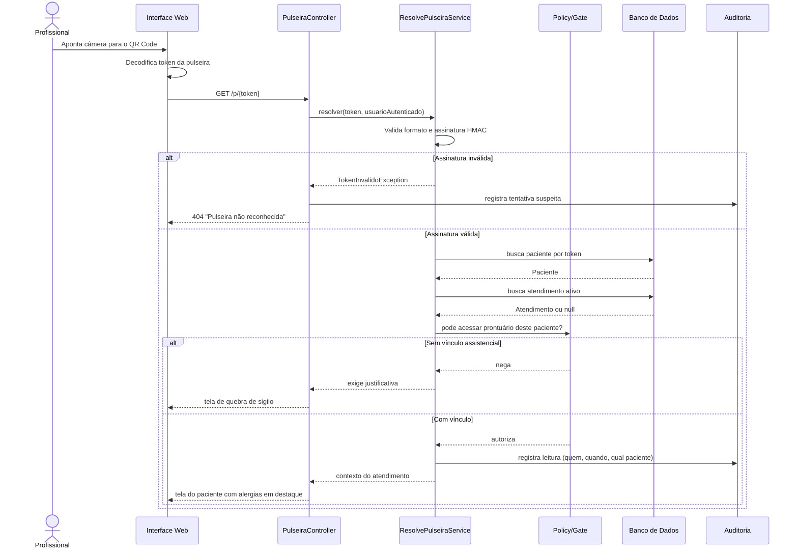

## 4.4 Diagrama de atividades — jornada do paciente

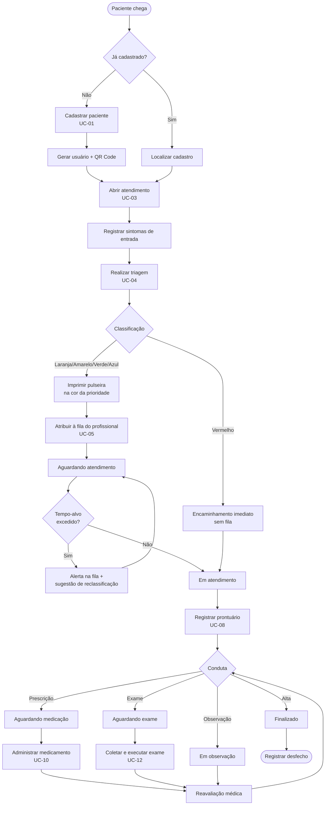

---

# 5. Modelo de dados

## 5.1 Decisões de modelagem

Antes do diagrama, as escolhas que estruturam o modelo. Em um TCC, **justificar a
decisão vale mais que o diagrama em si** — é o que demonstra domínio do assunto.

### D-01 — A idade não é armazenada

O enunciado do sistema pede "nome, CPF, data de nascimento, **idade** e demais dados".
Armazenar a idade viola a Segunda Forma Normal por dependência funcional derivada: a
idade é função da data de nascimento e da data atual. Armazená-la produz um dado que
**começa correto e apodrece silenciosamente** — no dia seguinte ao aniversário, o
prontuário mente.

A idade é, portanto, um **atributo derivado**, calculado na camada de aplicação:

```php
// app/Models/Paciente.php
protected function idade(): Attribute
{
    return Attribute::get(
        fn () => $this->data_nascimento?->diffInYears(now())
    );
}
```

Para pacientes neonatos e lactentes, a idade em anos é clinicamente inútil. O sistema
apresenta a idade em granularidade adaptativa — dias até 30 dias, meses até 24 meses,
anos a partir daí — o que é a prática assistencial corrente.

> Em MySQL, uma coluna gerada (`GENERATED ALWAYS AS`) não pode ser usada aqui, porque
> `CURDATE()` é não determinística e o motor recusa funções não determinísticas em
> colunas geradas. Isso reforça a decisão de computar na aplicação.

### D-02 — Herança por tabela de classe para usuários

`paciente` e `profissional` não são tabelas independentes com login próprio: ambas
referenciam `usuario`, que concentra credencial, sessão e auditoria.

| Alternativa | Avaliação |
|---|---|
| Tabela única com coluna `tipo` | Muitas colunas nulas; regras de obrigatoriedade impossíveis de expressar no schema |
| Tabelas totalmente separadas com login em cada | Dois mecanismos de auth, dois logs, e o funcionário atendido como paciente vira dois usuários |
| **Herança por tabela de classe** (escolhida) | Um `usuario` por pessoa; `paciente` e `profissional` como especializações com FK-PK compartilhada |

O ganho concreto: quando a enfermeira Ana é atendida na própria unidade, ela tem **um**
usuário, dois papéis, e a auditoria mostra corretamente "Ana acessou o prontuário de
Ana" — nada de sigilo violado.

### D-03 — Classificação de risco como tabela de domínio, status como ENUM

A classificação de risco (cor da pulseira) **tem atributos próprios**: nome, cor
hexadecimal, tempo-alvo de espera, peso de ordenação. Isso pede tabela. Um hospital
que adote outro protocolo altera dados, não código.

O status do atendimento é uma **máquina de estados fechada**, referenciada em
condicionais por todo o sistema. Aqui um `ENUM` é preferível: erros de digitação
falham na escrita, e não há atributos pendurados no estado.

### D-04 — Prescrição, aprazamento e administração são três coisas distintas

Este é o erro de modelagem mais comum em sistemas hospitalares acadêmicos: uma única
tabela `medicamento_paciente` misturando ordem médica e execução de enfermagem.

| Conceito | Quem cria | O que representa |
|---|---|---|
| `prescricao_item` | Médico | A **ordem**: "Dipirona 1 g, IV, de 6 em 6 h, por 2 dias" |
| `aprazamento` | Sistema | A **agenda**: 8 doses previstas às 06h, 12h, 18h, 00h… |
| `administracao_medicamento` | Enfermagem | O **fato**: "dose das 12h aplicada às 12h37 por João, COREN 123456" |

Separá-los é o que permite responder às perguntas que importam: *quantas doses foram
prescritas e não aplicadas? qual a pontualidade da equipe? o paciente recusou
medicação?* Uma tabela única não responde a nenhuma delas.

### D-05 — Prontuário append-only

`registro_clinico` **não admite `UPDATE` nem `DELETE`**. A correção de um registro cria
um novo registro do tipo `ADENDO`, com `registro_retificado_id` apontando para o
original, que permanece visível e marcado. Detalhamento na §9.

### D-06 — Sinais vitais em tabela própria

Sinais vitais são aferidos na triagem **e repetidamente** durante o atendimento (em
observação, pós-medicação). Guardá-los dentro de `triagem` impediria a série temporal.
A tabela `sinal_vital` pertence ao atendimento; `triagem` referencia a aferição inicial.

### D-07 — Unicidade do atendimento ativo via coluna gerada

RN-07 exige no máximo um atendimento não finalizado por paciente por unidade. MySQL não
tem índice único parcial. A solução é uma coluna gerada determinística que assume o
`paciente_id` quando o atendimento está aberto e `NULL` quando encerrado — e um índice
único sobre ela. Como o MySQL permite múltiplos `NULL` em índice único, atendimentos
finalizados não colidem. **A regra passa a ser garantida pelo banco, não pela
aplicação** — o que sobrevive a condições de corrida entre duas recepcionistas.

### D-08 — Exclusão sempre lógica

Nenhuma entidade clínica é removida fisicamente. Todas possuem `deleted_at`
(`SoftDeletes`). Fisicamente removível: apenas dados de configuração sem histórico.

### D-09 — Token de pulseira separado do ID

O QR Code **não codifica o `id` numérico do paciente**. Codifica um token opaco
armazenado em `paciente.token_pulseira`. A justificativa completa está na §8.2.

## 5.2 Diagrama entidade-relacionamento

O DER é apresentado em três recortes, por legibilidade.

### 5.2.1 Recorte 1 — Identidade, acesso e cadastro

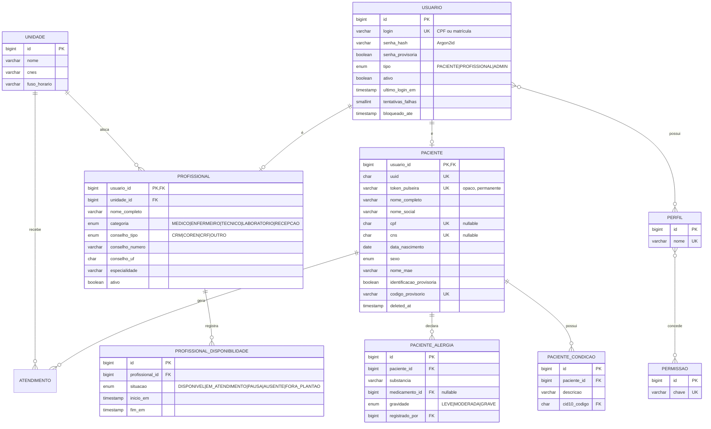

### 5.2.2 Recorte 2 — Atendimento, triagem e fila

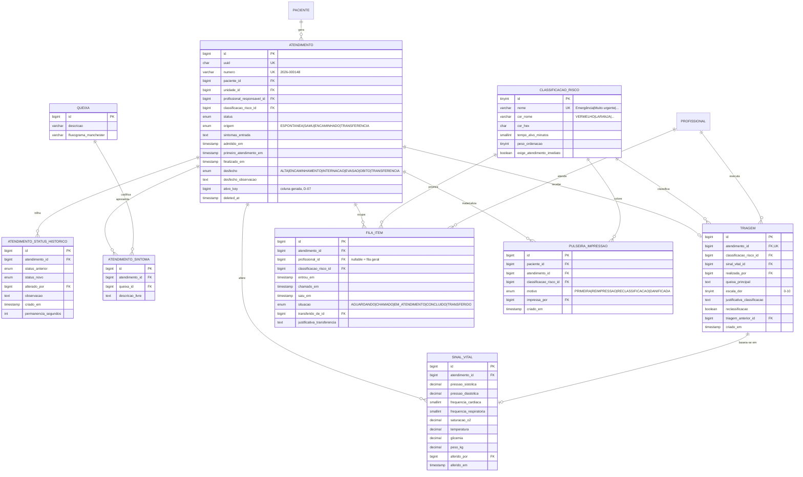

### 5.2.3 Recorte 3 — Prontuário, medicamentos e exames

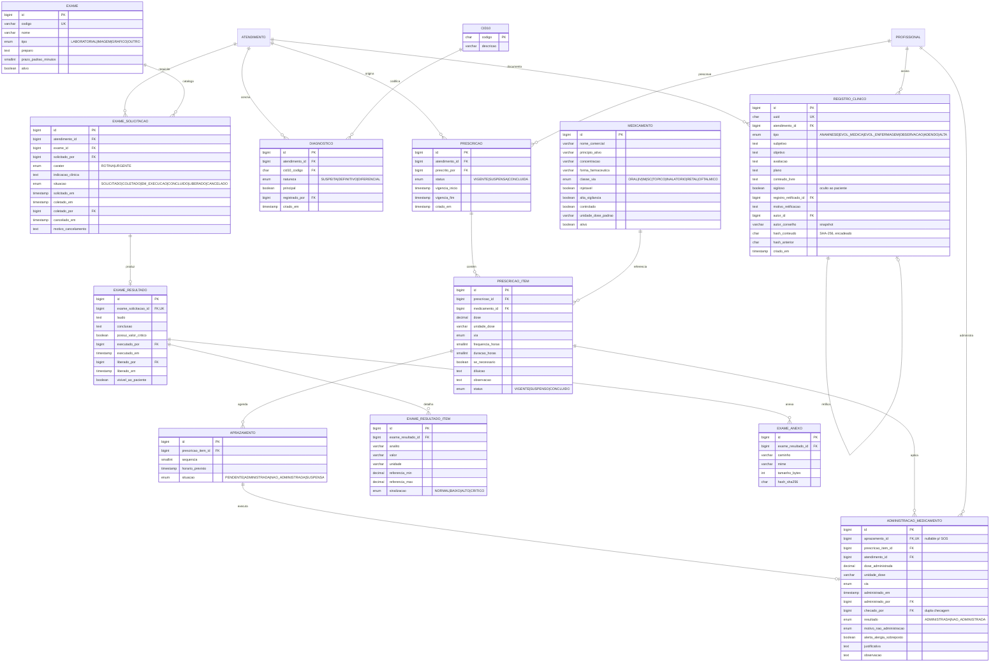

> **Três tabelas do esquema não aparecem nos diagramas acima, por escolha de
> representação:** `usuario_perfil` e `perfil_permissao` são tabelas associativas de
> relacionamento *N:N*, já expressas nos diagramas pela notação `}o--o{` entre `USUARIO`,
> `PERFIL` e `PERMISSAO`; e `auditoria_log` é deliberadamente **desacoplada** — ela
> referencia `usuario_id`, `paciente_id` e `atendimento_id` como colunas simples, **sem
> chave estrangeira**. Essa é uma decisão consciente: um log de auditoria com FK para
> `paciente` impediria qualquer operação de manutenção sobre o cadastro e, pior, criaria
> um caminho pelo qual o `ON DELETE` de outra tabela poderia propagar exclusão para a
> trilha. A auditoria precisa sobreviver a tudo o que ela audita.

## 5.3 Dicionário de dados (tabelas centrais)

### `paciente`

| Coluna | Tipo | Nulo | Descrição / Restrição |
|---|---|---|---|
| `usuario_id` | BIGINT UNSIGNED | N | PK e FK para `usuario.id`. Herança por tabela de classe (D-02) |
| `uuid` | CHAR(36) | N | Identificador externo estável; usado em URLs internas |
| `token_pulseira` | VARCHAR(64) | N | Token opaco impresso no QR Code. **Único e imutável** (RN-03) |
| `nome_completo` | VARCHAR(150) | N | Nome civil |
| `nome_social` | VARCHAR(150) | S | Nome social; quando presente, é o nome exibido |
| `cpf` | CHAR(11) | S | Somente dígitos. Único quando não nulo. Nulo permite RF-04 |
| `cns` | CHAR(15) | S | Cartão Nacional de Saúde |
| `data_nascimento` | DATE | N | Base para idade (D-01) e para a senha inicial (RN-05) |
| `sexo` | ENUM | N | `FEMININO`, `MASCULINO`, `OUTRO`, `NAO_INFORMADO` |
| `nome_mae` | VARCHAR(150) | S | Critério auxiliar de desambiguação de homônimos |
| `telefone` | VARCHAR(20) | S | Contato principal |
| `contato_emergencia_nome` | VARCHAR(150) | S | — |
| `contato_emergencia_telefone` | VARCHAR(20) | S | — |
| `logradouro`…`uf`, `cep` | VARCHAR | S | Endereço desnormalizado no cadastro |
| `identificacao_provisoria` | BOOLEAN | N | `true` para paciente não identificado (RF-04) |
| `codigo_provisorio` | VARCHAR(20) | S | Ex.: `NI-2026-0031`. Serve como login provisório |
| `observacoes` | TEXT | S | Notas administrativas, não clínicas |
| `created_at` / `updated_at` | TIMESTAMP | N | — |
| `deleted_at` | TIMESTAMP | S | Exclusão lógica (D-08) |

### `atendimento`

| Coluna | Tipo | Nulo | Descrição / Restrição |
|---|---|---|---|
| `id` | BIGINT UNSIGNED | N | PK |
| `uuid` | CHAR(36) | N | Identificador externo |
| `numero` | VARCHAR(20) | N | Número legível, sequencial por ano e unidade (RF-21) |
| `paciente_id` | BIGINT UNSIGNED | N | FK `paciente.usuario_id` |
| `unidade_id` | BIGINT UNSIGNED | N | FK `unidade.id` |
| `profissional_responsavel_id` | BIGINT UNSIGNED | S | FK `profissional.usuario_id`. Nulo até a atribuição |
| `classificacao_risco_id` | TINYINT UNSIGNED | S | Classificação **vigente**. Nulo antes da triagem |
| `status` | ENUM | N | Máquina de estados da §6 |
| `origem` | ENUM | N | `ESPONTANEA`, `SAMU`, `ENCAMINHADO`, `TRANSFERENCIA` |
| `sintomas_entrada` | TEXT | S | Relato de entrada, texto livre (RF-05) |
| `admitido_em` | DATETIME | N | Marco para o indicador porta-atendimento |
| `primeiro_atendimento_em` | DATETIME | S | Preenchido na primeira transição para `EM_ATENDIMENTO` |
| `finalizado_em` | DATETIME | S | Preenchido na transição para `FINALIZADO` |
| `desfecho` | ENUM | S | Obrigatório quando `status = FINALIZADO` (RN-14) |
| `desfecho_observacao` | TEXT | S | — |
| `ativo_key` | BIGINT UNSIGNED | S | **Coluna gerada** para o índice único de atendimento ativo (D-07) |

### `administracao_medicamento`

| Coluna | Tipo | Nulo | Descrição / Restrição |
|---|---|---|---|
| `id` | BIGINT UNSIGNED | N | PK |
| `aprazamento_id` | BIGINT UNSIGNED | S | FK única. Nulo para medicação "se necessário" (SOS). Garante RN-20 |
| `prescricao_item_id` | BIGINT UNSIGNED | N | FK — a ordem que autoriza esta administração |
| `atendimento_id` | BIGINT UNSIGNED | N | Redundância controlada, para consulta direta e índice |
| `dose_administrada` | DECIMAL(10,3) | S | Valor efetivo; pode divergir do prescrito (RN-23) |
| `unidade_dose` | VARCHAR(20) | S | `mg`, `mL`, `UI`, `g`, `gotas` |
| `via` | ENUM | S | Via efetivamente utilizada |
| `administrado_em` | DATETIME | N | **Horário real**, atribuído pelo servidor (RN-29) |
| `administrado_por` | BIGINT UNSIGNED | N | FK `profissional.usuario_id` |
| `checado_por` | BIGINT UNSIGNED | S | Segundo profissional; obrigatório em alta vigilância (RN-22) |
| `resultado` | ENUM | N | `ADMINISTRADA` ou `NAO_ADMINISTRADA` |
| `motivo_nao_administracao` | ENUM | S | `RECUSA_PACIENTE`, `INDISPONIVEL`, `JEJUM`, `SUSPENSA_MEDICO`, `INTERCORRENCIA`, `OUTRO` |
| `alerta_alergia_sobreposto` | BOOLEAN | N | `true` quando o bloqueio por alergia foi liberado com justificativa |
| `justificativa` | TEXT | S | Obrigatório quando `alerta_alergia_sobreposto = true` |
| `observacao` | TEXT | S | — |

### `auditoria_log`

| Coluna | Tipo | Nulo | Descrição / Restrição |
|---|---|---|---|
| `id` | BIGINT UNSIGNED | N | PK |
| `usuario_id` | BIGINT UNSIGNED | S | Autor. Nulo em eventos anônimos (tentativa de login) |
| `perfis_no_momento` | VARCHAR(255) | S | *Snapshot* dos perfis: perfis mudam, o log não pode mudar com eles |
| `acao` | VARCHAR(60) | N | `LEITURA`, `CRIACAO`, `ATUALIZACAO`, `EXCLUSAO_LOGICA`, `LOGIN`, `LOGIN_FALHA`, `QR_LEITURA`, `QUEBRA_SIGILO`, `IMPRESSAO_PULSEIRA` |
| `entidade` | VARCHAR(60) | S | Nome da tabela afetada |
| `entidade_id` | BIGINT UNSIGNED | S | PK do registro afetado |
| `paciente_id` | BIGINT UNSIGNED | S | Denormalizado: permite responder "quem acessou os dados deste paciente?" |
| `atendimento_id` | BIGINT UNSIGNED | S | Idem |
| `justificativa` | TEXT | S | Obrigatório em `QUEBRA_SIGILO` (RN-28) |
| `dados_antes` | JSON | S | Estado anterior, para operações de escrita |
| `dados_depois` | JSON | S | Estado posterior |
| `ip` | VARCHAR(45) | S | IPv4 ou IPv6 |
| `user_agent` | VARCHAR(255) | S | — |
| `criado_em` | DATETIME(6) | N | Precisão de microssegundos para ordenação confiável |

> **Sobre a imutabilidade da auditoria.** O usuário de banco da aplicação recebe
> `INSERT` e `SELECT` nesta tabela — **nunca** `UPDATE` ou `DELETE`. Isso é privilégio
> de banco, não decisão de código, e é o que torna a trilha efetivamente confiável
> (RNF-11). Um bug na aplicação não consegue apagar o rastro.

## 5.4 Esquema físico (DDL)

O script completo de criação está no **Apêndice A** e no arquivo `schema.sql`, pronto
para execução. Ele foi **efetivamente executado e validado** contra um servidor MySQL/MariaDB
durante a elaboração deste documento, resultando em:

| Objeto | Quantidade |
|---|---|
| Tabelas | 34 |
| Views de apoio | 3 |
| Chaves estrangeiras | 67 |
| Restrições `CHECK` de domínio | 18 |

Além da criação, foram executados **14 testes negativos** — tentativas deliberadas de
violar regras de negócio — todos corretamente recusados pelo banco, e **2 testes
positivos** confirmando que os casos legítimos passam. O script está em
`verificacao/testes_schema.sh`:

| Teste | Regra | Resultado |
|---|---|---|
| Abrir segundo atendimento ativo para o mesmo paciente | RN-07 / D-07 | `ERROR 1062 Duplicate entry '1-1' for key 'uk_atendimento_ativo'` |
| Finalizar atendimento sem informar desfecho | RN-14 | `CONSTRAINT ck_atend_desfecho failed` |
| Administrar medicamento com alerta de alergia sem justificativa | RN-21 | `CONSTRAINT ck_adm_justificativa failed` |
| Administrar duas vezes a mesma dose aprazada | RN-20 | `ERROR 1062 Duplicate entry '1' for key 'uk_adm_aprazamento'` |
| Registrar não-administração sem motivo | RF-58 | `CONSTRAINT ck_adm_motivo failed` |
| Tornar resultado visível ao paciente sem liberação | RN-24 | `CONSTRAINT ck_result_liberacao failed` |
| Gravar temperatura de 99,9 °C | domínio | `CONSTRAINT ck_sinal_temp failed` |
| Criar adendo sem apontar o registro retificado | RN-16 | `CONSTRAINT ck_registro_adendo failed` |
| Cadastrar CPF com formato inválido | RF-03 | `CONSTRAINT ck_paciente_cpf_digitos failed` |
| Cadastrar médico sem número de conselho | RN-18 | `CONSTRAINT ck_profissional_conselho failed` |
| Cadastrar paciente sem CPF **e** sem código provisório | RF-04 / RN-30 | `CONSTRAINT ck_paciente_identificacao failed` |
| Prescrever dose zero ou negativa | domínio | `CONSTRAINT ck_item_dose failed` |
| Registrar escala de dor igual a 15 (faixa 0–10) | domínio | `CONSTRAINT ck_sinal_dor failed` |
| Registrar saturação de O₂ de 150 % | domínio | `CONSTRAINT ck_sinal_spo2 failed` |

E os dois testes positivos, que confirmam que as restrições não são excessivamente
rígidas — um esquema que recusa o caso legítimo é tão defeituoso quanto um que aceita o
ilegítimo:

| Teste | Regra | Resultado |
|---|---|---|
| Cadastrar paciente não identificado **com** código provisório | RF-04 / RN-30 | aceito |
| Abrir novo atendimento **após** finalizar o anterior | RN-07 / D-07 | aceito |

> **O ponto metodológico.** As regras de negócio mais críticas não estão apenas
> documentadas nem apenas implementadas em PHP: estão **gravadas no esquema do banco**.
> Uma validação em `FormRequest` protege contra o usuário; uma constraint no banco
> protege contra o próprio código. Em sistema hospitalar, os dois níveis são
> necessários — e o segundo é o que sobrevive a condições de corrida, a scripts de
> importação e a bugs de refatoração.

### 5.4.1 Views de apoio criadas

| View | Finalidade | Requisito atendido |
|---|---|---|
| `vw_fila_ordenada` | Fila com posição calculada por `ROW_NUMBER()`, tempo de espera e sinalizador de estouro de tempo-alvo | RF-29, RF-30, RF-33 |
| `vw_carga_profissional` | Carga por profissional, composição da fila por cor e carga ponderada | RF-27, RF-28 |
| `vw_doses_pendentes` | Checklist de doses aprazadas do turno, com destaque de alta vigilância e atraso | RF-60 |

Amostra real de `vw_fila_ordenada`, com cinco pacientes inseridos em ordem de chegada
propositalmente **inversa** à prioridade:

| posição | paciente | prioridade | espera (min) | alvo (min) | alvo excedido | profissional |
|---|---|---|---|---|---|---|
| 1 | Ana Paula | Muito urgente (LARANJA) | 4 | 10 | não | 10 |
| 2 | Carlos Dias | Urgente (AMARELO) | 69 | 60 | **sim** | 10 |
| 3 | José Lima | Pouco urgente (VERDE) | 149 | 120 | **sim** | 10 |
| 4 | Rita Nunes | Pouco urgente (VERDE) | 39 | 120 | não | 10 |
| 5 | Bebê Oliveira | Urgente (AMARELO) | 19 | 60 | não | 11 |

A leitura demonstra RN-10 funcionando: Ana Paula, que chegou **por último** (4 min de
espera), está em primeiro lugar por ser laranja; e entre os dois verdes, o desempate é
por ordem de chegada (149 min antes de 39 min).

### 5.4.2 Trecho central do DDL — a garantia da unicidade do atendimento ativo

```sql
CREATE TABLE atendimento (
    id          BIGINT UNSIGNED NOT NULL AUTO_INCREMENT,
    paciente_id BIGINT UNSIGNED NOT NULL,
    unidade_id  BIGINT UNSIGNED NOT NULL,
    status      ENUM('AGUARDANDO_TRIAGEM','AGUARDANDO_ATENDIMENTO','EM_ATENDIMENTO',
                     'AGUARDANDO_EXAME','EM_EXAME','AGUARDANDO_MEDICACAO',
                     'EM_OBSERVACAO','FINALIZADO','CANCELADO')
                NOT NULL DEFAULT 'AGUARDANDO_TRIAGEM',
    -- ...
    -- D-07: substitui o índice único parcial, inexistente em MySQL
    ativo_key   BIGINT UNSIGNED
                GENERATED ALWAYS AS (
                    CASE WHEN status IN ('FINALIZADO','CANCELADO')
                         THEN NULL ELSE paciente_id END
                ) STORED,
    PRIMARY KEY (id),
    UNIQUE KEY uk_atendimento_ativo (unidade_id, ativo_key),
    CONSTRAINT ck_atend_desfecho  CHECK (status <> 'FINALIZADO' OR desfecho IS NOT NULL),
    CONSTRAINT ck_atend_finalizado CHECK (status <> 'FINALIZADO' OR finalizado_em IS NOT NULL)
) ENGINE = InnoDB;
```

O mecanismo: enquanto o atendimento está aberto, `ativo_key` vale o `paciente_id` e o
índice único impede um segundo registro aberto do mesmo paciente na mesma unidade. Ao
finalizar, `ativo_key` passa a `NULL` — e como o MySQL admite múltiplos `NULL` em índice
único, o histórico acumula sem colidir.

## 5.5 Estratégia de índices e desempenho

| Índice | Tabela | Consulta que atende | Justificativa |
|---|---|---|---|
| `ix_fila_ordenacao (profissional_id, situacao, classificacao_risco_id, entrou_em)` | `fila_item` | Painel do profissional | Índice **composto na ordem exata** do `ORDER BY` da fila: o motor lê o índice já ordenado, sem `filesort` |
| `ix_atendimento_status (unidade_id, status)` | `atendimento` | Painéis operacionais | Filtro mais frequente do sistema |
| `ix_atendimento_paciente (paciente_id, admitido_em)` | `atendimento` | Histórico do paciente | Cobre a ordenação cronológica descendente |
| `uk_paciente_token` | `paciente` | Resolução do QR Code | Índice único: RNF-01 (≤ 1,5 s) depende dele |
| `ix_aprazamento_agenda (situacao, horario_previsto)` | `aprazamento` | Doses do turno | Alta seletividade: `PENDENTE` é minoria |
| `ix_registro_atendimento (atendimento_id, criado_em)` | `registro_clinico` | Prontuário do atendimento | Tabela de maior crescimento |
| `ix_audit_paciente (paciente_id, criado_em)` | `auditoria_log` | "Quem acessou os dados deste paciente?" | Consulta obrigatória para atender requisição de titular (LGPD art. 18) |
| `ix_solic_fila_lab (situacao, carater, solicitado_em)` | `exame_solicitacao` | Fila do laboratório | Urgentes primeiro |

**Cuidados de crescimento.** As três tabelas que dominam o volume são
`auditoria_log`, `registro_clinico` e `administracao_medicamento` — todas append-only e
com crescimento linear ao movimento assistencial. Para um horizonte de produção,
`auditoria_log` é candidata natural a **particionamento por intervalo em `criado_em`**
(mensal), o que permite descartar partições antigas sem `DELETE` e mantém os índices
das partições recentes pequenos.

**Portabilidade para PostgreSQL.** Migrar o esquema exige quatro ajustes: (1) trocar
`ENUM` inline por tipos `CREATE TYPE ... AS ENUM` ou por `VARCHAR` + `CHECK`; (2) usar
`BIGSERIAL` ou `GENERATED BY DEFAULT AS IDENTITY` no lugar de `AUTO_INCREMENT`; (3)
substituir a coluna gerada `ativo_key` por um **índice único parcial**, que é a solução
nativa e mais limpa — `CREATE UNIQUE INDEX ... ON atendimento (unidade_id, paciente_id)
WHERE status NOT IN ('FINALIZADO','CANCELADO')`; (4) trocar `JSON` por `JSONB`. O
PostgreSQL é o alvo tecnicamente superior para este sistema; MySQL foi adotado aqui pela
familiaridade típica em ambiente acadêmico.

---

# 6. Máquina de estados do atendimento

## 6.1 Diagrama de estados

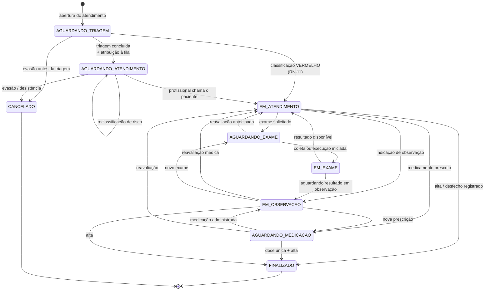

## 6.2 Tabela de transições

| De | Para | Ator autorizado | Guarda (pré-condição) | Efeito colateral |
|---|---|---|---|---|
| — | `AGUARDANDO_TRIAGEM` | Recepção | Nenhum atendimento ativo do paciente (RN-07) | Gera número; registra `admitido_em` |
| `AGUARDANDO_TRIAGEM` | `AGUARDANDO_ATENDIMENTO` | Enf. triagem | Triagem registrada; profissional atribuído | Cria `fila_item`; imprime pulseira |
| `AGUARDANDO_TRIAGEM` | `EM_ATENDIMENTO` | Enf. triagem | Classificação = VERMELHO | Notifica plantão; posição 1 na fila |
| `AGUARDANDO_ATENDIMENTO` | `EM_ATENDIMENTO` | Prof. responsável | Ator é o responsável ou supervisor | Grava `primeiro_atendimento_em`; `fila_item` → `EM_ATENDIMENTO` |
| `AGUARDANDO_ATENDIMENTO` | `AGUARDANDO_ATENDIMENTO` | Enf. / médico | Nova triagem de reclassificação | Reordena fila; exige reimpressão de pulseira (RN-09) |
| `EM_ATENDIMENTO` | `AGUARDANDO_EXAME` | Médico | ≥ 1 solicitação de exame ativa | Insere na fila do laboratório |
| `EM_ATENDIMENTO` | `AGUARDANDO_MEDICACAO` | Médico | ≥ 1 prescrição vigente | Gera aprazamento |
| `EM_ATENDIMENTO` | `EM_OBSERVACAO` | Médico | — | Inicia contagem de tempo em observação |
| `EM_ATENDIMENTO` | `FINALIZADO` | Médico | Desfecho informado; nenhuma pendência crítica aberta | Grava `finalizado_em`; encerra `fila_item`; libera o profissional |
| `AGUARDANDO_EXAME` | `EM_EXAME` | Laboratório | Solicitação em situação `COLETADO` | — |
| `EM_EXAME` | `EM_ATENDIMENTO` | Laboratório / médico | Resultado registrado | Notifica médico solicitante |
| `AGUARDANDO_MEDICACAO` | `EM_OBSERVACAO` | Enfermagem | ≥ 1 dose administrada | — |
| `EM_OBSERVACAO` | `FINALIZADO` | Médico | Desfecho informado | Idem finalização |
| qualquer não terminal | `CANCELADO` | Supervisor | Justificativa obrigatória | Encerra `fila_item` como `DESISTENCIA` |
| `FINALIZADO` | qualquer | **ninguém** | Estado terminal (RN-14) | — |

## 6.3 Implementação no Laravel

O enum de domínio concentra as transições legais, o que impede que a regra se espalhe
por *controllers*:

```php
<?php
// app/Enums/StatusAtendimento.php
namespace App\Enums;

enum StatusAtendimento: string
{
    case AguardandoTriagem     = 'AGUARDANDO_TRIAGEM';
    case AguardandoAtendimento = 'AGUARDANDO_ATENDIMENTO';
    case EmAtendimento         = 'EM_ATENDIMENTO';
    case AguardandoExame       = 'AGUARDANDO_EXAME';
    case EmExame               = 'EM_EXAME';
    case AguardandoMedicacao   = 'AGUARDANDO_MEDICACAO';
    case EmObservacao          = 'EM_OBSERVACAO';
    case Finalizado            = 'FINALIZADO';
    case Cancelado             = 'CANCELADO';

    /** @return array<int, self> */
    public function transicoesPermitidas(): array
    {
        return match ($this) {
            self::AguardandoTriagem => [
                self::AguardandoAtendimento, self::EmAtendimento, self::Cancelado,
            ],
            self::AguardandoAtendimento => [
                self::EmAtendimento, self::AguardandoAtendimento, self::Cancelado,
            ],
            self::EmAtendimento => [
                self::AguardandoExame, self::AguardandoMedicacao,
                self::EmObservacao, self::Finalizado, self::Cancelado,
            ],
            self::AguardandoExame => [
                self::EmExame, self::EmAtendimento, self::Cancelado,
            ],
            self::EmExame => [
                self::EmAtendimento, self::EmObservacao, self::Cancelado,
            ],
            self::AguardandoMedicacao => [
                self::EmObservacao, self::EmAtendimento, self::Finalizado, self::Cancelado,
            ],
            self::EmObservacao => [
                self::EmAtendimento, self::AguardandoExame,
                self::AguardandoMedicacao, self::Finalizado, self::Cancelado,
            ],
            // RN-14: estados terminais não têm saída
            self::Finalizado, self::Cancelado => [],
        };
    }

    public function podeTransitarPara(self $destino): bool
    {
        return in_array($destino, $this->transicoesPermitidas(), strict: true);
    }

    public function ehTerminal(): bool
    {
        return $this->transicoesPermitidas() === [];
    }

    /** Rótulo exibido ao paciente no portal, em linguagem acessível */
    public function rotuloPaciente(): string
    {
        return match ($this) {
            self::AguardandoTriagem     => 'Aguardando avaliação inicial',
            self::AguardandoAtendimento => 'Na fila para atendimento',
            self::EmAtendimento         => 'Em atendimento',
            self::AguardandoExame       => 'Aguardando realização de exame',
            self::EmExame               => 'Exame em andamento',
            self::AguardandoMedicacao   => 'Aguardando medicação',
            self::EmObservacao          => 'Em observação',
            self::Finalizado            => 'Atendimento concluído',
            self::Cancelado             => 'Atendimento cancelado',
        };
    }
}
```

A ação de transição, única porta de entrada para mudança de status:

```php
<?php
// app/Actions/Atendimento/AlterarStatusAction.php
namespace App\Actions\Atendimento;

use App\Enums\StatusAtendimento;
use App\Exceptions\TransicaoInvalidaException;
use App\Models\{Atendimento, Usuario};
use Illuminate\Support\Facades\DB;

final class AlterarStatusAction
{
    public function execute(
        Atendimento $atendimento,
        StatusAtendimento $novoStatus,
        Usuario $autor,
        ?string $observacao = null,
    ): Atendimento {
        $atual = $atendimento->status;

        // RN-13
        if (! $atual->podeTransitarPara($novoStatus)) {
            throw new TransicaoInvalidaException(
                "Transição inválida: {$atual->value} → {$novoStatus->value}"
            );
        }

        return DB::transaction(function () use ($atendimento, $atual, $novoStatus, $autor, $observacao) {
            $ultima = $atendimento->statusHistorico()->latest('criado_em')->first();
            $permanencia = $ultima
                ? now()->diffInSeconds($ultima->criado_em)
                : now()->diffInSeconds($atendimento->admitido_em);

            // RN-15: histórico é acrescentado, nunca sobrescrito
            $atendimento->statusHistorico()->create([
                'status_anterior'      => $atual->value,
                'status_novo'          => $novoStatus->value,
                'alterado_por'         => $autor->id,
                'observacao'           => $observacao,
                'permanencia_segundos' => $permanencia,
                'criado_em'            => now(),   // RN-29: hora do servidor
            ]);

            $atendimento->status = $novoStatus;

            if ($novoStatus === StatusAtendimento::EmAtendimento
                && $atendimento->primeiro_atendimento_em === null) {
                $atendimento->primeiro_atendimento_em = now();
            }

            if ($novoStatus->ehTerminal()) {
                $atendimento->finalizado_em = now();
                $atendimento->filaItens()
                    ->whereIn('situacao', ['AGUARDANDO', 'CHAMADO', 'EM_ATENDIMENTO'])
                    ->update(['situacao' => 'CONCLUIDO', 'saiu_em' => now()]);
            }

            $atendimento->save();

            // Atualiza painéis e o portal do paciente (RF-38)
            event(new \App\Events\StatusAtendimentoAlterado($atendimento, $atual, $novoStatus));

            return $atendimento;
        });
    }
}
```

> **Por que enum e não tabela de estados.** Colocando as transições no enum, uma
> transição ilegal é um erro de *tipo* detectável em teste unitário sem banco. A
> alternativa — tabela `transicao_permitida` — daria flexibilidade de configuração que
> este domínio não pede: a máquina de estados de um pronto-socorro não muda por
> parametrização, muda por decisão clínica que exige revisão de código.

---

# 7. Módulo Triagem, Fila e Priorização

Este é o módulo que determina se o sistema resolve ou agrava o problema real do
pronto-socorro. Uma fila mal modelada não é um defeito de software: é risco assistencial.

## 7.1 O protocolo de classificação de risco

O sistema adota o **Protocolo de Manchester**, que classifica o paciente em cinco níveis
identificados por cor, cada um com um tempo-alvo máximo de espera:

| Cor | Classificação | Tempo-alvo | Peso de ordenação | Semântica |
|---|---|---|---|---|
| 🔴 Vermelho | Emergência | **0 min** — atendimento imediato | 1 | Risco iminente de morte |
| 🟠 Laranja | Muito urgente | **10 min** | 2 | Atendimento praticamente imediato |
| 🟡 Amarelo | Urgente | **60 min** | 3 | Atendimento rápido, mas pode aguardar |
| 🟢 Verde | Pouco urgente | **120 min** | 4 | Pode aguardar ou ser encaminhado |
| 🔵 Azul | Não urgente | **240 min** | 5 | Pode aguardar ou ser encaminhado |

Esses cinco níveis, com esses tempos, são exatamente a carga inicial da tabela
`classificacao_risco` no DDL. **A cor da pulseira é a materialização física desta
classificação** — é o que conecta este módulo ao módulo de pulseira (§8).

**Duas decisões de projeto derivadas do protocolo:**

1. **O tempo-alvo é dado, não constante de código.** A coluna `tempo_alvo_minutos`
   permite que a unidade calibre os tempos sem alterar o sistema — algumas unidades
   trabalham com 15 min para o laranja, por exemplo.
2. **A cor nunca é o único indicador.** Conforme RNF-15, a interface sempre apresenta
   cor + rótulo textual + ícone. Um profissional com discromatopsia (≈ 8 % dos homens)
   precisa ler "Muito urgente", não inferir do tom de laranja.

## 7.2 Modelo de dados da fila

A tabela `fila_item` **não armazena a posição na fila**. Essa é a decisão central do
módulo, e vale explicá-la.

| Abordagem | Problema |
|---|---|
| Coluna `posicao` persistida | Toda reclassificação, transferência ou desistência exige `UPDATE` em cascata em todos os itens seguintes. Sob concorrência, produz posições duplicadas ou lacunas |
| Lista encadeada (`proximo_id`) | Reordenar é O(1), mas ler a fila inteira exige recursão e um ponteiro corrompido quebra a fila silenciosamente |
| **Ordenação derivada** (escolhida) | A posição é **calculada na leitura**, por `ROW_NUMBER() OVER (PARTITION BY profissional_id ORDER BY peso, entrou_em)`. Sempre consistente por construção |

O custo da escolha é uma janela de ordenação a cada leitura do painel — e o índice
composto `ix_fila_ordenacao (profissional_id, situacao, classificacao_risco_id,
entrou_em)` foi desenhado exatamente na ordem da cláusula `ORDER BY`, de modo que o
motor percorre o índice já ordenado, sem `filesort`. Com 200 pacientes ativos, a
consulta é trivial; RNF-02 é folgadamente atendido.

**O que `entrou_em` significa exatamente.** Não é o horário de chegada ao hospital
(`atendimento.admitido_em`), é o horário de entrada **naquela fila**. A distinção
importa: quando um paciente é transferido da fila do Dr. A para a do Dr. B, ele **não
volta ao fim** — cria-se um novo `fila_item` preservando o `entrou_em` original, com
`transferido_de_id` apontando para o item anterior. Assim o paciente não é punido por
uma decisão administrativa.

## 7.3 O algoritmo de ordenação

A ordenação implementa RN-10 — prioridade clínica primeiro, ordem de chegada como
desempate:

```sql
SELECT
    ROW_NUMBER() OVER (
        PARTITION BY f.profissional_id
        ORDER BY cr.peso_ordenacao ASC,   -- 1º critério: gravidade (1 = vermelho)
                 f.entrou_em ASC          -- 2º critério: quem esperou mais
    ) AS posicao,
    /* ... */
FROM fila_item f
JOIN atendimento a          ON a.id = f.atendimento_id
JOIN classificacao_risco cr ON cr.id = f.classificacao_risco_id
WHERE f.situacao IN ('AGUARDANDO','CHAMADO');
```

O resultado, demonstrado com dados reais na §5.4.1: o paciente laranja que chegou por
último é atendido primeiro, e entre dois verdes vence quem chegou antes.

### 7.3.1 O problema da inanição — e por que ele não é resolvido por envelhecimento

Ordenação estritamente lexicográfica por prioridade tem um efeito conhecido:
**inanição** (*starvation*). Se pacientes laranja chegam continuamente, o paciente azul
nunca é chamado.

A solução clássica em escalonamento de processos é *aging*: aumentar a prioridade
conforme o tempo de espera cresce. **Aqui essa solução é inadequada, e a justificativa é
clínica, não técnica.** Um paciente azul que espera três horas não se torna mais grave
do que um laranja que acabou de chegar. Promovê-lo automaticamente inverteria a lógica
de segurança do paciente e poderia matar alguém.

A resposta correta é **tornar a espera visível, não reordená-la silenciosamente**:

```php
<?php
// app/Services/Fila/AvaliadorEsperaService.php
namespace App\Services\Fila;

final class AvaliadorEsperaService
{
    /**
     * Não altera a ordem. Classifica a criticidade da espera para exibição e alerta.
     */
    public function avaliar(int $esperaMinutos, int $tempoAlvoMinutos): SituacaoEspera
    {
        if ($tempoAlvoMinutos === 0) {
            return SituacaoEspera::AtendimentoImediato;   // vermelho: nunca espera
        }

        $razao = $esperaMinutos / $tempoAlvoMinutos;

        return match (true) {
            $razao < 0.75 => SituacaoEspera::DentroDoAlvo,
            $razao < 1.00 => SituacaoEspera::ProximoDoAlvo,      // amarelo na tela
            $razao < 2.00 => SituacaoEspera::AlvoExcedido,       // vermelho na tela
            default       => SituacaoEspera::EsperaCritica,      // escalonamento
        };
    }
}
```

O que o sistema faz em cada caso:

| Situação | Ação do sistema |
|---|---|
| Dentro do alvo | Nenhuma |
| Próximo do alvo | Destaque visual na fila do profissional |
| Alvo excedido | Alerta no painel + registro no indicador de qualidade + **sugestão de reavaliação de risco** |
| Espera crítica (> 2× o alvo) | Notificação à coordenação do plantão; entra no relatório gerencial |

A sugestão de reavaliação é a chave: em vez de o sistema promover o paciente por conta
própria, ele convoca um profissional a **reclassificá-lo** — porque quem espera três
horas pode, de fato, ter piorado. A decisão permanece clínica; o sistema apenas garante
que ninguém seja esquecido.

## 7.4 Balanceamento entre profissionais

RF-27 exige mostrar "quantos pacientes estão aguardando com cada um". Contar cabeças,
porém, é uma métrica ruim: cinco pacientes azuis não equivalem a cinco laranjas.

O sistema calcula uma **carga ponderada** pela gravidade:

```
carga_ponderada = Σ (6 − peso_ordenacao)
```

Como `peso_ordenacao` vale 1 para vermelho e 5 para azul, o peso assistencial fica:

| Cor | peso_ordenacao | Contribuição à carga |
|---|---|---|
| Vermelho | 1 | 5 |
| Laranja | 2 | 4 |
| Amarelo | 3 | 3 |
| Verde | 4 | 2 |
| Azul | 5 | 1 |

Verificação com os dados reais da §5.4.1 — Dr. Ana tem 1 laranja + 1 amarelo + 2 verdes:

```
carga = 4 + 3 + 2 + 2 = 11
```

que é exatamente o valor retornado por `vw_carga_profissional`. O Enf. João, com 1
amarelo, tem carga 3. A sugestão automática (RF-28) aponta para o de menor carga entre
os disponíveis e compatíveis com a especialidade.

A tela de atribuição do UC-05 apresenta, para cada profissional:

```
┌──────────────────────────────────────────────────────────────────────┐
│ Dr. Ana Costa · Clínica Médica · CRM/SP 123456      ● Disponível     │
│ Aguardando: 4 pacientes            Carga ponderada: 11              │
│ 🟠 1   🟡 1   🟢 2                                                   │
│ Em atendimento: —                  Espera estimada: ~48 min         │
├──────────────────────────────────────────────────────────────────────┤
│ Enf. João Reis · COREN/SP 654321                    ● Disponível     │
│ Aguardando: 1 paciente             Carga ponderada: 3   ★ sugerido   │
│ 🟡 1                                                                 │
│ Em atendimento: —                  Espera estimada: ~12 min         │
├──────────────────────────────────────────────────────────────────────┤
│ Enf. Bia Alves · COREN/SP 654322                    ○ Ausente        │
│ Indisponível para novas atribuições                                  │
└──────────────────────────────────────────────────────────────────────┘
```

A estimativa de espera usa a média histórica de duração de atendimento do próprio
profissional por cor de prioridade — uma média móvel dos últimos 30 dias, não uma
constante. Profissionais têm ritmos diferentes, e o paciente merece uma estimativa
honesta.

> **Limitação conhecida da ponderação linear.** Como a escala vai de 1 a 5, cinco
> pacientes azuis somam carga 5 — exatamente a carga de **um** paciente vermelho. Isso
> subestima o esforço de um caso crítico, que na prática consome mais que cinco
> atendimentos leves. Uma ponderação exponencial (`2^(5−peso)`: azul 1, verde 2,
> amarelo 4, laranja 8, vermelho 16) refletiria melhor a realidade assistencial. A
> escala linear foi mantida nesta versão por ser mais legível ao usuário — a carga
> aparece na tela e precisa ser interpretável por quem distribui os pacientes — mas a
> troca é um ajuste de uma linha na view `vw_carga_profissional`, e está registrada
> como ponto de calibração para validação com a equipe do hospital.

## 7.5 Reclassificação de risco

Reclassificar é o mecanismo de segurança do módulo: o quadro clínico muda durante a
espera, e a fila precisa acompanhar.

```php
<?php
// app/Actions/Triagem/ReclassificarRiscoAction.php
namespace App\Actions\Triagem;

use App\Models\{Atendimento, Triagem, Profissional};
use Illuminate\Support\Facades\DB;

final class ReclassificarRiscoAction
{
    public function execute(
        Atendimento $atendimento,
        int $novaClassificacaoId,
        Profissional $autor,
        string $justificativa,
        ?array $sinaisVitais = null,
    ): Triagem {
        return DB::transaction(function () use (
            $atendimento, $novaClassificacaoId, $autor, $justificativa, $sinaisVitais
        ) {
            $anterior = $atendimento->triagemVigente();

            $sinalVital = $sinaisVitais
                ? $atendimento->sinaisVitais()->create([
                      ...$sinaisVitais,
                      'aferido_por' => $autor->usuario_id,
                      'aferido_em'  => now(),
                  ])
                : null;

            // Nova triagem: a anterior permanece intacta, encadeada (histórico completo)
            $nova = $atendimento->triagens()->create([
                'classificacao_risco_id'      => $novaClassificacaoId,
                'sinal_vital_id'              => $sinalVital?->id,
                'realizada_por'               => $autor->usuario_id,
                'queixa_principal'            => $anterior->queixa_principal,
                'justificativa_classificacao' => $justificativa,
                'reclassificacao'             => true,
                'triagem_anterior_id'         => $anterior->id,
                'criado_em'                   => now(),
            ]);

            // A classificação vigente do atendimento passa a ser a nova (RN-09)
            $atendimento->update(['classificacao_risco_id' => $novaClassificacaoId]);

            // A fila reordena por consequência: basta atualizar a prioridade do item.
            // entrou_em é preservado — o paciente não perde o tempo já esperado.
            $atendimento->filaItemAtivo()?->update([
                'classificacao_risco_id' => $novaClassificacaoId,
            ]);

            // RN-09: cor da pulseira precisa refletir a nova classificação
            event(new \App\Events\ReimpressaoPulseiraNecessaria($atendimento, 'RECLASSIFICACAO'));

            // Vermelho não espera (RN-11)
            if ($nova->classificacaoRisco->exige_atendimento_imediato) {
                event(new \App\Events\EmergenciaDetectada($atendimento));
            }

            return $nova;
        });
    }
}
```

Três pontos merecem destaque nesse código:

1. **A triagem anterior não é sobrescrita.** Cria-se uma nova triagem encadeada por
   `triagem_anterior_id`. Reconstruir o raciocínio clínico ("o paciente entrou verde e
   virou laranja às 14h20, com queda de saturação") é essencial em auditoria de evento
   adverso.
2. **`entrou_em` é preservado.** Reclassificação não é penalidade nem prêmio de posição:
   é correção de gravidade. Ao alterar apenas `classificacao_risco_id` no `fila_item`, a
   reordenação acontece **automaticamente** na próxima leitura da view — não há
   recálculo de posições.
3. **A reclassificação dispara a reimpressão da pulseira.** Uma pulseira verde num
   paciente laranja é pior que nenhuma pulseira, porque comunica ativamente a informação
   errada.

## 7.6 Indicadores operacionais

O modelo de dados sustenta, sem estruturas adicionais, os indicadores que a gestão de
urgência efetivamente usa:

| Indicador | Cálculo | Fonte |
|---|---|---|
| Tempo porta-triagem | `triagem.criado_em − atendimento.admitido_em` | `triagem` |
| Tempo porta-atendimento | `atendimento.primeiro_atendimento_em − admitido_em` | `atendimento` |
| Aderência ao tempo-alvo | % de atendimentos com espera ≤ `tempo_alvo_minutos` da cor | `fila_item` + `classificacao_risco` |
| Tempo de permanência | `finalizado_em − admitido_em` | `atendimento` |
| Distribuição por cor | Contagem agrupada por `classificacao_risco_id` | `atendimento` |
| Taxa de reclassificação | % de atendimentos com `triagem.reclassificacao = true` | `triagem` |
| Taxa de evasão | % com `desfecho = 'EVASAO'` | `atendimento` |
| Produtividade por profissional | Atendimentos concluídos / hora de plantão | `fila_item` + `profissional_disponibilidade` |
| Tempo médio em cada status | Média de `permanencia_segundos` por `status_anterior` | `atendimento_status_historico` |

> A **taxa de reclassificação** é o indicador mais interessante da lista: se for muito
> baixa, provavelmente a equipe não está reavaliando quem espera; se for muito alta,
> provavelmente a triagem inicial está imprecisa. É um termômetro da qualidade do
> próprio processo de triagem.

## 7.7 Atualização em tempo real do painel

RF-34 e RNF-03 pedem atualização do painel sem recarga, com defasagem ≤ 10 s. Três
opções, com trade-offs distintos:

| Estratégia | Prós | Contras | Veredito |
|---|---|---|---|
| *Polling* Livewire (`wire:poll.10s`) | Trivial de implementar; funciona em qualquer infraestrutura | N requisições/minuto por painel aberto | **Escolhida para o MVP** |
| WebSocket (Laravel Reverb + Echo) | Instantâneo; uma conexão persistente por cliente | Exige processo servidor extra e configuração de proxy | Recomendada para produção |
| SSE (Server-Sent Events) | Unidirecional e leve; sem dependência extra | Suporte a reconexão mais frágil | Alternativa intermediária |

Com 10 painéis abertos e *polling* de 10 s, são 60 requisições/minuto sobre uma consulta
indexada — carga desprezível. A migração para Reverb é incremental: os eventos de domínio
(`StatusAtendimentoAlterado`, `FilaAtualizada`) já são emitidos pelas *actions*; basta
torná-los `ShouldBroadcast`. **Modelar os eventos desde o início é o que torna essa
migração barata depois** — e é a razão de as *actions* dispararem eventos mesmo quando
ninguém os escuta ainda.

---

# 8. Módulo QR Code e Pulseira de Identificação

Este módulo é o **eixo de identificação** de todo o sistema. Um erro de projeto aqui não
produz um bug: produz troca de paciente ou vazamento de dado de saúde.

## 8.1 O que codificar no QR Code — análise de alternativas

A pergunta parece trivial e não é. Quatro alternativas foram avaliadas:

### Alternativa 1 — Codificar o ID numérico do paciente

```
https://sgh.hosp.br/p/1427
```

| Aspecto | Avaliação |
|---|---|
| Simplicidade | Máxima |
| **Enumeração** | **Falha grave.** Quem lê a pulseira de um paciente descobre `/p/1428`, `/p/1429`… e varre o cadastro inteiro |
| Vazamento de metadado | O ID revela a ordem de cadastro e permite estimar o volume de pacientes da unidade |
| **Veredito** | **Rejeitada** |

### Alternativa 2 — Codificar o CPF

```
https://sgh.hosp.br/p/11144477735
```

| Aspecto | Avaliação |
|---|---|
| Enumeração | Difícil (10¹¹ combinações válidas) |
| **Exposição de dado pessoal** | **Falha grave.** A pulseira passa a estampar o CPF em código de barras. Qualquer pessoa com celular — outro paciente, visitante, faxineiro — lê o CPF de quem está no leito ao lado |
| Requisito de sistema | Viola RN-03: se o cadastro for corrigido, o CPF muda e o QR Code deixa de resolver |
| **Veredito** | **Rejeitada** |

### Alternativa 3 — Codificar um JWT com os dados do paciente

```
eyJhbGciOiJIUzI1NiIsInR5cCI6IkpXVCJ9.eyJub21lIjoiTWFyaWEgU291emEiLCJjcGYiOi...
```

| Aspecto | Avaliação |
|---|---|
| Funciona offline | Sim — é a única vantagem real |
| **Tamanho** | Um JWT com nome, CPF e nascimento passa de 250 caracteres, exigindo QR versão 11+ (61×61 módulos). Numa pulseira de 20 mm, cada módulo ficaria com ~0,3 mm — abaixo do limite de leitura confiável |
| **Payload legível** | O JWT é **assinado, não cifrado**. Qualquer um decodifica o Base64 e lê os dados pessoais. É a Alternativa 2 com passos extras |
| Imutabilidade | Corrigir o nome exigiria reemitir o token — viola RN-03 |
| **Veredito** | **Rejeitada** |

### Alternativa 4 — Token opaco aleatório, com dígito verificador criptográfico

```
https://sgh.hosp.br/p/6gU439hKOJjCKmCVxnkYzn
```

| Aspecto | Avaliação |
|---|---|
| Enumeração | **Inviável.** 22 caracteres base62 = **131 bits** de entropia |
| Vazamento | Zero. O token não carrega informação: é uma chave de busca opaca |
| Imutabilidade | Total. O token é independente de qualquer dado cadastral, atendendo RN-03 |
| Tamanho do QR | URL de 48 caracteres → QR **versão 5** (37×37 módulos) com correção de erro nível Q |
| **Veredito** | **Adotada** |

## 8.2 Especificação do token de pulseira

### 8.2.1 Estrutura e geração

O token tem duas partes: um **corpo aleatório** de 22 caracteres base62 e um **sufixo de
verificação** HMAC de 4 caracteres.

```php
<?php
// app/Services/Pulseira/TokenPulseiraService.php
namespace App\Services\Pulseira;

use Illuminate\Support\Str;

final class TokenPulseiraService
{
    private const ALFABETO   = '0123456789ABCDEFGHIJKLMNOPQRSTUVWXYZabcdefghijklmnopqrstuvwxyz';
    private const TAM_CORPO  = 22;   // 22 * log2(62) ≈ 131 bits
    private const TAM_CHECK  = 4;

    public function gerar(): string
    {
        $corpo = '';
        for ($i = 0; $i < self::TAM_CORPO; $i++) {
            // random_int usa o CSPRNG do sistema operacional.
            // rand()/mt_rand() seriam inaceitáveis: previsíveis a partir da semente.
            $corpo .= self::ALFABETO[random_int(0, strlen(self::ALFABETO) - 1)];
        }

        return $corpo . $this->checksum($corpo);
    }

    public function valido(string $token): bool
    {
        if (strlen($token) !== self::TAM_CORPO + self::TAM_CHECK) {
            return false;
        }

        $corpo    = substr($token, 0, self::TAM_CORPO);
        $recebido = substr($token, self::TAM_CORPO);

        // hash_equals: comparação em tempo constante, imune a timing attack
        return hash_equals($this->checksum($corpo), $recebido);
    }

    private function checksum(string $corpo): string
    {
        $hmac = hash_hmac('sha256', $corpo, config('app.pulseira_key'), binary: true);

        return substr(
            rtrim(strtr(base64_encode($hmac), '+/', 'AB'), '='),
            0,
            self::TAM_CHECK
        );
    }
}
```

**Por que um checksum HMAC, se 131 bits de entropia já tornam a adivinhação impossível?**
Por três razões operacionais, não criptográficas:

1. **Rejeição sem consulta ao banco.** Um token malformado é descartado por comparação
   de string, antes de qualquer `SELECT`. Uma varredura automatizada de 100.000
   tentativas não gera 100.000 consultas ao banco — é mitigação de DoS por custo, barata
   e eficaz.
2. **Detecção de leitura corrompida.** Pulseira suja, molhada ou parcialmente rasgada
   pode produzir uma decodificação errada que ainda assim tenha o formato válido. O
   checksum transforma isso em "pulseira não reconhecida" em vez de, na pior das
   hipóteses, resolver para outro paciente.
3. **Sinal de auditoria.** Um token com formato correto e checksum inválido é evidência
   de **manipulação deliberada**, não de erro de digitação. Isso merece registro
   distinto na trilha de auditoria e alerta de segurança.

### 8.2.2 Análise quantitativa de resistência à enumeração

| Grandeza | Valor |
|---|---|
| Espaço do token | 62²² ≈ 2¹³¹ ≈ 2,7 × 10³⁹ |
| Pacientes cadastrados (hipótese de 20 anos de operação) | 10⁶ |
| Densidade de tokens válidos | ≈ 3,7 × 10⁻³⁴ |
| Tentativas para 50 % de chance de um acerto | ≈ 1,9 × 10³³ |
| Tempo a 10.000 tentativas/segundo | ≈ 6 × 10²¹ anos |

Para comparação: o mesmo cálculo com ID sequencial (Alternativa 1) exigiria **uma**
tentativa.

### 8.2.3 O token é permanente — e o que isso implica

RN-03 e a restrição R-03 exigem que o QR Code nunca mude. Isso é a decisão correta —
uma pulseira que deixa de funcionar é um risco assistencial — mas gera uma consequência
que precisa ser reconhecida honestamente:

> **Uma pulseira antiga continua válida indefinidamente.** Se um paciente descarta a
> pulseira na rua e alguém a encontra e escaneia, o token resolve.

O que **não** acontece nesse cenário, por projeto:

| Ação de quem encontrou | Resultado |
|---|---|
| Escanear o QR Code | Cai na tela de **login** do portal do paciente (RF-43). Nenhum dado é exibido |
| Tentar acessar dados clínicos | Impossível sem autenticação (RF-41) |
| Ler o que está impresso na pulseira | **Aqui há exposição real** — nome e data de nascimento estão em texto legível |

A conclusão de projeto: o vetor de risco relevante **não é o QR Code, é a tinta**. Por
isso a §8.4 restringe o que se imprime, e §8.5 recomenda o descarte da pulseira na alta
como procedimento operacional — mitigação de processo, não de software. Um sistema bem
modelado sabe distinguir os dois.

## 8.3 Os dois fluxos de resolução

A mesma URL atende dois públicos com necessidades opostas. A distinção é feita pela
**sessão autenticada**, nunca pelo conteúdo do QR Code:

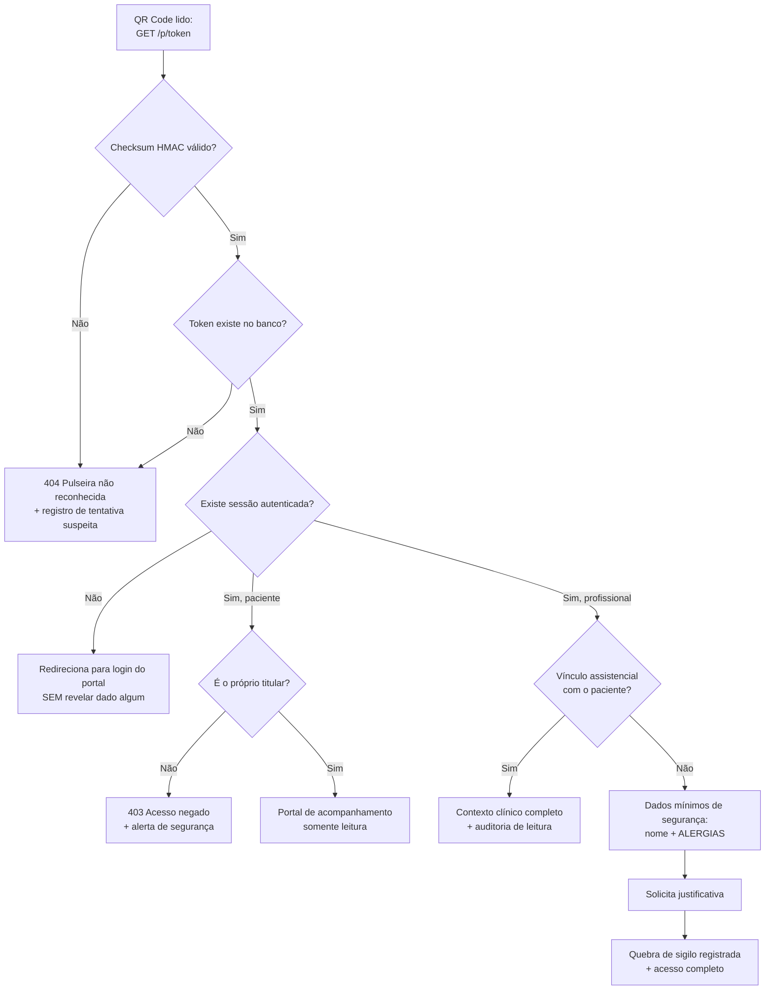

O detalhe de projeto mais importante desse fluxograma: no caminho **D → Não**, o sistema
redireciona para o login **sem confirmar que o token é válido**. Um invasor não consegue
usar a rota `/p/{token}` como oráculo para descobrir quais tokens existem, porque token
inválido e token válido sem sessão produzem respostas indistinguíveis.

O caminho **I → Não → K** merece igual atenção: mesmo sem vínculo assistencial, o
profissional recebe **nome e alergias**. Isso é deliberado. Se um paciente entra em
parada no corredor e o médico que passa não é o responsável, negar acesso à lista de
alergias em nome do sigilo seria uma decisão de projeto que mata pessoas. O mínimo
necessário para a segurança imediata é liberado; o resto exige justificativa registrada.

```php
<?php
// app/Http/Controllers/PulseiraController.php
namespace App\Http\Controllers;

use App\Models\Paciente;
use App\Services\Pulseira\TokenPulseiraService;
use App\Services\Auditoria\AuditoriaService;
use Illuminate\Http\Request;

final class PulseiraController extends Controller
{
    public function __construct(
        private TokenPulseiraService $tokens,
        private AuditoriaService $auditoria,
    ) {}

    public function resolver(Request $request, string $token)
    {
        // 1. Validação barata, antes de tocar o banco
        if (! $this->tokens->valido($token)) {
            $this->auditoria->registrarTentativaSuspeita('TOKEN_PULSEIRA_INVALIDO', $token);
            abort(404, 'Pulseira não reconhecida.');
        }

        // 2. Usuário não autenticado nunca recebe dado algum — nem confirmação
        //    de que o token existe. Redirecionar antes da consulta é o que
        //    impede o uso da rota como oráculo de enumeração.
        if (! $request->user()) {
            return redirect()->route('portal.login')
                ->with('pulseira_token', $token);   // preserva o destino pós-login
        }

        $paciente = Paciente::where('token_pulseira', $token)->firstOrFail();

        // 3. Paciente autenticado: só os próprios dados (RN-26)
        if ($request->user()->tipo === 'PACIENTE') {
            abort_unless($request->user()->id === $paciente->usuario_id, 403);

            return redirect()->route('portal.acompanhamento');
        }

        // 4. Profissional: Policy decide entre contexto completo e mínimo vital
        $this->authorize('verContexto', $paciente);

        $this->auditoria->registrar(
            acao: 'QR_LEITURA',
            paciente: $paciente,
            atendimento: $paciente->atendimentoAtivo(),
        );

        return view('profissional.contexto-paciente', [
            'paciente'    => $paciente,
            'atendimento' => $paciente->atendimentoAtivo(),
            'alergias'    => $paciente->alergias,   // sempre em destaque
        ]);
    }
}
```

## 8.4 Conteúdo impresso na pulseira

Aqui há uma tensão real de projeto, e ela precisa ser explicitada:

| Força | Direção |
|---|---|
| **Segurança do paciente** | Imprimir o máximo — a pulseira precisa identificar o paciente inconsciente, com o sistema fora do ar, no meio de uma emergência |
| **Privacidade (LGPD)** | Imprimir o mínimo — a pulseira é lida por qualquer pessoa que passe pelo leito |

A resolução adotada segue o princípio da **minimização com garantia de identificação**:
imprime-se o necessário para identificar com segurança, e nada além.

| Campo | Imprime? | Justificativa |
|---|---|---|
| Nome completo (ou nome social) | **Sim** | Identificação primária. Nome social tem precedência: é dignidade e reduz erro de conferência verbal |
| Data de nascimento | **Sim** | Segundo identificador. Protocolos de segurança do paciente exigem **dois** identificadores conferidos antes de qualquer procedimento |
| Idade | Sim | Conveniência clínica (cálculo de dose pediátrica) |
| Iniciais do sexo | Sim | Conferência rápida |
| Número do atendimento | **Sim** | Vincula o paciente ao episódio; permite busca manual se o QR falhar |
| Data/hora de admissão | Sim | Contextualiza o tempo de permanência |
| Cor de prioridade | **Sim** | Requisito RF-13. Faixa colorida + **rótulo textual** (RNF-15) |
| Alerta de alergia | **Sim** | Faixa `⚠ ALERGIA` quando houver registro. Salva vidas; sobrepõe a privacidade |
| QR Code | **Sim** | Requisito RF-14 |
| **CPF** | **Não** | Dado desnecessário para identificação assistencial e de alto valor para fraude |
| **CNS** | **Não** | Idem |
| **Diagnóstico / CID** | **Não** | Dado clínico sensível. Um CID de HIV impresso na pulseira é vazamento com potencial de discriminação |
| **Endereço, telefone** | **Não** | Sem utilidade assistencial; risco alto |
| **Nome do medicamento em uso** | **Não** | Fica no sistema, não na tinta |

> **Sobre não imprimir o CPF.** É a decisão que mais gera resistência em implantação
> real — "sempre imprimimos o CPF". O argumento decisivo: o CPF **não melhora a
> identificação assistencial** (o nome + data de nascimento já dão dois identificadores
> independentes) e **piora significativamente a exposição**. Custo alto, benefício nulo.

### Layout proposto (pulseira térmica, 25 mm × 280 mm)

```
┌───────────────────────────────────────────────────────────────────────────┐
│ ████████████ 🟠 MUITO URGENTE — LARANJA ████████████                      │
├───────────────────────────────────────────────────────────────────────────┤
│                                                          ▄▄▄▄▄▄▄▄▄▄▄▄▄    │
│  MARIA APARECIDA SOUZA                                   █ ▄▄▄▄▄ █▀▄ █    │
│                                                          █ █   █ █▀▀▄█    │
│  Nasc. 12/03/1958      68a      F                        █ █▄▄▄█ █ ▄▀█    │
│                                                          █▄▄▄▄▄▄▄█▄█▄█    │
│  Atend. 2026-000148    Adm. 18/08/2026 14:07             █ ▀▄ ▀▄▀▄▄ ▀██    │
│                                                          █▄▄▄▄▄█▄▄▄█▄▄█    │
│  UPA CENTRAL                                             sgh.hosp.br/p    │
├───────────────────────────────────────────────────────────────────────────┤
│ ⚠⚠⚠  A L E R G I A :  D I P I R O N A   ⚠⚠⚠                              │
└───────────────────────────────────────────────────────────────────────────┘
```

Quatro decisões de layout que não são estéticas:

1. **A faixa de cor ocupa a borda superior inteira**, para ser identificável com a
   pulseira parcialmente coberta pelo lençol ou pela manga.
2. **O nome usa a maior fonte da pulseira.** É o campo lido em voz alta na conferência de
   identidade.
3. **A faixa de alergia é a última linha e usa marcação redundante** (símbolo + caixa
   alta + repetição). Se houver um único elemento que precise sobreviver a uma impressão
   ruim, é esse.
4. **A idade é impressa como valor congelado no momento da impressão** (`68a`). É a
   única exceção à decisão D-01, e ela é consciente: papel não recalcula. Por isso a
   data de nascimento vem impressa ao lado — ela é a fonte de verdade, a idade é
   conveniência.

## 8.5 Dimensionamento e impressão do QR Code

O QR Code numa pulseira enfrenta condições adversas: superfície curva, largura útil de
~20 mm, exposição a água, sabão, sangue e álcool 70 %, e leitura por câmera de celular
comum sob luz de corredor. O dimensionamento foi calculado, não estimado:

| Parâmetro | Valor | Justificativa |
|---|---|---|
| Conteúdo | `https://sgh.hosp.br/p/{token}` — **48 caracteres** (22 do corpo + 4 do checksum + 22 da URL base) | Host curto economiza uma versão inteira de QR |
| Versão do QR | **5** (37 × 37 módulos) | Menor versão que acomoda 48 bytes com ECC nível Q |
| Nível de correção de erro | **Q (25 %)** | Recupera leitura com até 25 % do símbolo danificado. Pulseira suja é a regra, não a exceção |
| Zona de silêncio | 2 módulos por lado | Reduzida do padrão (4) pela restrição de largura; aceitável com fundo branco garantido |
| Lado impresso | **22 mm** | Total de 41 módulos (37 + borda) → **0,54 mm por módulo** |
| Resolução da impressora | 300 dpi | **6,3 pontos por módulo** — confortavelmente acima do mínimo prático de 4 |

Os números foram calculados, não estimados. A tabela abaixo mostra o espaço de projeto
completo, para deixar visível de onde vem a escolha:

| ECC | Versão | Módulos + borda | 18 mm | 20 mm | 22 mm |
|---|---|---|---|---|---|
| M (15 %) | 4 | 37 | 5,7 pts | 6,4 pts | 7,0 pts |
| **Q (25 %)** | **5** | **41** | 5,2 pts | 5,8 pts | **6,3 pts** |

*(pontos por módulo, impressora de 300 dpi)*

Com ECC nível Q e 0,54 mm por módulo, o símbolo tolera a perda de um quadrante inteiro e
ainda decodifica. Duas armadilhas ficam explícitas nesses números:

- Reduzir para 18 mm levaria a 5,2 pontos/módulo — ainda funciona a 300 dpi, mas
  **falha numa impressora de 203 dpi**, resolução comum em modelos de entrada, onde o
  valor cai a 3,5 pontos/módulo, abaixo do mínimo prático.
- Baixar a correção de erro para nível M ganharia uma versão (33 módulos em vez de 37),
  mas trocaria tolerância a sujeira por tamanho — exatamente o recurso que uma pulseira
  usada por 12 horas mais consome.

**22 mm com ECC Q é a escolha defensável**, e ela sobrevive a impressoras de 203 dpi.

### Implementação da geração e impressão

```php
<?php
// app/Services/Pulseira/GerarPulseiraService.php
namespace App\Services\Pulseira;

use App\Models\{Atendimento, Paciente, Profissional};
use Barryvdh\DomPDF\Facade\Pdf;
use Endroid\QrCode\{Builder\Builder, ErrorCorrectionLevel, RoundBlockSizeMode, Writer\PngWriter};
use Illuminate\Support\Facades\DB;

final class GerarPulseiraService
{
    public function gerar(
        Paciente $paciente,
        ?Atendimento $atendimento,
        ?int $classificacaoRiscoId,
        Profissional $operador,
        string $motivo = 'PRIMEIRA',
    ): string {
        return DB::transaction(function () use (
            $paciente, $atendimento, $classificacaoRiscoId, $operador, $motivo
        ) {
            // RF-15: toda impressão é rastreada — quem, quando, qual cor, por quê
            $paciente->pulseiraImpressoes()->create([
                'atendimento_id'         => $atendimento?->id,
                'classificacao_risco_id' => $classificacaoRiscoId,
                'motivo'                 => $motivo,
                'impressa_por'           => $operador->usuario_id,
                'criado_em'              => now(),
            ]);

            $qr = Builder::create()
                ->writer(new PngWriter())
                // RF-16 / RN-03: SEMPRE o mesmo token, em toda reimpressão
                ->data(route('pulseira.resolver', $paciente->token_pulseira))
                ->errorCorrectionLevel(ErrorCorrectionLevel::Quartile)  // 25 %
                ->size(600)                     // 22 mm a 300 dpi ≈ 260 px; 600 dá margem de reamostragem
                ->margin(0)                     // zona de silêncio controlada no template
                ->roundBlockSizeMode(RoundBlockSizeMode::Margin)
                ->build();

            return Pdf::loadView('pulseira.termica', [
                'paciente'      => $paciente,
                'atendimento'   => $atendimento,
                'classificacao' => $classificacaoRiscoId,
                'qrBase64'      => $qr->getDataUri(),
                'alergias'      => $paciente->alergias->pluck('substancia'),
                // D-01: idade congelada no papel; a data de nascimento é a fonte de verdade
                'idadeImpressa' => $paciente->idade,
            ])
                ->setPaper([0, 0, 793.7, 70.87])   // 280 mm × 25 mm em pontos
                ->output();
        });
    }
}
```

**PDF ou ZPL?** Duas estratégias de impressão, com trade-off claro:

| Estratégia | Prós | Contras | Recomendação |
|---|---|---|---|
| **PDF** (DomPDF) | Independente de fabricante; pré-visualização na tela; imprime em qualquer impressora | Depende do driver e do diálogo de impressão do navegador; margens podem variar | **MVP e este trabalho** |
| **ZPL** (Zebra Programming Language) | Controle absoluto do posicionamento; comando `^BQ` gera o QR no firmware da impressora; envio direto por socket TCP 9100 — sem diálogo de impressão | Amarra o sistema a impressoras Zebra ou compatíveis | Produção, se o parque for padronizado |

Um esboço de ZPL, para ilustrar por que ele ganha em produção:

```
^XA
^PW800^LL200
^FO20,15^GB760,40,40^FS                      ; faixa de prioridade
^FO40,25^A0N,28,28^FR^FDMUITO URGENTE - LARANJA^FS
^FO20,70^A0N,42,42^FDMARIA APARECIDA SOUZA^FS
^FO20,120^A0N,24,24^FDNasc. 12/03/1958   68a   F^FS
^FO20,150^A0N,22,22^FDAtend. 2026-000148   Adm. 18/08/2026 14:07^FS
^FO600,70^BQN,2,5^FDLA,https://sgh.hosp.br/p/6gU439hKOJjCKmCVxnkYzn^FS
^FO20,180^GB760,30,30^FS
^FO40,187^A0N,20,20^FR^FD** ALERGIA: DIPIRONA **^FS
^XZ
```

O comando `^BQN,2,5` instrui a própria impressora a renderizar o QR Code no modelo 2,
magnificação 5 — o símbolo nasce alinhado à grade de pontos do cabeçote térmico, o que
elimina o *anti-aliasing* que um PDF rasterizado pode introduzir. Em QR Code pequeno,
essa diferença é a fronteira entre ler na primeira tentativa e ler na terceira.

---

# 9. Módulo Prontuário e Evolução

## 9.1 O princípio da imutabilidade

Um prontuário não é um cadastro. É um **documento**, com valor probatório em processo
judicial, em sindicância de evento adverso e em auditoria de conselho de classe. A
consequência de projeto é direta e absoluta:

> **`registro_clinico` não sofre `UPDATE`. Nunca.**

Isso não é rigor decorativo. Um prontuário editável é um prontuário sem valor: se o
registro pode ser alterado depois do fato, ele não prova nada sobre o que se sabia no
momento da decisão clínica. A Lei 13.787/2018 (art. 2º) exige que o processo de
guarda do prontuário eletrônico assegure **integridade e autenticidade** — e integridade
significa exatamente isto.

A imutabilidade é imposta em quatro camadas, de dentro para fora:

| Camada | Mecanismo |
|---|---|
| **Banco de dados** | O usuário de aplicação recebe `INSERT` e `SELECT` na tabela; `UPDATE` e `DELETE` **não são concedidos** |
| **ORM** | O model sobrescreve `save()` para recusar alteração de registro existente |
| **Domínio** | Não existe `AtualizarRegistroClinicoAction`. A operação simplesmente não faz parte do vocabulário do sistema |
| **Interface** | Não há botão "editar". Há botão "retificar", que abre um formulário de adendo |

```sql
-- Concessão de privilégios: a imutabilidade é do banco, não do código
CREATE USER 'sgh_app'@'%' IDENTIFIED BY '...';
GRANT SELECT, INSERT, UPDATE, DELETE ON sgh.* TO 'sgh_app'@'%';

-- Revogação cirúrgica nas tabelas append-only
REVOKE UPDATE, DELETE ON sgh.registro_clinico             FROM 'sgh_app'@'%';
REVOKE UPDATE, DELETE ON sgh.auditoria_log                FROM 'sgh_app'@'%';
REVOKE UPDATE, DELETE ON sgh.atendimento_status_historico  FROM 'sgh_app'@'%';
REVOKE UPDATE, DELETE ON sgh.administracao_medicamento     FROM 'sgh_app'@'%';
FLUSH PRIVILEGES;
```

```php
<?php
// app/Models/RegistroClinico.php
namespace App\Models;

use App\Exceptions\RegistroImutavelException;
use Illuminate\Database\Eloquent\Model;

class RegistroClinico extends Model
{
    public $timestamps = false;

    // Sem SoftDeletes: não há exclusão, nem lógica.
    protected $fillable = [
        'uuid', 'atendimento_id', 'tipo', 'subjetivo', 'objetivo', 'avaliacao',
        'plano', 'conteudo_livre', 'sigiloso', 'registro_retificado_id',
        'motivo_retificacao', 'autor_id', 'autor_nome', 'autor_conselho',
        'hash_conteudo', 'hash_anterior', 'criado_em',
    ];

    public function save(array $options = []): bool
    {
        if ($this->exists) {
            throw new RegistroImutavelException(
                'Registro clínico é imutável (RN-16). Utilize a retificação por adendo.'
            );
        }

        return parent::save($options);
    }

    public function delete(): bool
    {
        throw new RegistroImutavelException('Registro clínico não pode ser excluído (RN-17).');
    }
}
```

## 9.2 A estrutura SOAP

O registro médico segue a estrutura **SOAP**, padrão consagrado de nota clínica, com uma
coluna por componente em vez de um único campo de texto livre:

| Componente | Coluna | Conteúdo | Exemplo |
|---|---|---|---|
| **S**ubjetivo | `subjetivo` | O que o paciente relata | "Dor abdominal em cólica há 6 h, náusea, sem febre" |
| **O**bjetivo | `objetivo` | O que o profissional constata e mede | "PA 130/85, FC 92, abdome doloroso à palpação em FID, Blumberg +" |
| **A**valiação | `avaliacao` | Raciocínio e hipóteses | "Abdome agudo inflamatório. HD: apendicite aguda" |
| **P**lano | `plano` | Conduta | "Hemograma, PCR, US de abdome. Analgesia com dipirona 1 g IV. Reavaliar em 1 h" |

**Por que quatro colunas e não um `TEXT` único?** Três ganhos concretos:

1. **A estrutura é um guia cognitivo.** Um campo em branco rotulado "Avaliação" cobra do
   profissional o raciocínio explícito. Um `TEXT` livre aceita "paciente bem, alta" — que
   é um registro sem conteúdo.
2. **Leitura seletiva.** O médico da reavaliação lê primeiro o *Plano* da nota anterior.
   Com texto único, ele lê tudo para achar o que quer.
3. **Extração de dados sem processamento de linguagem natural.** "Quais hipóteses
   diagnósticas foram levantadas nos casos de dor abdominal?" é uma consulta sobre a
   coluna `avaliacao`, não um projeto de mineração de texto.

O campo `conteudo_livre` permanece disponível para tipos de registro que não se encaixam
em SOAP — evolução de enfermagem, intercorrências, sumário de alta.

## 9.3 Retificação por adendo

Quando um profissional precisa corrigir um registro, o sistema cria um **novo** registro
de tipo `ADENDO`, apontando para o original:

```php
<?php
// app/Actions/Prontuario/RetificarRegistroAction.php
namespace App\Actions\Prontuario;

use App\Models\{Profissional, RegistroClinico};
use App\Services\Prontuario\HashEncadeadoService;
use Illuminate\Support\Facades\DB;
use Illuminate\Support\Str;

final class RetificarRegistroAction
{
    public function __construct(private HashEncadeadoService $hashes) {}

    public function execute(
        RegistroClinico $original,
        Profissional $autor,
        string $motivo,
        array $conteudoCorrigido,
    ): RegistroClinico {
        return DB::transaction(function () use ($original, $autor, $motivo, $conteudoCorrigido) {
            $dados = [
                'uuid'                   => (string) Str::uuid(),
                'atendimento_id'         => $original->atendimento_id,
                'tipo'                   => 'ADENDO',
                'registro_retificado_id' => $original->id,      // ck_registro_adendo exige
                'motivo_retificacao'     => $motivo,            // ck_registro_adendo exige
                'autor_id'               => $autor->usuario_id,
                // Snapshot: se o cadastro do profissional mudar, o documento não muda
                'autor_nome'             => $autor->nome_completo,
                'autor_conselho'         => $autor->conselhoFormatado(),
                'criado_em'              => now(),
                ...$conteudoCorrigido,
            ];

            $dados['hash_anterior'] = $this->hashes->ultimoHashDoAtendimento($original->atendimento_id);
            $dados['hash_conteudo'] = $this->hashes->calcular($dados);

            // O original NÃO é tocado. Permanece legível, marcado como retificado
            // por consequência da existência deste adendo.
            return RegistroClinico::create($dados);
        });
    }
}
```

Na apresentação, o original aparece com tarja e vínculo explícito:

```
┌────────────────────────────────────────────────────────────────────────┐
│ ⚠ REGISTRO RETIFICADO — consulte o adendo de 18/08/2026 16:42          │
├────────────────────────────────────────────────────────────────────────┤
│ Evolução médica · 18/08/2026 15:10 · Dr. Ana Costa · CRM/SP 123456     │
│                                                                        │
│ A: Abdome agudo inflamatório. HD: colecistite aguda.                   │
│ P: Dipirona 1 g IV. US de abdome.                                      │
└────────────────────────────────────────────────────────────────────────┘
        │
        └──► ┌──────────────────────────────────────────────────────────┐
             │ ADENDO · 18/08/2026 16:42 · Dr. Ana Costa · CRM/SP 123456│
             │ Motivo: correção de hipótese diagnóstica após ultrassom   │
             ├──────────────────────────────────────────────────────────┤
             │ A: US sem sinais de colecistite. Apêndice espessado.      │
             │    HD retificada: apendicite aguda.                       │
             │ P: Avaliação da cirurgia geral.                           │
             └──────────────────────────────────────────────────────────┘
```

A hipótese errada permanece visível. Isso é intencional e importante: em sindicância, o
que se avalia é se a conduta foi razoável **diante da informação disponível naquele
momento** — e essa informação só é reconstituível se o registro original sobreviver.

## 9.4 Encadeamento de hash — detecção de adulteração

Revogar `UPDATE` no banco protege contra a aplicação. Não protege contra quem tem acesso
administrativo ao SGBD. Para esse cenário, cada registro carrega o hash do anterior,
formando uma cadeia:

```php
<?php
// app/Services/Prontuario/HashEncadeadoService.php
namespace App\Services\Prontuario;

use App\Models\RegistroClinico;

final class HashEncadeadoService
{
    /**
     * Hash sobre a forma canônica: ordem de chaves fixa e conjunto de campos
     * explícito. Sem canonicalização, o mesmo conteúdo produziria hashes
     * diferentes e a verificação seria inútil.
     */
    public function calcular(array $dados): string
    {
        $canonico = json_encode([
            'atendimento_id'         => $dados['atendimento_id'],
            'tipo'                   => $dados['tipo'],
            'subjetivo'              => $dados['subjetivo']      ?? null,
            'objetivo'               => $dados['objetivo']       ?? null,
            'avaliacao'              => $dados['avaliacao']      ?? null,
            'plano'                  => $dados['plano']          ?? null,
            'conteudo_livre'         => $dados['conteudo_livre'] ?? null,
            'autor_id'               => $dados['autor_id'],
            'autor_conselho'         => $dados['autor_conselho'] ?? null,
            'registro_retificado_id' => $dados['registro_retificado_id'] ?? null,
            'criado_em'              => (string) $dados['criado_em'],
            'hash_anterior'          => $dados['hash_anterior'] ?? null,
        ], JSON_UNESCAPED_UNICODE | JSON_UNESCAPED_SLASHES);

        return hash('sha256', $canonico);
    }

    public function ultimoHashDoAtendimento(int $atendimentoId): ?string
    {
        return RegistroClinico::where('atendimento_id', $atendimentoId)
            ->orderByDesc('id')
            ->value('hash_conteudo');
    }

    /**
     * Verificação de integridade da cadeia. Executada por rotina periódica
     * e sob demanda, em auditoria.
     *
     * @return array{integra: bool, quebras: array<int, array{id:int, motivo:string}>}
     */
    public function verificarCadeia(int $atendimentoId): array
    {
        $registros = RegistroClinico::where('atendimento_id', $atendimentoId)
            ->orderBy('id')->get();

        $quebras = [];
        $hashEsperado = null;

        foreach ($registros as $r) {
            if ($r->hash_anterior !== $hashEsperado) {
                $quebras[] = ['id' => $r->id, 'motivo' => 'ELO_ROMPIDO'];
            }

            if ($this->calcular($r->toArray()) !== $r->hash_conteudo) {
                $quebras[] = ['id' => $r->id, 'motivo' => 'CONTEUDO_ALTERADO'];
            }

            $hashEsperado = $r->hash_conteudo;
        }

        return ['integra' => $quebras === [], 'quebras' => $quebras];
    }
}
```

**Qual é exatamente a garantia — e qual não é.** Ser honesto sobre isso é parte da
qualidade do trabalho:

| A cadeia de hash **garante** | A cadeia de hash **não garante** |
|---|---|
| Alteração de um registro é **detectável** — o hash deixa de bater | Que a alteração seja **impossível** |
| Exclusão de um registro do meio da cadeia é detectável — o elo se rompe | Proteção contra quem tem acesso ao banco **e** conhece o algoritmo: quem altera o conteúdo pode recalcular a cadeia inteira a partir dali |
| Evidência técnica objetiva em auditoria | Valor jurídico de assinatura digital |

Para fechar a lacuna da terceira linha, produção exigiria: (a) **assinatura digital com
certificado ICP-Brasil** sobre cada registro — a via prevista pela Lei 13.787/2018,
art. 2º; e (b) publicação periódica do hash da última âncora em meio externo (registro
em cartório, *timestamp* de terceiro confiável), de modo que recalcular a cadeia
localmente não seja suficiente. Ambos estão declarados fora do escopo (§1.3.2), mas o
modelo de dados **já os acomoda** — é por isso que `hash_conteudo` e `hash_anterior`
existem desde a primeira versão do esquema.

## 9.5 Conformidade regulatória

| Norma | Exigência | Como o modelo atende |
|---|---|---|
| **Resolução CFM 1.821/2007** | Autoriza o prontuário eletrônico e remete os requisitos técnicos à certificação SBIS/CFM | Estrutura de registro com autoria, data/hora e integridade |
| **Lei 13.787/2018, art. 2º** | Digitalização deve assegurar integridade, autenticidade e confidencialidade, com certificado ICP-Brasil ou padrão legalmente aceito | Hash encadeado como base; assinatura ICP-Brasil prevista como extensão |
| **Lei 13.787/2018, art. 6º** | Guarda mínima de **20 anos a partir do último registro** | RNF-13; política de retenção da §14.4 |
| **Manual SBIS/CFM — NGS1** | Requisitos básicos de segurança de um S-RES | Controle de acesso, auditoria, autenticação, trilha de auditoria |
| **Manual SBIS/CFM — NGS2** | Requisitos do NGS1 **mais** as funcionalidades para operar sem papel (*paperless*), com certificação digital | **Não atendido nesta versão** — exige assinatura digital. Declarado como trabalho futuro |
| **LGPD, art. 5º, II e art. 11** | Dado de saúde é dado pessoal **sensível**, com hipóteses de tratamento restritas | §14.1 |

> **A conclusão honesta sobre a certificação.** Este sistema, como modelado, atende ao
> espírito do **NGS1** e **não** ao NGS2. A distinção prática: NGS1 admite o registro
> eletrônico como apoio, permanecendo o papel legalmente necessário; o NGS2 é o que
> autoriza eliminar o papel, e exige assinatura digital. Um sistema hospitalar real
> precisa de NGS2. Reconhecer essa lacuna com precisão vale mais, em um trabalho
> acadêmico, do que afirmar conformidade que não existe.

## 9.6 Visibilidade do registro ao paciente

O campo `sigiloso` implementa RF-77. Ele permite ao médico marcar um registro como não
exibível no portal do paciente. Os casos legítimos são estreitos e conhecidos:

| Situação | Motivo |
|---|---|
| Suspeita diagnóstica grave ainda não comunicada | Descobrir uma suspeita de neoplasia pelo celular, sem apoio, é dano evitável |
| Informação de terceiro no relato | Um relato de violência doméstica contém dados de outra pessoa |
| Anotação sobre risco de autoagressão | Exposição pode agravar o quadro |
| Registro sob segredo de justiça | Determinação judicial |

Duas salvaguardas contra o abuso desse campo:

1. **Marcar como sigiloso é auditado** — quem marcou, quando, e o registro não deixa de
   existir para a equipe assistencial nem para o auditor.
2. **Sigilo é sobre a exibição no portal, não sobre o direito de acesso.** O paciente
   mantém o direito de obter o prontuário completo (LGPD art. 18, II e Código de Ética
   Médica), por via presencial e com o acompanhamento adequado. `sigiloso = true`
   significa "não deve ser lido pelo celular sozinho, às 3h da manhã" — não significa
   "o paciente não pode saber".

O portal omite o item **sem indicar que ele existe**. Exibir "1 registro oculto" seria
pior que omitir: cria ansiedade sem informação.

---

# 10. Módulo Medicamentos

## 10.1 Catálogo de medicamentos

O enunciado pede "cadastrar medicamentos comuns e injetáveis". A modelagem trata isso
como **atributo**, não como tipo: um mesmo princípio ativo existe em apresentação oral e
injetável, e criar duas tabelas duplicaria o catálogo.

| Coluna | Papel na segurança do paciente |
|---|---|
| `principio_ativo` | **A checagem de alergia é feita por princípio ativo, nunca por nome comercial.** Um paciente alérgico a dipirona é alérgico a Novalgina, Anador e Dorflex igualmente |
| `concentracao` | `500 mg/mL` ≠ `500 mg`. A confusão entre concentração e dose é causa clássica de erro de dez vezes |
| `classe_via` | Via padrão de administração |
| `injetavel` | Habilita campos de diluição e velocidade de infusão na prescrição |
| `alta_vigilancia` | Aciona a dupla checagem obrigatória (RN-22) |
| `controlado` | Sujeito a controle especial (Portaria SVS/MS 344/1998); exige rastreio adicional |
| `dose_maxima_diaria` | Base para o alerta de dose acumulada |

**A flag `alta_vigilancia` é a coluna mais importante da tabela.** Ela marca os
medicamentos cujo erro de administração tem alta probabilidade de causar dano grave —
insulina, heparina, opioides, cloreto de potássio, bloqueadores neuromusculares. O
padrão internacional de segurança do paciente para essa classe é a dupla checagem
independente, e o modelo a impõe por dado, não por treinamento.

## 10.2 As três entidades do ciclo do medicamento

Retomando a decisão D-04, com o fluxo completo:

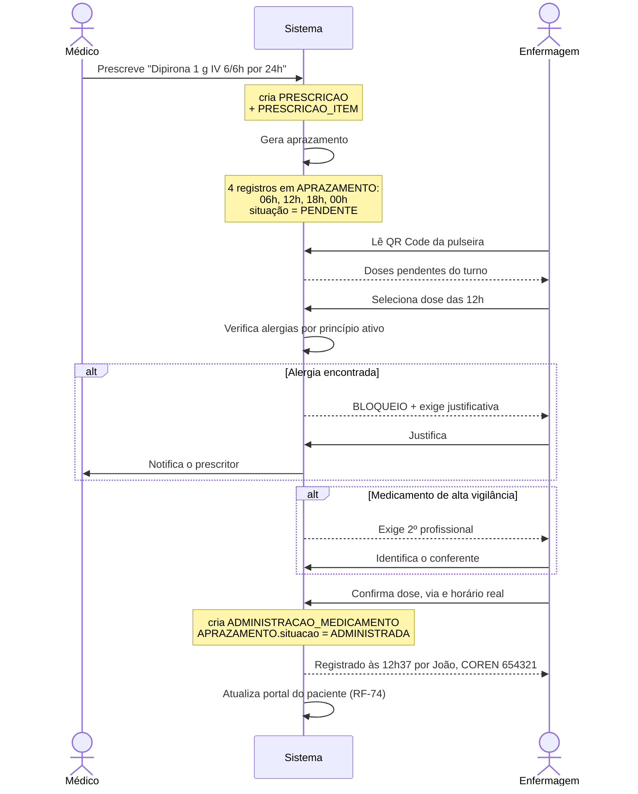

O que a separação em três tabelas permite responder, e uma tabela única não permitiria:

| Pergunta | Consulta |
|---|---|
| Quantas doses foram prescritas e não administradas? | `aprazamento` onde `situacao = 'NAO_ADMINISTRADA'` |
| Qual a pontualidade da equipe? | `administrado_em − horario_previsto`, agregado |
| O paciente recusou medicação? | `motivo_nao_administracao = 'RECUSA_PACIENTE'` |
| Alguma dose foi administrada divergente da prescrita? | `dose_administrada ≠ prescricao_item.dose` |
| Houve administração sobrepondo alerta de alergia? | `alerta_alergia_sobreposto = true` |
| Quem conferiu a insulina do turno da noite? | `checado_por`, filtrado por `alta_vigilancia` |

## 10.3 A conferência dos nove certos

A tela de administração implementa a checagem consagrada de segurança medicamentosa,
apresentada como conferência explícita antes da confirmação:

| # | Certo | Como o sistema apoia |
|---|---|---|
| 1 | **Paciente** certo | Leitura obrigatória do QR Code da pulseira; nome e nascimento exibidos para conferência verbal |
| 2 | **Medicamento** certo | Nome comercial **e** princípio ativo exibidos juntos |
| 3 | **Dose** certa | Dose prescrita em destaque; divergência exige observação (RN-23) |
| 4 | **Via** certa | Via prescrita destacada; troca exige confirmação |
| 5 | **Horário** certo | Horário aprazado versus horário atual; atraso é registrado |
| 6 | **Validade** | Campo de conferência de lote e validade (checagem visual, registrada) |
| 7 | **Orientação** ao paciente | *Checkbox* de orientação prestada |
| 8 | **Forma** farmacêutica certa | Apresentação exibida (comprimido, ampola, frasco) |
| 9 | **Registro** da administração | O próprio ato de salvar; sem ele, a administração não existe |

```
┌──────────────────────────────────────────────────────────────────────────┐
│ CONFERÊNCIA DE ADMINISTRAÇÃO                        Atend. 2026-000148   │
├──────────────────────────────────────────────────────────────────────────┤
│ 1 PACIENTE   MARIA APARECIDA SOUZA · 12/03/1958 · 68a                    │
│              ✔ identificado por leitura de pulseira 12:35                │
├──────────────────────────────────────────────────────────────────────────┤
│ ⚠⚠ ALERTA DE ALERGIA ⚠⚠                                                  │
│ Paciente com alergia GRAVE registrada a DIPIRONA SÓDICA                  │
│ O medicamento prescrito contém este princípio ativo.                     │
│ [ Cancelar administração ]   [ Prosseguir com justificativa ]            │
├──────────────────────────────────────────────────────────────────────────┤
│ 2 MEDICAMENTO  Dipirona 500 mg/mL  (dipirona sódica)                     │
│ 3 DOSE         1000 mg          prescrito: 1000 mg          ✔            │
│ 4 VIA          IV               prescrito: IV               ✔            │
│ 5 HORÁRIO      12:37            aprazado: 12:00        ⚠ +37 min         │
│ 6 VALIDADE     lote [______]  val. [__/____]   ☐ conferido               │
│ 7 ORIENTAÇÃO   ☐ paciente orientado sobre a medicação                    │
│ 8 FORMA        ampola 2 mL                                               │
│ 9 REGISTRO     Enf. João Reis · COREN/SP 654321                          │
└──────────────────────────────────────────────────────────────────────────┘
```

## 10.4 Implementação da administração

```php
<?php
// app/Actions/Medicamento/RegistrarAdministracaoAction.php
namespace App\Actions\Medicamento;

use App\Exceptions\{AlergiaBloqueanteException, DoseJaAdministradaException,
                    DuplaChecagemObrigatoriaException, PrescricaoNaoVigenteException};
use App\Models\{Administracao, Aprazamento, Profissional};
use Illuminate\Support\Facades\DB;

final class RegistrarAdministracaoAction
{
    public function execute(
        Aprazamento $dose,
        Profissional $executor,
        float $doseAdministrada,
        string $via,
        ?Profissional $conferente = null,
        ?string $justificativaAlergia = null,
        ?string $observacao = null,
    ): Administracao {
        $item        = $dose->prescricaoItem;
        $prescricao  = $item->prescricao;
        $atendimento = $prescricao->atendimento;
        $paciente    = $atendimento->paciente;
        $medicamento = $item->medicamento;

        // RN-19: a ordem médica precisa estar vigente
        if ($prescricao->status !== 'VIGENTE' || $item->status !== 'VIGENTE') {
            throw new PrescricaoNaoVigenteException(
                'Prescrição suspensa ou concluída; administração não autorizada.'
            );
        }

        // RN-20: a checagem em código dá mensagem clara; a garantia real é
        // a UNIQUE KEY uk_adm_aprazamento no banco, que resiste a corrida.
        if ($dose->situacao !== 'PENDENTE') {
            throw new DoseJaAdministradaException(
                "Dose já registrada como {$dose->situacao}."
            );
        }

        // RN-21: alergia é verificada por PRINCÍPIO ATIVO
        $alergia = $paciente->alergias()
            ->where(function ($q) use ($medicamento) {
                $q->where('medicamento_id', $medicamento->id)
                  ->orWhere('substancia', 'like', "%{$medicamento->principio_ativo}%");
            })
            ->first();

        if ($alergia && ! $justificativaAlergia) {
            throw new AlergiaBloqueanteException(
                "Paciente com alergia {$alergia->gravidade} a {$alergia->substancia}. "
                . 'Justificativa obrigatória para prosseguir.'
            );
        }

        // RN-22: alta vigilância exige um segundo profissional, distinto do executor
        if ($medicamento->alta_vigilancia
            && ($conferente === null || $conferente->usuario_id === $executor->usuario_id)) {
            throw new DuplaChecagemObrigatoriaException(
                "{$medicamento->nome_comercial} é de alta vigilância: "
                . 'exige conferência por um segundo profissional.'
            );
        }

        return DB::transaction(function () use (
            $dose, $item, $atendimento, $executor, $conferente,
            $doseAdministrada, $via, $justificativaAlergia, $observacao, $alergia
        ) {
            $adm = Administracao::create([
                'aprazamento_id'            => $dose->id,
                'prescricao_item_id'        => $item->id,
                'atendimento_id'            => $atendimento->id,
                'dose_administrada'         => $doseAdministrada,
                'unidade_dose'              => $item->unidade_dose,
                'via'                       => $via,
                'administrado_em'           => now(),   // RN-29: hora do servidor
                'administrado_por'          => $executor->usuario_id,
                'checado_por'               => $conferente?->usuario_id,
                'resultado'                 => 'ADMINISTRADA',
                'alerta_alergia_sobreposto' => (bool) $alergia,
                'justificativa'             => $justificativaAlergia,
                'observacao'                => $observacao,
            ]);

            // Invariante de aplicação: o aprazamento sai de PENDENTE na MESMA transação.
            // Não há trigger — a consistência é garantida pelo escopo transacional,
            // e o teste de integração da §15.2 cobre exatamente este ponto.
            $dose->update(['situacao' => 'ADMINISTRADA']);

            if ($alergia) {
                event(new \App\Events\AlertaAlergiaSobreposto($adm, $alergia));
            }

            if (abs($doseAdministrada - $item->dose) > 0.001) {
                event(new \App\Events\DoseDivergente($adm, $item));   // RN-23
            }

            return $adm;
        });
    }
}
```

Note a diferença de tratamento entre RN-21 e RN-23, que é uma decisão deliberada de
projeto:

| Regra | Situação | Comportamento | Por quê |
|---|---|---|---|
| RN-21 | Alergia registrada | **Bloqueia**, exige justificativa | O sistema tem informação que a enfermagem pode não ter. Bloquear é apropriado |
| RN-23 | Dose divergente da prescrita | **Permite**, sinaliza e notifica | Reduzir dose por instabilidade hemodinâmica é conduta clínica legítima. Bloquear geraria registro falso ou nenhum registro |

Bloquear tudo produz **fadiga de alerta**: a equipe aprende a clicar em "prosseguir" sem
ler, e o alerta que importava perde efeito. O sistema bloqueia pouco e sinaliza muito.

## 10.5 Aprazamento

```php
<?php
// app/Services/Medicamento/AprazamentoService.php
namespace App\Services\Medicamento;

use App\Models\PrescricaoItem;
use Carbon\CarbonImmutable;

final class AprazamentoService
{
    /**
     * Gera os horários previstos a partir da frequência prescrita.
     * Medicação "se necessário" (SOS) NÃO é aprazada: não tem horário previsto.
     */
    public function gerar(PrescricaoItem $item, ?CarbonImmutable $inicio = null): int
    {
        if ($item->se_necessario) {
            return 0;
        }

        $inicio   = $inicio ?? CarbonImmutable::now();
        $duracao  = $item->duracao_horas ?? 24;
        $qtdDoses = (int) floor($duracao / $item->frequencia_horas);

        // Ancoragem em horários redondos: a enfermagem trabalha em rounds de
        // horário fechado. Aprazar 06h/12h/18h/00h em vez de 06h13/12h13/...
        // reduz drasticamente o número de idas ao leito.
        $ancora = $this->proximoHorarioRedondo($inicio, $item->frequencia_horas);

        $registros = [];
        for ($i = 0; $i < $qtdDoses; $i++) {
            $registros[] = [
                'prescricao_item_id' => $item->id,
                'sequencia'          => $i + 1,
                'horario_previsto'   => $ancora->addHours($i * $item->frequencia_horas),
                'situacao'           => 'PENDENTE',
            ];
        }

        $item->aprazamentos()->insert($registros);

        return count($registros);
    }

    private function proximoHorarioRedondo(CarbonImmutable $ref, int $frequenciaHoras): CarbonImmutable
    {
        // Frequências curtas (< 6h) não são ancoradas: a precisão do intervalo
        // importa mais que a conveniência do round.
        if ($frequenciaHoras < 6) {
            return $ref->startOfMinute();
        }

        $grade = match (true) {
            $frequenciaHoras >= 24 => [8],
            $frequenciaHoras >= 12 => [8, 20],
            $frequenciaHoras >=  8 => [6, 14, 22],
            default                => [6, 12, 18, 0],   // 6/6h
        };

        foreach ($grade as $hora) {
            $candidato = $ref->setTime($hora, 0);
            if ($candidato->greaterThan($ref)) {
                return $candidato;
            }
        }

        return $ref->addDay()->setTime($grade[0], 0);
    }
}
```

> **Um detalhe que só aparece em uso real.** A ancoragem em horários redondos é o tipo de
> requisito que não está no enunciado e que a enfermagem descobre no primeiro dia: se
> cada prescrição for aprazada a partir do minuto em que o médico clicou, um enfermeiro
> com 12 pacientes precisa ir ao leito em 40 horários diferentes por turno. Ancorando na
> grade, ele agrupa em quatro *rounds*. Esse é o tipo de decisão que separa um sistema
> usável de um sistema abandonado — e a razão de o campo `horario_previsto` existir
> separado de `administrado_em`.

---

# 11. Módulo Clínica e Exames

## 11.1 Ciclo de vida do exame

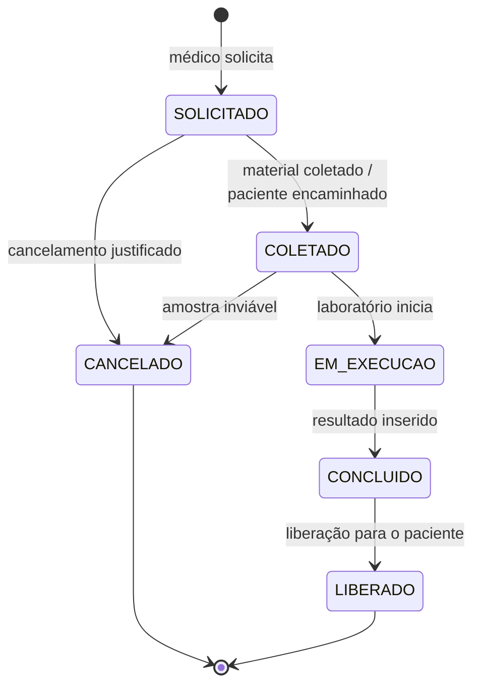

**A separação entre `CONCLUIDO` e `LIBERADO` é a decisão central deste módulo.** Ela
existe porque um resultado disponível não é automaticamente um resultado que o paciente
deve ler sozinho.

| Situação | `CONCLUIDO` | `LIBERADO` |
|---|---|---|
| Resultado existe no sistema | Sim | Sim |
| Visível ao médico solicitante | Sim | Sim |
| Visível ao paciente no portal | **Não** | Sim |
| Portal exibe | "Exame realizado — resultado em análise médica" | O resultado completo |

O `CHECK` `ck_result_liberacao` garante no banco que `visivel_ao_paciente = true` só
existe com `liberado_por` e `liberado_em` preenchidos — a regra não depende de a
aplicação lembrar.

## 11.2 Valores críticos

Um valor crítico é um resultado que exige ação imediata — potássio 7,2 mEq/L, hemoglobina
4 g/dL, troponina elevada. O modelo trata isso em dois níveis:

- `exame_resultado_item.sinalizacao` classifica cada analito individualmente
  (`NORMAL`, `BAIXO`, `ALTO`, `CRITICO`);
- `exame_resultado.possui_valor_critico` é o agregado que aciona a notificação.

```php
<?php
// app/Services/Exame/AvaliadorResultadoService.php
namespace App\Services\Exame;

final class AvaliadorResultadoService
{
    /**
     * Faixas críticas por analito. Em produção, isto é tabela parametrizável
     * validada pelo responsável técnico do laboratório — nunca constante de código.
     */
    private const CRITICOS = [
        'Potássio'    => ['min' => 2.5, 'max' => 6.5, 'unidade' => 'mEq/L'],
        'Sódio'       => ['min' => 120, 'max' => 160, 'unidade' => 'mEq/L'],
        'Hemoglobina' => ['min' => 6.0, 'max' => 20.0,'unidade' => 'g/dL'],
        'Glicose'     => ['min' => 45,  'max' => 500, 'unidade' => 'mg/dL'],
        'Plaquetas'   => ['min' => 20000, 'max' => 1000000, 'unidade' => '/mm³'],
    ];

    public function sinalizar(string $analito, ?float $valor, ?float $refMin, ?float $refMax): string
    {
        if ($valor === null) {
            return 'INDETERMINADO';
        }

        // A faixa crítica tem precedência sobre a faixa de referência:
        // o que importa primeiro é "isto pode matar", não "isto está alterado".
        if (isset(self::CRITICOS[$analito])) {
            $c = self::CRITICOS[$analito];
            if ($valor <= $c['min'] || $valor >= $c['max']) {
                return 'CRITICO';
            }
        }

        return match (true) {
            $refMin !== null && $valor < $refMin => 'BAIXO',
            $refMax !== null && $valor > $refMax => 'ALTO',
            default                              => 'NORMAL',
        };
    }
}
```

**RN-25 tem uma consequência de fluxo que merece destaque:** resultado com valor crítico
**não pode ser liberado ao paciente antes da ciência do médico solicitante**. O
raciocínio é o mesmo do campo `sigiloso` do prontuário — receber "Potássio 7,2 (CRÍTICO)"
por notificação de celular, sem contexto e sem ninguém para perguntar, produz pânico sem
produzir cuidado. O sistema, nesse caso, notifica o médico com prioridade máxima e
mantém o resultado fora do portal até a liberação explícita.

## 11.3 Resultado estruturado e anexos

A tabela `exame_resultado_item` armazena cada analito como uma linha, com valor, unidade
e faixa de referência. Isso é o que permite:

- **Série temporal.** "Mostre a evolução da hemoglobina deste paciente" atravessa todos
  os atendimentos, com um `JOIN` simples.
- **Faixa de referência versionada.** A referência fica gravada **no resultado**, não
  apenas no catálogo. Se o laboratório mudar o método e a faixa, resultados antigos
  continuam interpretáveis pela referência vigente no momento em que foram produzidos.
- **Comparação automática.** A sinalização é calculada, não digitada.

Exames de imagem não têm analitos: usam `laudo` e `conclusao` em texto, mais anexos em
`exame_anexo`. Cada anexo guarda o `hash_sha256` do arquivo — se o PDF do laudo for
substituído no armazenamento, a divergência de hash denuncia. O sistema **não** armazena
imagens DICOM (§1.3.2): isso é função de um PACS, e reimplementá-lo seria erro de escopo.

---

# 12. Portal do Paciente

## 12.1 Escopo estritamente somente-leitura

O portal é o módulo com a maior superfície de exposição do sistema: é o único acessível
da internet pública, por dispositivo não gerenciado, por usuário sem treinamento. A
resposta arquitetural é reduzir o que ele **pode fazer** a praticamente nada.

O guard `paciente` não tem acesso a nenhuma rota de escrita, exceto a troca da própria
senha (RN-27). Isso não é implementado por verificação no controller — é implementado por
**ausência de rota**:

```php
<?php
// routes/portal.php — arquivo completo. Não existe rota POST de dado clínico.
use Illuminate\Support\Facades\Route;

Route::middleware(['guest:paciente'])->group(function () {
    Route::get ('/portal/entrar',  [PortalLoginController::class, 'form'])->name('portal.login');
    Route::post('/portal/entrar',  [PortalLoginController::class, 'autenticar'])
        ->middleware('throttle:portal-login');
});

Route::middleware(['auth:paciente'])->group(function () {

    // RN-06: enquanto a senha for provisória, só existe a tela de troca
    Route::middleware('senha.provisoria')->group(function () {
        Route::get ('/portal/senha', [SenhaController::class, 'form'])->name('portal.senha');
        Route::post('/portal/senha', [SenhaController::class, 'atualizar']);
    });

    // Somente leitura. Todas GET. Sem exceção.
    Route::middleware('senha.definitiva')->group(function () {
        Route::get('/portal',                     [AcompanhamentoController::class, 'index'])->name('portal.acompanhamento');
        Route::get('/portal/atendimento/{uuid}',  [AcompanhamentoController::class, 'atendimento']);
        Route::get('/portal/medicamentos',        [AcompanhamentoController::class, 'medicamentos']);
        Route::get('/portal/exames',              [AcompanhamentoController::class, 'exames']);
        Route::get('/portal/historico',           [AcompanhamentoController::class, 'historico']);
    });

    Route::post('/portal/sair', [PortalLoginController::class, 'sair'])->name('portal.sair');
});
```

Toda consulta é filtrada pelo paciente autenticado no próprio *global scope* do model, de
modo que esquecer o `where` em um controller não vaza dado de outro paciente:

```php
<?php
// app/Models/Scopes/DoPacienteAutenticadoScope.php
namespace App\Models\Scopes;

use Illuminate\Database\Eloquent\{Builder, Model, Scope};

final class DoPacienteAutenticadoScope implements Scope
{
    public function apply(Builder $builder, Model $model): void
    {
        if ($paciente = auth('paciente')->user()) {
            // RN-26: defesa em profundidade — nem um bug de controller vaza dado alheio
            $builder->where($model->getTable() . '.paciente_id', $paciente->id);
        }
    }
}
```

## 12.2 Análise crítica: CPF como login e data de nascimento como senha

O requisito R-01 é explícito e será atendido. Mas ele merece uma avaliação honesta,
porque é a fragilidade de segurança mais séria do sistema — e reconhecê-la, quantificá-la
e mitigá-la é mais valioso que implementá-la sem comentário.

### 12.2.1 O problema, quantificado

**Sobre o login.** O CPF não é segredo. Ele consta de contratos, cadastros comerciais,
fichas escolares e de inúmeros vazamentos de dados brasileiros de grande escala. Tratar
o CPF como identificador é correto; tratá-lo como fator de autenticação seria erro. Aqui
ele é só identificador — o que está adequado.

**Sobre a senha.** É aqui que o problema mora. O espaço de busca de uma data de
nascimento é minúsculo:

| Cenário do atacante | Espaço de busca | Tentativas para sucesso garantido |
|---|---|---|
| Nenhuma informação sobre a vítima (110 anos possíveis) | **40.150** datas | 40.150 |
| Sabe a década (aparência, contexto) | 3.650 | 3.650 |
| Sabe o ano | 365 | 365 |
| É familiar, vizinho, colega — ou viu a pulseira | **1** | **1** |

Para comparação, uma senha de 8 caracteres alfanuméricos tem 2,2 × 10¹⁴ combinações —
**5,4 bilhões de vezes** maior que 40.150. Uma data de nascimento equivale a cerca de
**15,3 bits** de entropia. O piso normalmente aceito para senha de baixo risco é 40 bits.

E há o agravante estrutural: **a data de nascimento está impressa na pulseira** (§8.4), e
está lá por uma razão de segurança do paciente que não se pode abrir mão. Ou seja: quem
tem acesso visual à pulseira tem a senha. Não é uma senha — é um dado público do
paciente.

### 12.2.2 O requisito contém a própria solução

A observação que resolve o problema está no próprio enunciado do sistema: **"Ao ler o QR
Code, o próprio paciente poderá acessar uma área de acompanhamento utilizando seu login e
senha."**

O acesso é iniciado pela **leitura do QR Code**. E o token do QR Code tem **131 bits de
entropia** (§8.2.2). Ou seja: o fluxo especificado já contém, naturalmente, um **fator de
posse** criptograficamente forte. Basta reconhecê-lo como tal.

| Fator | Elemento | Entropia | Natureza |
|---|---|---|---|
| Posse | Token da pulseira | **131 bits** | Algo que o paciente **tem** |
| Conhecimento | Data de nascimento | 15,3 bits | Algo que o paciente **sabe** |

Combinados, os dois exigem do atacante **posse física da pulseira** *e* conhecimento da
data. Isso transforma um esquema fraco em um esquema de dois fatores respeitável — sem
alterar em nada a experiência do paciente, que continua escaneando e digitando os mesmos
dois campos.

A implementação é direta: a rota de login só aceita CPF + data de nascimento quando a
sessão carrega um `pulseira_token` válido, colocado ali pelo redirecionamento do
`PulseiraController` (§8.3).

### 12.2.3 Mitigações propostas

| # | Mitigação | Efeito |
|---|---|---|
| M-1 | **Troca obrigatória no primeiro acesso** (RF-07, RN-06) | Reduz a janela de exposição da senha fraca a um único login |
| M-2 | **Senha inicial com validade** — expira em 72 h ou ao fim do atendimento, o que vier primeiro | Uma pulseira de três meses atrás não serve mais como credencial |
| M-3 | **Token da pulseira como fator de posse** (§12.2.2) | Eleva a entropia efetiva do primeiro acesso de 15,3 para 146 bits |
| M-4 | **Limitação de taxa com bloqueio progressivo** | 3 tentativas → 1 min · 5 → 15 min · 8 → 1 h · 10 → bloqueio até desbloqueio na recepção |
| M-5 | **Limitação por IP além de por conta** | Impede varredura de muitos CPFs de uma mesma origem |
| M-6 | **Mensagem de erro genérica** | "Credenciais inválidas" nunca revela se o CPF existe no cadastro |
| M-7 | **Comparação em tempo constante** e custo uniforme para CPF inexistente | Elimina o oráculo por tempo de resposta |
| M-8 | **Notificação de acesso** ao telefone cadastrado | Dá ao paciente a chance de perceber acesso indevido |
| M-9 | **Escopo temporal do portal** — acesso durante o atendimento e por 30 dias após a alta | Reduz a superfície permanentemente exposta |
| M-10 | **Segundo fator opcional por SMS** para acesso sem a pulseira | Permite acesso de casa mantendo dois fatores |
| M-11 | **Registro em auditoria de toda tentativa**, bem-sucedida ou não | Detecção de padrão de ataque |
| M-12 | **Recusa de senha fraca na troca** — mínimo 8 caracteres e rejeição da própria data de nascimento, do CPF e de listas de senhas vazadas | Impede que o paciente "troque" para a mesma senha |

```php
<?php
// app/Http/Controllers/Portal/PortalLoginController.php
namespace App\Http\Controllers\Portal;

use App\Models\Paciente;
use App\Services\Auditoria\AuditoriaService;
use Illuminate\Http\Request;
use Illuminate\Support\Facades\{Auth, Hash, RateLimiter};

final class PortalLoginController extends Controller
{
    public function __construct(private AuditoriaService $auditoria) {}

    public function autenticar(Request $request)
    {
        $dados = $request->validate([
            'cpf'   => ['required', 'digits:11'],
            'senha' => ['required', 'string'],
        ]);

        // M-4 e M-5: limitação por conta E por origem
        $chaveConta = 'portal:cpf:' . $dados['cpf'];
        $chaveIp    = 'portal:ip:'  . $request->ip();

        foreach ([[$chaveConta, 10], [$chaveIp, 30]] as [$chave, $limite]) {
            if (RateLimiter::tooManyAttempts($chave, $limite)) {
                $this->auditoria->registrar('LOGIN_BLOQUEADO', dados: ['chave' => $chave]);

                return back()->withErrors([
                    'cpf' => 'Muitas tentativas. Aguarde ' .
                             RateLimiter::availableIn($chave) .
                             ' segundos ou procure a recepção.',
                ]);
            }
        }

        $paciente = Paciente::where('cpf', $dados['cpf'])->first();

        // M-7: mesmo custo computacional quando o CPF não existe, para não
        // criar oráculo por tempo de resposta.
        $hashComparacao = $paciente?->usuario->senha_hash
            ?? '$argon2id$v=19$m=65536,t=4,p=1$c2FsZ29mYWtl$ZmFrZWhhc2hmYWtlaGFzaA';

        $senhaCorreta = Hash::check($dados['senha'], $hashComparacao);

        if (! $paciente || ! $senhaCorreta) {
            RateLimiter::hit($chaveConta, decaySeconds: 900);
            RateLimiter::hit($chaveIp,    decaySeconds: 900);
            $this->auditoria->registrar('LOGIN_FALHA', dados: ['cpf' => $dados['cpf']]);

            // M-6: mensagem idêntica para CPF inexistente e senha errada
            return back()->withErrors(['cpf' => 'Credenciais inválidas.']);
        }

        // M-3: primeiro acesso com senha provisória exige a posse da pulseira
        if ($paciente->usuario->senha_provisoria) {
            $token = $request->session()->get('pulseira_token');

            if ($token !== $paciente->token_pulseira) {
                return back()->withErrors([
                    'cpf' => 'No primeiro acesso, escaneie o QR Code da sua pulseira.',
                ]);
            }

            // M-2: a senha provisória tem prazo
            if ($paciente->usuario->created_at->addHours(72)->isPast()) {
                return back()->withErrors([
                    'cpf' => 'Senha inicial expirada. Solicite uma nova na recepção.',
                ]);
            }
        }

        // M-9: escopo temporal do acesso
        if (! $paciente->possuiAcessoVigente()) {
            return back()->withErrors([
                'cpf' => 'Acesso disponível durante o atendimento e por 30 dias após a alta.',
            ]);
        }

        RateLimiter::clear($chaveConta);
        Auth::guard('paciente')->login($paciente->usuario);
        $request->session()->regenerate();   // proteção contra fixação de sessão

        $this->auditoria->registrar('LOGIN', paciente: $paciente);
        event(new \App\Events\AcessoPortalRealizado($paciente, $request->ip()));  // M-8

        return $paciente->usuario->senha_provisoria
            ? redirect()->route('portal.senha')          // RN-06
            : redirect()->route('portal.acompanhamento');
    }
}
```

### 12.2.4 A alternativa que seria melhor, e por que não foi adotada

O esquema tecnicamente superior seria abandonar a senha e usar **acesso por link mágico**
com código de uso único enviado ao telefone cadastrado: sem senha para vazar, sem senha
para esquecer, sem senha para o paciente idoso anotar num papel dentro da carteira.

Não foi adotado por três razões concretas:

1. **O requisito R-01 é explícito** e vem do cliente.
2. **Depende de telefone cadastrado e válido** — que frequentemente não existe em
   atendimento de urgência, exatamente quando o portal é mais útil.
3. **Depende de sinal de celular e de crédito**, dentro de um hospital, onde a recepção
   costuma ser ruim.

O caminho recomendado é **híbrido**, e é o que a modelagem prevê: CPF + data de
nascimento + posse da pulseira no primeiro acesso (M-3), senha definida pelo paciente
depois (M-1, M-12), e código por SMS como alternativa opcional para quem perdeu a
pulseira (M-10).

> **Este é o argumento central da seção, e vale enunciá-lo com clareza:** um requisito
> aparentemente inseguro pode se tornar seguro quando se identifica que o próprio fluxo
> especificado — a leitura do QR Code — já carrega um fator de autenticação forte que
> ninguém havia nomeado como tal. Não foi preciso contrariar o cliente; foi preciso ler
> o requisito inteiro.

## 12.3 Telas do portal

```
┌────────────────────────────────────────────────────────────────────────┐
│  Olá, Maria                                            [ Sair ]        │
├────────────────────────────────────────────────────────────────────────┤
│  ┌──────────────────────────────────────────────────────────────────┐  │
│  │  🟠  SUA SITUAÇÃO AGORA                                          │  │
│  │                                                                  │  │
│  │      Aguardando realização de exame                              │  │
│  │                                                                  │  │
│  │      Prioridade: Muito urgente                                   │  │
│  │      Profissional: Dr. Ana Costa                                 │  │
│  │      Você está no hospital desde 14:07 (2 h 35 min)              │  │
│  └──────────────────────────────────────────────────────────────────┘  │
│                                                                        │
│  LINHA DO TEMPO DO SEU ATENDIMENTO                                     │
│  ●  14:07   Você chegou ao hospital                                    │
│  ●  14:22   Avaliação inicial realizada — prioridade laranja           │
│  ●  14:31   Chamada para atendimento com Dr. Ana Costa                 │
│  ●  15:05   Medicação administrada                                     │
│  ●  15:40   Exames solicitados                                         │
│  ○  agora   Aguardando realização de exame                             │
│                                                                        │
│  MEDICAMENTOS QUE VOCÊ RECEBEU                                         │
│  15:05   Dipirona 1000 mg · na veia · Enf. João Reis                   │
│                                                                        │
│  SEUS EXAMES                                                           │
│  ✔ Hemograma completo    coletado 15:52 · resultado liberado  [ ver ]  │
│  ⏳ Ultrassom de abdome   solicitado 15:40 · aguardando realização      │
│  ⏳ PCR                   coletado 15:52 · resultado em análise médica  │
│                                                                        │
│  [ Ver atendimentos anteriores ]                                       │
└────────────────────────────────────────────────────────────────────────┘
```

Quatro decisões de design de conteúdo, todas voltadas a reduzir ansiedade — que é o
verdadeiro problema que o portal resolve:

1. **Linguagem acessível, não jargão.** "Aguardando realização de exame", não
   `AGUARDANDO_EXAME`. É o que o método `rotuloPaciente()` do enum entrega.
2. **"na veia" em vez de "IV".** A via de administração é traduzida.
3. **O tempo decorrido é exibido, a previsão não.** Prometer "faltam 20 minutos" e não
   cumprir é pior que não prometer. A honestidade do dado é o que sustenta a confiança.
4. **Resultado não liberado aparece como "em análise médica", não como ausência.** O
   paciente sabe que o exame foi feito e que alguém está olhando. Omitir sem explicar
   geraria a suspeita de que o sistema está escondendo algo.

---

# 13. Arquitetura de software

## 13.1 Stack tecnológica

| Camada | Tecnologia | Versão | Justificativa |
|---|---|---|---|
| Linguagem | PHP | 8.3+ | Requisito mínimo do Laravel 13. Tipos, enums e *readonly properties* dão segurança ao domínio |
| Framework | **Laravel** | **13** | Versão atual (13.9, agosto/2026). O Laravel 12 saiu do período de correção de bugs em 13/08/2026 — iniciar um projeto nele seria começar em versão sem manutenção |
| Interface | **Livewire 4 + Flux UI** | starter kit oficial | Renderização no servidor com reatividade, sem SPA. Ver §13.2 |
| Banco de dados | MySQL | 8.4 LTS | Requisito do projeto. Ver observação de portabilidade na §5.5 |
| Autenticação | Laravel Fortify | — | Base dos starter kits oficiais do Laravel 13; suporta 2FA nativamente (útil para M-10) |
| Autorização | Policies + Gates nativos | — | Suficiente para o modelo RBAC da §2.3, sem dependência externa |
| QR Code | `endroid/qr-code` | 5.x | Controle explícito de nível de correção de erro e margem — necessário para o dimensionamento da §8.5 |
| PDF | `barryvdh/laravel-dompdf` | 3.x | Geração da pulseira e exportação do prontuário |
| Fila de jobs | Redis + Horizon | — | Notificações, aprazamento, verificação de integridade da cadeia de hash |
| Tempo real | `wire:poll` no MVP → Laravel Reverb | — | Ver §7.7 |
| Testes | Pest | 4.x | Sintaxe concisa; boa integração com Laravel |

**Por que Livewire e não React/Inertia.** Os quatro starter kits do Laravel 13 (React,
Vue, Svelte, Livewire) são todos viáveis, mas o perfil deste sistema aponta para
Livewire:

| Critério | Peso neste sistema | Livewire | React/Inertia |
|---|---|---|---|
| Muitos formulários CRUD, pouca interação complexa | Alto | Ideal | Excesso de cerimônia |
| Estado de verdade sempre no servidor (dado clínico) | **Crítico** | Natural | Exige sincronização e duplicação de validação |
| Equipe pequena, uma linguagem só | Alto | Vantagem | Exige competência em dois ecossistemas |
| Funcionamento em rede hospitalar instável | Alto | HTML pequeno por requisição | *Bundle* JS grande no primeiro carregamento |
| Trabalho acadêmico com prazo | **Crítico** | Menos superfície | Mais superfície |
| Interatividade rica offline | Baixo | Limitação | Vantagem |

Em sistema clínico, duplicar validação no cliente é passivo de segurança: a validação
que vale é a do servidor, e ter uma segunda no cliente cria a possibilidade de
divergirem. Livewire elimina a duplicação por construção.

## 13.2 Organização em camadas

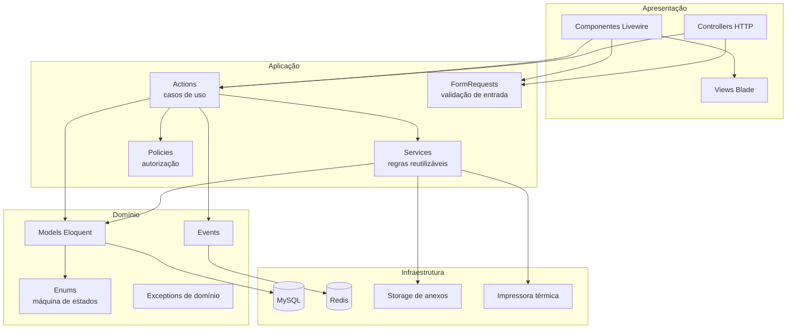

**A regra que sustenta a arquitetura: nenhuma escrita de dado clínico acontece fora de
uma Action.** Componentes Livewire e controllers não chamam `Model::create()` diretamente
para dado clínico. Isso concentra em um lugar auditável: a transação, a validação de
regra de negócio, o registro em auditoria e a emissão do evento.

## 13.3 Estrutura de diretórios

```
app/
├── Actions/                        # Um caso de uso por classe, método execute()
│   ├── Paciente/
│   │   ├── CadastrarPacienteAction.php       # UC-01 (transação: paciente + usuário + token)
│   │   ├── UnificarCadastrosAction.php       # RF-10
│   │   └── RegularizarIdentificacaoAction.php # RN-30
│   ├── Atendimento/
│   │   ├── AbrirAtendimentoAction.php        # UC-03
│   │   ├── AlterarStatusAction.php           # UC-06 — máquina de estados
│   │   └── FinalizarAtendimentoAction.php    # desfecho obrigatório
│   ├── Triagem/
│   │   ├── RealizarTriagemAction.php         # UC-04
│   │   └── ReclassificarRiscoAction.php      # UC-16
│   ├── Fila/
│   │   ├── AtribuirProfissionalAction.php    # UC-05
│   │   └── TransferirFilaAction.php          # UC-17
│   ├── Prontuario/
│   │   ├── RegistrarNotaClinicaAction.php    # UC-08
│   │   └── RetificarRegistroAction.php       # RN-16
│   ├── Medicamento/
│   │   ├── PrescreverAction.php              # UC-09
│   │   ├── RegistrarAdministracaoAction.php  # UC-10
│   │   └── SuspenderPrescricaoAction.php
│   └── Exame/
│       ├── SolicitarExameAction.php          # UC-11
│       ├── RegistrarResultadoAction.php      # UC-12
│       └── LiberarResultadoAction.php        # UC-13
├── Enums/
│   ├── StatusAtendimento.php                 # máquina de estados (§6.3)
│   ├── CorPrioridade.php
│   ├── ViaAdministracao.php
│   ├── TipoRegistroClinico.php
│   └── SituacaoEspera.php
├── Events/
│   ├── StatusAtendimentoAlterado.php
│   ├── EmergenciaDetectada.php
│   ├── AlertaAlergiaSobreposto.php
│   ├── ValorCriticoDetectado.php
│   └── ReimpressaoPulseiraNecessaria.php
├── Exceptions/
│   ├── TransicaoInvalidaException.php
│   ├── RegistroImutavelException.php
│   ├── AlergiaBloqueanteException.php
│   ├── DoseJaAdministradaException.php
│   └── DuplaChecagemObrigatoriaException.php
├── Http/
│   ├── Controllers/
│   │   ├── PulseiraController.php            # resolução do QR Code (§8.3)
│   │   └── Portal/
│   ├── Middleware/
│   │   ├── SenhaProvisoria.php               # RN-06
│   │   ├── RegistrarAuditoria.php
│   │   └── ExigirVinculoAssistencial.php     # RN-28
│   └── Requests/
├── Livewire/
│   ├── Paciente/{Cadastro,Busca,Ficha}.php
│   ├── Atendimento/{Timeline,PainelStatus}.php
│   ├── Fila/{PainelProfissional,TelaAtribuicao}.php   # wire:poll.10s
│   ├── Prontuario/{Editor,Historico}.php
│   ├── Medicamento/{Prescricao,ChecklistTurno}.php
│   └── Exame/{Solicitacao,Laudo}.php
├── Models/
│   ├── Scopes/DoPacienteAutenticadoScope.php # §12.1
│   ├── Usuario.php · Paciente.php · Profissional.php
│   ├── Atendimento.php · Triagem.php · FilaItem.php · SinalVital.php
│   ├── RegistroClinico.php                   # save() sobrescrito — imutável
│   ├── Prescricao.php · PrescricaoItem.php · Aprazamento.php · Administracao.php
│   └── ExameSolicitacao.php · ExameResultado.php
├── Policies/
│   ├── PacientePolicy.php                    # inclui o "mínimo vital" da §8.3
│   ├── AtendimentoPolicy.php
│   ├── RegistroClinicoPolicy.php
│   └── PrescricaoPolicy.php
└── Services/
    ├── Pulseira/{TokenPulseiraService,GerarPulseiraService}.php
    ├── Fila/{OrdenacaoService,BalanceamentoService,AvaliadorEsperaService}.php
    ├── Prontuario/HashEncadeadoService.php
    ├── Medicamento/{AprazamentoService,VerificadorAlergiaService}.php
    ├── Exame/AvaliadorResultadoService.php
    └── Auditoria/AuditoriaService.php
```

## 13.4 Autenticação com múltiplos guards

```php
<?php
// config/auth.php (extrato)
return [
    'guards' => [
        // Equipe: sessão de 30 min, 2FA disponível (RNF-10)
        'web' => [
            'driver'   => 'session',
            'provider' => 'profissionais',
        ],
        // Paciente: guard separado, sessão de 15 min, escopo somente leitura (RNF-09)
        'paciente' => [
            'driver'   => 'session',
            'provider' => 'pacientes',
        ],
    ],

    'providers' => [
        'profissionais' => [
            'driver' => 'eloquent',
            'model'  => App\Models\Usuario::class,
        ],
        'pacientes' => [
            'driver' => 'eloquent',
            'model'  => App\Models\Usuario::class,
        ],
    ],

    'passwords' => [
        'pacientes' => ['provider' => 'pacientes', 'table' => 'password_reset_tokens', 'expire' => 30],
    ],
];
```

**Por que dois guards e não um com verificação de papel.** Guards separados dão
**isolamento de sessão**: o cookie de sessão do paciente não é o mesmo do profissional.
Uma consequência prática relevante: um médico logado no mesmo navegador em que um paciente
acessou o portal não corre risco de confusão de contexto — e nenhuma rota de escrita da
equipe é alcançável a partir de uma sessão de paciente, mesmo que uma Policy falhe.

## 13.5 Exemplo de Policy — o acesso mínimo vital

```php
<?php
// app/Policies/PacientePolicy.php
namespace App\Policies;

use App\Models\{Paciente, Usuario};

final class PacientePolicy
{
    /**
     * Contexto clínico completo: exige vínculo assistencial (RN-28).
     */
    public function verContexto(Usuario $usuario, Paciente $paciente): bool
    {
        if ($usuario->ehAdmin()) {
            return true;
        }

        return $paciente->atendimentos()
            ->where(function ($q) use ($usuario) {
                $q->where('profissional_responsavel_id', $usuario->id)
                  ->orWhereHas('filaItens', fn ($f) => $f->where('profissional_id', $usuario->id))
                  ->orWhereHas('registrosClinicos', fn ($r) => $r->where('autor_id', $usuario->id))
                  ->orWhereHas('prescricoes', fn ($p) => $p->where('prescrito_por', $usuario->id));
            })
            ->exists();
    }

    /**
     * Mínimo vital: nome e ALERGIAS, liberados a qualquer profissional em plantão.
     *
     * Decisão de projeto deliberada. Negar a lista de alergias a um médico que
     * atende uma parada cardíaca no corredor, em nome do sigilo, seria uma
     * escolha de projeto com potencial letal. O acesso é amplo; o registro em
     * auditoria é integral.
     */
    public function verMinimoVital(Usuario $usuario, Paciente $paciente): bool
    {
        return $usuario->profissional?->emPlantao() ?? false;
    }

    /**
     * Quebra de sigilo: permitida com justificativa, sempre auditada (RN-28).
     */
    public function quebrarSigilo(Usuario $usuario, Paciente $paciente): bool
    {
        return $usuario->profissional?->emPlantao()
            && $usuario->temPermissao('prontuario.quebra_sigilo');
    }
}
```

---

# 14. Segurança, LGPD e conformidade

## 14.1 Enquadramento na LGPD

Dado de saúde é **dado pessoal sensível** (Lei 13.709/2018, art. 5º, II), sujeito ao
regime restritivo do art. 11. Isso muda o que o sistema precisa fazer:

| Aspecto | Enquadramento neste sistema |
|---|---|
| **Base legal do tratamento assistencial** | Art. 11, II, "a" — **tutela da saúde**, em procedimento realizado por profissionais de saúde ou serviços de saúde. Não depende de consentimento |
| **Base legal do portal do paciente** | Art. 11, II, "a", e art. 18, II — direito de acesso do titular |
| **Papel da instituição** | Controladora dos dados |
| **Papel dos profissionais** | Operam sob a controladora, não são controladores autônomos |
| **Vedação relevante** | Art. 11, § 4º — proibida a comunicação de dado de saúde para obtenção de vantagem econômica |
| **Prazo de retenção** | Prevalece a obrigação legal: 20 anos do último registro (Lei 13.787/2018, art. 6º). A retenção **não** é afastada por pedido de eliminação do titular |

> **O ponto que a maioria dos trabalhos erra.** O consentimento **não** é a base legal do
> tratamento assistencial. Pedir consentimento para tratar dado de saúde em atendimento
> de urgência seria juridicamente equivocado e operacionalmente absurdo — e criaria a
> falsa impressão de que o paciente pode revogá-lo e ter o prontuário apagado. Ele não
> pode: a guarda de 20 anos é obrigação legal do estabelecimento, e o art. 16, I, da LGPD
> autoriza expressamente a conservação para cumprimento de obrigação legal.

## 14.2 Controles técnicos

| Categoria | Controle | Implementação |
|---|---|---|
| Autenticação | Hash Argon2id | `PASSWORD_ARGON2ID`; nunca MD5/SHA1 puro |
| Autenticação | 2FA para a equipe | Laravel Fortify |
| Autenticação | Bloqueio progressivo | `RateLimiter`, §12.2.3 |
| Sessão | Regeneração de ID no login | `session()->regenerate()` |
| Sessão | Cookies `HttpOnly`, `Secure`, `SameSite=Lax` | `config/session.php` |
| Sessão | Expiração por inatividade | 30 min equipe · 15 min paciente |
| Transporte | TLS 1.3 obrigatório, HSTS | Servidor web |
| Autorização | RBAC + Policies por recurso | §2.3, §13.5 |
| Autorização | Escopo global por paciente autenticado | §12.1 |
| Minimização | Pulseira sem CPF, CNS ou CID | §8.4 |
| Minimização | Portal sem registro sigiloso | RF-77 |
| Integridade | Cadeia de hash SHA-256 no prontuário | §9.4 |
| Integridade | `hash_sha256` em cada anexo | `exame_anexo` |
| Integridade | Privilégios de banco sem `UPDATE`/`DELETE` em tabelas append-only | §9.1 |
| Rastreabilidade | Auditoria de leitura **e** escrita | §14.3 |
| Injeção | *Query builder* parametrizado; sem SQL concatenado | Eloquent |
| XSS | Escape automático do Blade; sem `{!! !!}` em dado de usuário | Convenção |
| CSRF | Token em todo formulário | Middleware nativo |
| Upload | Validação de MIME e extensão; anexos fora do *document root* | `storage/app/private` |
| Backup | Diário cifrado, com teste periódico de restauração | Rotina operacional |

## 14.3 Auditoria de leitura — o controle mais negligenciado

Auditar escrita é intuitivo. Auditar **leitura** é o que efetivamente protege dado de
saúde, porque o dano típico não é alteração: é *bisbilhotagem*. O caso clássico é o
funcionário que consulta o prontuário de um vizinho, de um colega ou de uma pessoa
pública. Sem log de leitura, isso é indetectável e, portanto, impune.

```php
<?php
// app/Services/Auditoria/AuditoriaService.php
namespace App\Services\Auditoria;

use App\Models\{Atendimento, AuditoriaLog, Paciente};
use Illuminate\Support\Facades\{Auth, Request};

final class AuditoriaService
{
    public function registrar(
        string $acao,
        ?Paciente $paciente = null,
        ?Atendimento $atendimento = null,
        ?string $entidade = null,
        ?int $entidadeId = null,
        ?array $antes = null,
        ?array $depois = null,
        ?string $justificativa = null,
    ): void {
        $usuario = Auth::user();

        AuditoriaLog::create([
            'usuario_id'        => $usuario?->id,
            // Snapshot dos perfis: perfis mudam, o log não pode mudar com eles
            'perfis_no_momento' => $usuario?->perfis->pluck('nome')->implode(','),
            'acao'              => $acao,
            'entidade'          => $entidade,
            'entidade_id'       => $entidadeId,
            'paciente_id'       => $paciente?->usuario_id,
            'atendimento_id'    => $atendimento?->id,
            'justificativa'     => $justificativa,
            'dados_antes'       => $antes  ? $this->mascarar($antes)  : null,
            'dados_depois'      => $depois ? $this->mascarar($depois) : null,
            'ip'                => Request::ip(),
            'user_agent'        => substr((string) Request::userAgent(), 0, 255),
            'criado_em'         => now(),
        ]);
    }

    /**
     * O log de auditoria não deve replicar o dado sensível integralmente:
     * isso criaria uma segunda base com o mesmo risco e sem os mesmos controles.
     */
    private function mascarar(array $dados): array
    {
        foreach (['senha_hash', 'token_pulseira', 'cpf', 'cns'] as $campo) {
            if (array_key_exists($campo, $dados)) {
                $dados[$campo] = '[REMOVIDO]';
            }
        }

        return $dados;
    }
}
```

O índice `ix_audit_paciente (paciente_id, criado_em)` existe para uma consulta específica,
que a instituição precisa saber responder em minutos:

```sql
-- "Quem acessou os dados desta paciente nos últimos 90 dias?"
-- (requisição de titular, LGPD art. 18; ou investigação de vazamento)
SELECT a.criado_em, u.login, p.nome_completo AS profissional,
       a.perfis_no_momento, a.acao, a.entidade, a.justificativa, a.ip
FROM auditoria_log a
LEFT JOIN usuario u      ON u.id = a.usuario_id
LEFT JOIN profissional p ON p.usuario_id = a.usuario_id
WHERE a.paciente_id = ?
  AND a.criado_em >= NOW() - INTERVAL 90 DAY
ORDER BY a.criado_em DESC;
```

## 14.4 Política de retenção

| Dado | Retenção | Fundamento |
|---|---|---|
| Prontuário e registros clínicos | **≥ 20 anos do último registro** | Lei 13.787/2018, art. 6º |
| Prontuário de menor de idade | 20 anos **contados do 18º aniversário** | Interpretação protetiva do prazo prescricional |
| Trilha de auditoria | Igual ao prontuário a que se refere | Sem o log, o prontuário perde a autenticidade que a Lei 13.787 exige |
| Dados cadastrais administrativos | Enquanto houver prontuário vinculado | Sem o cadastro, o prontuário fica órfão e inútil |
| Anexos de exame | Igual ao prontuário | Integram o registro clínico |
| Sessões e tokens expirados | 30 dias | Sem valor após expirar |
| Logs de acesso de infraestrutura | 6 meses | Marco Civil da Internet, art. 15 (aplicável ao provedor de aplicação) |

**Consequência arquitetural da retenção de 20 anos:** o esquema precisa suportar
migração de versão ao longo de duas décadas. Isso é o que fundamenta três decisões já
tomadas: os *snapshots* de autor (`autor_nome`, `autor_conselho`, `perfis_no_momento`),
que preservam o significado do registro mesmo depois de o cadastro do profissional
mudar; a exclusão sempre lógica (D-08); e a preferência por dados de domínio em tabela
(`classificacao_risco`) em vez de constantes de código, para que o protocolo de triagem
vigente em 2026 continue interpretável em 2046.

---

# 15. Estratégia de testes

## 15.1 Pirâmide de testes

| Nível | Cobertura | Ferramenta | O que valida |
|---|---|---|---|
| **Unitário** | Enums, Services puros, cálculos | Pest | Máquina de estados, ordenação da fila, geração de token, cadeia de hash, aprazamento, idade derivada |
| **Integração** | Actions com banco | Pest + `RefreshDatabase` | Transações completas, constraints do banco, eventos emitidos |
| **Funcional** | Fluxos HTTP e Livewire | Pest + `Livewire::test` | Autorização, escopo do portal, resolução do QR Code |
| **Schema** | DDL executável | `verificacao/testes_schema.sh` | As 18 restrições `CHECK` e os índices únicos (§5.4) |

RNF-19 exige ≥ 80 % de cobertura na camada de domínio — `app/Actions`, `app/Services`,
`app/Enums`. Cobertura de *views* não é meta: gera número alto sem valor.

## 15.2 Casos de teste críticos

Os testes abaixo são os que **precisam** existir. Cada um corresponde a uma regra cuja
violação causa dano real.

```php
<?php
// tests/Unit/StatusAtendimentoTest.php
use App\Enums\StatusAtendimento as S;

it('recusa transição a partir de estado terminal', function () {
    expect(S::Finalizado->podeTransitarPara(S::EmAtendimento))->toBeFalse()
        ->and(S::Finalizado->transicoesPermitidas())->toBeEmpty();
});

it('permite pular a fila quando a classificação é vermelho', function () {
    // RN-11
    expect(S::AguardandoTriagem->podeTransitarPara(S::EmAtendimento))->toBeTrue();
});

it('não permite finalizar direto da triagem', function () {
    expect(S::AguardandoTriagem->podeTransitarPara(S::Finalizado))->toBeFalse();
});

it('garante que todo estado não terminal alcança FINALIZADO', function () {
    // Ausência de deadlock: nenhum paciente pode ficar preso em um estado
    $alcanca = function (S $de, S $alvo, array $vistos = []) use (&$alcanca): bool {
        if ($de === $alvo) return true;
        $vistos[$de->value] = true;
        foreach ($de->transicoesPermitidas() as $p) {
            if (! isset($vistos[$p->value]) && $alcanca($p, $alvo, $vistos)) return true;
        }
        return false;
    };

    foreach (S::cases() as $estado) {
        if ($estado->ehTerminal()) continue;
        expect($alcanca($estado, S::Finalizado))->toBeTrue("{$estado->value} não alcança FINALIZADO");
    }
});
```

```php
<?php
// tests/Feature/FilaOrdenacaoTest.php

it('ordena por prioridade clínica e não por ordem de chegada', function () {
    // RN-10
    $verde   = criarAtendimentoNaFila(cor: 'VERDE',   entrouHaMinutos: 150);
    $amarelo = criarAtendimentoNaFila(cor: 'AMARELO', entrouHaMinutos: 70);
    $laranja = criarAtendimentoNaFila(cor: 'LARANJA', entrouHaMinutos: 5);

    $fila = FilaService::para($this->medico);

    expect($fila->pluck('atendimento_id')->all())
        ->toBe([$laranja->id, $amarelo->id, $verde->id]);
});

it('desempata por ordem de chegada dentro da mesma prioridade', function () {
    $antigo = criarAtendimentoNaFila(cor: 'VERDE', entrouHaMinutos: 150);
    $novo   = criarAtendimentoNaFila(cor: 'VERDE', entrouHaMinutos: 40);

    expect(FilaService::para($this->medico)->pluck('atendimento_id')->all())
        ->toBe([$antigo->id, $novo->id]);
});

it('preserva o tempo de espera na transferência entre filas', function () {
    // O paciente não vai para o fim da fila por decisão administrativa
    $atendimento = criarAtendimentoNaFila(cor: 'AMARELO', entrouHaMinutos: 55);
    $entradaOriginal = $atendimento->filaItemAtivo->entrou_em;

    app(TransferirFilaAction::class)
        ->execute($atendimento, $this->outroMedico, $this->supervisor, 'Redistribuição de carga');

    expect($atendimento->fresh()->filaItemAtivo->entrou_em->timestamp)
        ->toBe($entradaOriginal->timestamp);
});

it('reordena a fila imediatamente após reclassificação', function () {
    // RF-31
    $verde   = criarAtendimentoNaFila(cor: 'VERDE',   entrouHaMinutos: 100);
    $amarelo = criarAtendimentoNaFila(cor: 'AMARELO', entrouHaMinutos: 20);

    expect(FilaService::para($this->medico)->first()->atendimento_id)->toBe($amarelo->id);

    app(ReclassificarRiscoAction::class)->execute(
        $verde, novaClassificacaoId: 2, autor: $this->enfermeiro,
        justificativa: 'Queda de saturação para 88%',
    );

    expect(FilaService::para($this->medico)->first()->atendimento_id)->toBe($verde->id);
});
```

```php
<?php
// tests/Feature/AdministracaoMedicamentoTest.php

it('bloqueia administração de medicamento a que o paciente é alérgico', function () {
    // RN-21
    $paciente = Paciente::factory()->comAlergia('Dipirona sódica')->create();
    $dose     = criarDoseAprazada($paciente, principioAtivo: 'Dipirona sódica');

    expect(fn () => app(RegistrarAdministracaoAction::class)
        ->execute($dose, $this->enfermeiro, 1000, 'IV'))
        ->toThrow(AlergiaBloqueanteException::class);
});

it('permite administração com alergia quando há justificativa e marca o evento', function () {
    $paciente = Paciente::factory()->comAlergia('Dipirona sódica')->create();
    $dose     = criarDoseAprazada($paciente, principioAtivo: 'Dipirona sódica');

    $adm = app(RegistrarAdministracaoAction::class)->execute(
        $dose, $this->enfermeiro, 1000, 'IV',
        justificativaAlergia: 'Alergia leve prévia; risco/benefício avaliado pelo assistente',
    );

    expect($adm->alerta_alergia_sobreposto)->toBeTrue();
    Event::assertDispatched(AlertaAlergiaSobreposto::class);
});

it('impede administrar a mesma dose duas vezes', function () {
    // RN-20 — garantido no banco pela UNIQUE KEY uk_adm_aprazamento
    $dose = criarDoseAprazada($this->paciente);
    app(RegistrarAdministracaoAction::class)->execute($dose, $this->enfermeiro, 1000, 'IV');

    expect(fn () => app(RegistrarAdministracaoAction::class)
        ->execute($dose->fresh(), $this->outroEnfermeiro, 1000, 'IV'))
        ->toThrow(DoseJaAdministradaException::class);
});

it('exige dupla checagem em medicamento de alta vigilância', function () {
    // RN-22
    $dose = criarDoseAprazada($this->paciente, altaVigilancia: true);

    expect(fn () => app(RegistrarAdministracaoAction::class)
        ->execute($dose, $this->enfermeiro, 10, 'SC'))
        ->toThrow(DuplaChecagemObrigatoriaException::class);
});

it('recusa o próprio executor como conferente da dupla checagem', function () {
    $dose = criarDoseAprazada($this->paciente, altaVigilancia: true);

    expect(fn () => app(RegistrarAdministracaoAction::class)
        ->execute($dose, $this->enfermeiro, 10, 'SC', conferente: $this->enfermeiro))
        ->toThrow(DuplaChecagemObrigatoriaException::class);
});

it('marca o aprazamento como administrado na mesma transação', function () {
    // Cobre o invariante de aplicação documentado na §10.4
    $dose = criarDoseAprazada($this->paciente);
    app(RegistrarAdministracaoAction::class)->execute($dose, $this->enfermeiro, 1000, 'IV');

    expect($dose->fresh()->situacao)->toBe('ADMINISTRADA');
});
```

```php
<?php
// tests/Feature/PortalPacienteTest.php

it('não expõe dado algum a quem lê o QR Code sem autenticação', function () {
    // RF-43
    $paciente = Paciente::factory()->create(['nome_completo' => 'Maria Souza']);

    $this->get("/p/{$paciente->token_pulseira}")
        ->assertRedirect(route('portal.login'))
        ->assertDontSee('Maria Souza');
});

it('impede um paciente de acessar o atendimento de outro', function () {
    // RN-26
    $maria = Paciente::factory()->create();
    $joao  = Paciente::factory()->comAtendimentoAtivo()->create();

    $this->actingAs($maria->usuario, 'paciente')
        ->get("/portal/atendimento/{$joao->atendimentoAtivo->uuid}")
        ->assertNotFound();   // global scope faz o registro não existir para Maria
});

it('força a troca da senha provisória antes de qualquer outra tela', function () {
    // RN-06
    $paciente = Paciente::factory()->comSenhaProvisoria()->create();

    $this->actingAs($paciente->usuario, 'paciente')
        ->get('/portal')
        ->assertRedirect(route('portal.senha'));
});

it('recusa a própria data de nascimento como nova senha', function () {
    // M-12
    $paciente = Paciente::factory()->comSenhaProvisoria()
        ->create(['data_nascimento' => '1958-03-12']);

    $this->actingAs($paciente->usuario, 'paciente')
        ->post('/portal/senha', ['senha' => '12031958', 'senha_confirmation' => '12031958'])
        ->assertSessionHasErrors('senha');
});

it('não exibe resultado de exame ainda não liberado', function () {
    // RN-24
    $paciente  = Paciente::factory()->comAtendimentoAtivo()->create();
    $resultado = criarResultado($paciente, liberado: false, laudo: 'Hb 4,1 g/dL');

    $this->actingAs($paciente->usuario, 'paciente')
        ->get('/portal/exames')
        ->assertDontSee('Hb 4,1')
        ->assertSee('resultado em análise médica');
});

it('omite registro sigiloso sem indicar que ele existe', function () {
    // RF-77
    $paciente = Paciente::factory()->comAtendimentoAtivo()->create();
    criarRegistroClinico($paciente, sigiloso: true, avaliacao: 'Suspeita de neoplasia');

    $this->actingAs($paciente->usuario, 'paciente')
        ->get('/portal')
        ->assertDontSee('neoplasia')
        ->assertDontSee('oculto')
        ->assertDontSee('sigiloso');
});

it('não expõe nenhuma rota de escrita ao guard paciente', function () {
    // RN-27 — teste estrutural sobre a tabela de rotas
    $rotasDeEscrita = collect(Route::getRoutes())
        ->filter(fn ($r) => collect($r->methods())->intersect(['POST','PUT','PATCH','DELETE'])->isNotEmpty())
        ->filter(fn ($r) => in_array('auth:paciente', $r->gatherMiddleware(), true))
        ->map(fn ($r) => $r->uri())
        ->values();

    expect($rotasDeEscrita->all())->toBe(['portal/senha', 'portal/sair']);
});
```

```php
<?php
// tests/Feature/ProntuarioImutavelTest.php

it('recusa alteração de registro clínico já persistido', function () {
    // RN-16
    $registro = RegistroClinico::factory()->create(['avaliacao' => 'HD: colecistite']);

    $registro->avaliacao = 'HD: apendicite';
    expect(fn () => $registro->save())->toThrow(RegistroImutavelException::class);
});

it('recusa exclusão de registro clínico', function () {
    expect(fn () => RegistroClinico::factory()->create()->delete())
        ->toThrow(RegistroImutavelException::class);
});

it('preserva o original visível após retificação por adendo', function () {
    // RN-16
    $original = RegistroClinico::factory()->create(['avaliacao' => 'HD: colecistite']);

    $adendo = app(RetificarRegistroAction::class)->execute(
        $original, $this->medico, 'US descartou colecistite',
        ['avaliacao' => 'HD retificada: apendicite'],
    );

    expect($original->fresh()->avaliacao)->toBe('HD: colecistite')
        ->and($adendo->registro_retificado_id)->toBe($original->id)
        ->and($adendo->tipo)->toBe('ADENDO');
});

it('detecta adulteração na cadeia de hash', function () {
    // §9.4
    $atendimento = Atendimento::factory()->comTresRegistros()->create();

    DB::table('registro_clinico')                 // simula acesso direto ao SGBD
        ->where('atendimento_id', $atendimento->id)
        ->limit(1)->update(['avaliacao' => 'conteúdo alterado por fora da aplicação']);

    $resultado = app(HashEncadeadoService::class)->verificarCadeia($atendimento->id);

    expect($resultado['integra'])->toBeFalse()
        ->and(collect($resultado['quebras'])->pluck('motivo'))->toContain('CONTEUDO_ALTERADO');
});
```

## 15.3 Resultado da verificação executada

Os algoritmos centrais deste documento foram implementados como código executável e
testados durante a elaboração do trabalho. O script `verificacao/verifica_algoritmos.php`
executa **36 asserções**, todas aprovadas:

| Grupo | Asserções | Resultado |
|---|---|---|
| `TokenPulseiraService` — geração, validação, rejeição de adulteração, 20.000 tokens sem colisão | 8 | ✅ |
| `HashEncadeadoService` — determinismo, detecção de conteúdo alterado, detecção de elo rompido | 6 | ✅ |
| Máquina de estados — terminalidade, transições recusadas, ausência de *deadlock* | 8 | ✅ |
| Ordenação da fila e carga ponderada | 5 | ✅ |
| Idade derivada — véspera, dia do aniversário, ano bissexto, recém-nascido | 5 | ✅ |
| Senha inicial — formato, hash Argon2id, verificação | 4 | ✅ |
| **Total** | **36** | **36 aprovadas, 0 reprovadas** |

Somados aos **14 testes negativos de esquema** e aos **2 testes positivos** (§5.4), a
verificação total do trabalho é de **52 asserções executadas, todas aprovadas**.

Os dois scripts de verificação acompanham este documento e são reexecutáveis:

```
verificacao/verifica_algoritmos.php     # 36 asserções — php verifica_algoritmos.php
verificacao/testes_schema.sh            # 16 asserções — ./testes_schema.sh mysql
verificacao/fixtures_schema.sql         # dados mínimos para os testes de esquema
```

---

# 16. Roadmap de implementação

## 16.1 Sequenciamento por dependência

A ordem abaixo não é arbitrária: cada entrega depende da anterior, e a primeira coisa
construída é a que tudo mais referencia.

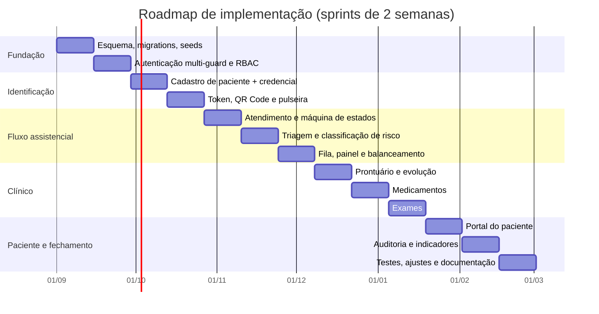

| Sprint | Entrega | Critério de conclusão |
|---|---|---|
| 1 | Esquema completo, migrations, *seeds*, catálogos | `schema.sql` executa; os 12 testes negativos passam |
| 2 | Autenticação, guards, perfis, permissões, Policies | Matriz RBAC da §2.3 coberta por testes |
| 3 | Cadastro de paciente com geração de credencial | UC-01 completo, incluindo os fluxos A1–A5 |
| 4 | Token de pulseira, QR Code, impressão, resolução | UC-07 completo; 8 asserções do token passam |
| 5 | Atendimento, histórico, máquina de estados | Transições inválidas recusadas; RN-07 garantido pelo banco |
| 6 | Triagem, sinais vitais, classificação de risco | UC-04 e UC-16 completos |
| 7 | Fila, painel do profissional, atribuição, transferência | UC-05 completo; ordenação testada; `wire:poll` funcionando |
| 8 | Prontuário SOAP, evolução, adendo, cadeia de hash | Imutabilidade testada; adulteração detectada |
| 9 | Catálogo, prescrição, aprazamento, administração | Os nove certos; RN-20, RN-21, RN-22 testados |
| 10 | Catálogo de exames, ciclo completo, liberação | RN-24 e RN-25 testados |
| 11 | Portal do paciente | UC-11 completo; nenhuma rota de escrita além da senha |
| 12 | Auditoria de leitura e escrita, indicadores | Consulta "quem acessou este paciente" respondida |
| 13 | Cobertura de testes, ajustes, documentação final | ≥ 80 % na camada de domínio |

## 16.2 Riscos do projeto

| Risco | Prob. | Impacto | Mitigação |
|---|---|---|---|
| Impressora térmica indisponível para testes | Alta | Médio | Gerar PDF e validar por leitura do QR na tela e em impressão a laser; ZPL fica documentado, não implementado |
| Cobertura de 80 % consumir mais tempo que o previsto | Média | Médio | Escrever teste junto com a Action, nunca ao final. As 36 asserções da §15.3 já estão prontas |
| Escopo crescer para internação e faturamento | **Alta** | **Alto** | §1.3.2 é o instrumento de defesa: a exclusão está registrada e justificada |
| Modelagem da fila revelar-se inadequada em uso real | Média | Alto | A ponderação é dado, não código (§7.4); calibração sem alteração de esquema |
| Ausência de validação com profissionais de saúde reais | Média | **Alto** | Buscar uma entrevista com enfermeiro de triagem antes da Sprint 6 — é a validação de maior retorno do projeto |
| Confundir NGS1 com conformidade plena | Baixa | Alto | §9.5 documenta explicitamente a lacuna |

## 16.3 Trabalhos futuros

| Extensão | Valor | Complexidade |
|---|---|---|
| Assinatura digital ICP-Brasil e certificação SBIS/CFM NGS2 | **Alto** — habilita a eliminação do papel | Alta |
| Integração com a RNDS via FHIR R4 | Alto — interoperabilidade nacional | Alta |
| Módulo de internação, censo de leitos e censo de ocupação | Alto | Média |
| Aplicativo móvel para a equipe, com leitor de QR nativo | Médio — melhora o fluxo de administração | Média |
| Painel público de espera por cor (sem identificar pacientes) | Médio — reduz conflito na recepção | Baixa |
| Alerta de interação medicamentosa via base terminológica | **Alto** — segurança do paciente | Alta |
| Aprendizado de máquina para apoio à classificação de risco | Médio — e exige cuidado ético e regulatório | Alta |
| Tempo real com Laravel Reverb substituindo `wire:poll` | Baixo — otimização | Baixa |

---

# 17. Referências

## Normas e legislação

- **BRASIL. Lei nº 13.709, de 14 de agosto de 2018** (Lei Geral de Proteção de Dados Pessoais — LGPD). Arts. 5º, II; 6º; 11; 16; 18.
- **BRASIL. Lei nº 13.787, de 27 de dezembro de 2018.** Digitalização e utilização de sistemas informatizados para guarda, armazenamento e manuseio de prontuário de paciente. Arts. 2º, 3º, 5º e 6º. Disponível em: https://www.planalto.gov.br/ccivil_03/_ato2015-2018/2018/lei/l13787.htm
- **BRASIL. Lei nº 12.965, de 23 de abril de 2014** (Marco Civil da Internet). Art. 15.
- **CONSELHO FEDERAL DE MEDICINA. Resolução CFM nº 1.821/2007.** Normas técnicas concernentes à digitalização e uso dos sistemas informatizados para a guarda e manuseio dos documentos dos prontuários dos pacientes.
- **AGÊNCIA NACIONAL DE VIGILÂNCIA SANITÁRIA. Portaria SVS/MS nº 344, de 12 de maio de 1998.** Regulamento técnico sobre substâncias e medicamentos sujeitos a controle especial.

## Certificação e boas práticas

- **SOCIEDADE BRASILEIRA DE INFORMÁTICA EM SAÚDE; CONSELHO FEDERAL DE MEDICINA.** *Manual de Certificação para Sistemas de Registro Eletrônico em Saúde (S-RES)*, versão 4.3, 2019. Níveis de Garantia de Segurança NGS1 e NGS2. Disponível em: https://www.sbis.org.br/certificacao/Manual_Certificacao_SBIS-CFM_2019_v4-3.pdf
- **HOSPITAL SÃO CAMILO.** *Entenda as cores de classificação no Protocolo de Manchester.* Disponível em: https://hospitalsaocamilosp.org.br/entenda-as-cores-de-classificacao-no-protocolo-de-manchester/
- **SECRETARIA DE ESTADO DA SAÚDE DE SÃO PAULO.** *Classificações do Protocolo de Manchester.* Disponível em: https://cdr.saude.sp.gov.br/wp-content/uploads/2022/08/CLASSIFICACAO-DE-RISCO-12.8.22.pdf

## Documentação técnica

- **LARAVEL.** *Starter Kits — Laravel 13.x.* Disponível em: https://laravel.com/docs/13.x/starter-kits
- **LARAVEL.** *Authentication — Laravel 13.x.* Disponível em: https://laravel.com/docs/13.x/authentication
- **LARAVEL.** *Fortify — Laravel 13.x.* Disponível em: https://laravel.com/docs/13.x/fortify
- **VERSIONLOG.** *Laravel Latest Version — Release History, LTS & EOL.* Disponível em: https://versionlog.com/laravel/
- **ISO/IEC 18004:2015.** *Information technology — Automatic identification and data capture techniques — QR Code bar code symbology specification.*

## Notas sobre as fontes

Os tempos-alvo do Protocolo de Manchester (0/10/60/120/240 minutos) e a estrutura de
níveis NGS1/NGS2 da certificação SBIS/CFM foram conferidos diretamente nas fontes
primárias listadas. Vale um alerta metodológico: **material secundário sobre a
certificação SBIS/CFM circula com erros** — durante a elaboração deste documento
encontrou-se conteúdo publicado afirmando a existência de um "NGS3", que **não consta do
manual oficial**, o qual define apenas dois níveis. Em trabalho acadêmico, conferir a
fonte primária não é formalidade.


---

# Apêndice A — Script completo de criação do banco de dados

Arquivo: `schema.sql` · SGBD alvo: MySQL 8.4 (InnoDB, utf8mb4) · **Validado por execução**

```sql
-- =====================================================================
-- Sistema de Gestão Hospitalar (SGH)
-- Script de criação do esquema físico
-- SGBD alvo: MySQL 8.4 (InnoDB, utf8mb4)
-- Versão: 1.0  ·  Data: 2026-08-18
-- =====================================================================

SET NAMES utf8mb4;
SET time_zone = '+00:00';

CREATE DATABASE IF NOT EXISTS sgh
    CHARACTER SET utf8mb4
    COLLATE utf8mb4_0900_ai_ci;
USE sgh;

-- ---------------------------------------------------------------------
-- 1. ESTRUTURA ORGANIZACIONAL
-- ---------------------------------------------------------------------

CREATE TABLE unidade (
    id              BIGINT UNSIGNED NOT NULL AUTO_INCREMENT,
    nome            VARCHAR(150)    NOT NULL,
    cnes            VARCHAR(7)      NULL COMMENT 'Cadastro Nacional de Estabelecimentos de Saúde',
    fuso_horario    VARCHAR(40)     NOT NULL DEFAULT 'America/Sao_Paulo',
    ativo           BOOLEAN         NOT NULL DEFAULT TRUE,
    created_at      TIMESTAMP       NULL,
    updated_at      TIMESTAMP       NULL,
    PRIMARY KEY (id),
    UNIQUE KEY uk_unidade_cnes (cnes)
) ENGINE = InnoDB;

-- ---------------------------------------------------------------------
-- 2. IDENTIDADE, ACESSO E AUTORIZAÇÃO
-- ---------------------------------------------------------------------

CREATE TABLE usuario (
    id                  BIGINT UNSIGNED NOT NULL AUTO_INCREMENT,
    login               VARCHAR(60)     NOT NULL COMMENT 'CPF do paciente, matrícula do profissional ou código provisório',
    senha_hash          VARCHAR(255)    NOT NULL COMMENT 'Argon2id (RNF-07)',
    senha_provisoria    BOOLEAN         NOT NULL DEFAULT FALSE COMMENT 'RN-06: força troca no primeiro acesso',
    senha_alterada_em   TIMESTAMP       NULL,
    tipo                ENUM('PACIENTE','PROFISSIONAL','ADMIN') NOT NULL,
    ativo               BOOLEAN         NOT NULL DEFAULT TRUE,
    ultimo_login_em     TIMESTAMP       NULL,
    tentativas_falhas   SMALLINT UNSIGNED NOT NULL DEFAULT 0,
    bloqueado_ate       TIMESTAMP       NULL COMMENT 'RNF-08: bloqueio progressivo',
    created_at          TIMESTAMP       NULL,
    updated_at          TIMESTAMP       NULL,
    deleted_at          TIMESTAMP       NULL,
    PRIMARY KEY (id),
    UNIQUE KEY uk_usuario_login (login),
    KEY ix_usuario_tipo_ativo (tipo, ativo)
) ENGINE = InnoDB;

CREATE TABLE perfil (
    id          BIGINT UNSIGNED NOT NULL AUTO_INCREMENT,
    nome        VARCHAR(60)     NOT NULL,
    descricao   VARCHAR(255)    NULL,
    PRIMARY KEY (id),
    UNIQUE KEY uk_perfil_nome (nome)
) ENGINE = InnoDB;

CREATE TABLE permissao (
    id          BIGINT UNSIGNED NOT NULL AUTO_INCREMENT,
    chave       VARCHAR(100)    NOT NULL COMMENT 'ex.: prontuario.criar',
    descricao   VARCHAR(255)    NULL,
    PRIMARY KEY (id),
    UNIQUE KEY uk_permissao_chave (chave)
) ENGINE = InnoDB;

CREATE TABLE perfil_permissao (
    perfil_id       BIGINT UNSIGNED NOT NULL,
    permissao_id    BIGINT UNSIGNED NOT NULL,
    PRIMARY KEY (perfil_id, permissao_id),
    CONSTRAINT fk_pp_perfil    FOREIGN KEY (perfil_id)    REFERENCES perfil (id)    ON DELETE CASCADE,
    CONSTRAINT fk_pp_permissao FOREIGN KEY (permissao_id) REFERENCES permissao (id) ON DELETE CASCADE
) ENGINE = InnoDB;

CREATE TABLE usuario_perfil (
    usuario_id  BIGINT UNSIGNED NOT NULL,
    perfil_id   BIGINT UNSIGNED NOT NULL,
    PRIMARY KEY (usuario_id, perfil_id),
    CONSTRAINT fk_up_usuario FOREIGN KEY (usuario_id) REFERENCES usuario (id) ON DELETE CASCADE,
    CONSTRAINT fk_up_perfil  FOREIGN KEY (perfil_id)  REFERENCES perfil (id)  ON DELETE CASCADE
) ENGINE = InnoDB;

-- ---------------------------------------------------------------------
-- 3. PACIENTE (especialização de usuario — D-02)
-- ---------------------------------------------------------------------

CREATE TABLE paciente (
    usuario_id                   BIGINT UNSIGNED NOT NULL,
    uuid                         CHAR(36)        NOT NULL,
    token_pulseira               VARCHAR(64)     NOT NULL COMMENT 'RN-03: opaco, único, imutável',
    nome_completo                VARCHAR(150)    NOT NULL,
    nome_social                  VARCHAR(150)    NULL,
    cpf                          CHAR(11)        NULL COMMENT 'RF-04: nulo permitido para não identificado',
    cns                          CHAR(15)        NULL,
    data_nascimento              DATE            NOT NULL,
    sexo                         ENUM('FEMININO','MASCULINO','OUTRO','NAO_INFORMADO') NOT NULL DEFAULT 'NAO_INFORMADO',
    nome_mae                     VARCHAR(150)    NULL,
    telefone                     VARCHAR(20)     NULL,
    contato_emergencia_nome      VARCHAR(150)    NULL,
    contato_emergencia_telefone  VARCHAR(20)     NULL,
    logradouro                   VARCHAR(180)    NULL,
    numero                       VARCHAR(20)     NULL,
    complemento                  VARCHAR(80)     NULL,
    bairro                       VARCHAR(100)    NULL,
    municipio                    VARCHAR(100)    NULL,
    uf                           CHAR(2)         NULL,
    cep                          CHAR(8)         NULL,
    identificacao_provisoria     BOOLEAN         NOT NULL DEFAULT FALSE,
    codigo_provisorio            VARCHAR(20)     NULL,
    observacoes                  TEXT            NULL,
    created_at                   TIMESTAMP       NULL,
    updated_at                   TIMESTAMP       NULL,
    deleted_at                   TIMESTAMP       NULL,
    PRIMARY KEY (usuario_id),
    UNIQUE KEY uk_paciente_uuid (uuid),
    UNIQUE KEY uk_paciente_token (token_pulseira),
    UNIQUE KEY uk_paciente_cpf (cpf),
    UNIQUE KEY uk_paciente_cns (cns),
    UNIQUE KEY uk_paciente_provisorio (codigo_provisorio),
    KEY ix_paciente_nome (nome_completo),
    KEY ix_paciente_nascimento (data_nascimento),
    CONSTRAINT fk_paciente_usuario FOREIGN KEY (usuario_id) REFERENCES usuario (id),
    CONSTRAINT ck_paciente_cpf_digitos CHECK (cpf IS NULL OR cpf REGEXP '^[0-9]{11}$'),
    CONSTRAINT ck_paciente_identificacao CHECK (
        (identificacao_provisoria = FALSE AND cpf IS NOT NULL)
        OR (identificacao_provisoria = TRUE AND codigo_provisorio IS NOT NULL)
    )
) ENGINE = InnoDB;

-- ---------------------------------------------------------------------
-- 4. PROFISSIONAL (especialização de usuario — D-02)
-- ---------------------------------------------------------------------

CREATE TABLE profissional (
    usuario_id       BIGINT UNSIGNED NOT NULL,
    unidade_id       BIGINT UNSIGNED NOT NULL,
    nome_completo    VARCHAR(150)    NOT NULL,
    matricula        VARCHAR(30)     NULL,
    categoria        ENUM('MEDICO','ENFERMEIRO','TECNICO_ENFERMAGEM','LABORATORIO','RECEPCAO','FARMACIA','ADMIN') NOT NULL,
    conselho_tipo    ENUM('CRM','COREN','CRF','CRBM','OUTRO') NULL,
    conselho_numero  VARCHAR(20)     NULL,
    conselho_uf      CHAR(2)         NULL,
    especialidade    VARCHAR(100)    NULL,
    capacidade_fila  SMALLINT UNSIGNED NOT NULL DEFAULT 20 COMMENT 'Teto de referência para balanceamento (§7.4)',
    ativo            BOOLEAN         NOT NULL DEFAULT TRUE,
    created_at       TIMESTAMP       NULL,
    updated_at       TIMESTAMP       NULL,
    deleted_at       TIMESTAMP       NULL,
    PRIMARY KEY (usuario_id),
    UNIQUE KEY uk_profissional_conselho (conselho_tipo, conselho_numero, conselho_uf),
    UNIQUE KEY uk_profissional_matricula (matricula),
    KEY ix_profissional_unidade_cat (unidade_id, categoria, ativo),
    CONSTRAINT fk_profissional_usuario FOREIGN KEY (usuario_id) REFERENCES usuario (id),
    CONSTRAINT fk_profissional_unidade FOREIGN KEY (unidade_id) REFERENCES unidade (id),
    CONSTRAINT ck_profissional_conselho CHECK (
        categoria NOT IN ('MEDICO','ENFERMEIRO') OR conselho_numero IS NOT NULL
    )
) ENGINE = InnoDB;

CREATE TABLE profissional_disponibilidade (
    id               BIGINT UNSIGNED NOT NULL AUTO_INCREMENT,
    profissional_id  BIGINT UNSIGNED NOT NULL,
    situacao         ENUM('DISPONIVEL','EM_ATENDIMENTO','PAUSA','AUSENTE','FORA_PLANTAO') NOT NULL,
    inicio_em        DATETIME        NOT NULL,
    fim_em           DATETIME        NULL COMMENT 'NULL = situação vigente',
    observacao       VARCHAR(255)    NULL,
    PRIMARY KEY (id),
    KEY ix_disp_prof_vigente (profissional_id, fim_em),
    CONSTRAINT fk_disp_profissional FOREIGN KEY (profissional_id) REFERENCES profissional (usuario_id),
    CONSTRAINT ck_disp_periodo CHECK (fim_em IS NULL OR fim_em >= inicio_em)
) ENGINE = InnoDB;

-- ---------------------------------------------------------------------
-- 5. CATÁLOGOS DE DOMÍNIO
-- ---------------------------------------------------------------------

CREATE TABLE classificacao_risco (
    id                          TINYINT UNSIGNED NOT NULL,
    nome                        VARCHAR(40)      NOT NULL,
    cor_nome                    ENUM('VERMELHO','LARANJA','AMARELO','VERDE','AZUL') NOT NULL,
    cor_hex                     CHAR(7)          NOT NULL,
    tempo_alvo_minutos          SMALLINT UNSIGNED NOT NULL,
    peso_ordenacao              TINYINT UNSIGNED NOT NULL COMMENT 'Menor = mais prioritário',
    exige_atendimento_imediato  BOOLEAN          NOT NULL DEFAULT FALSE,
    descricao                   VARCHAR(255)     NULL,
    PRIMARY KEY (id),
    UNIQUE KEY uk_risco_cor (cor_nome),
    UNIQUE KEY uk_risco_peso (peso_ordenacao)
) ENGINE = InnoDB;

CREATE TABLE cid10 (
    codigo      CHAR(7)      NOT NULL,
    descricao   VARCHAR(255) NOT NULL,
    PRIMARY KEY (codigo),
    KEY ix_cid10_descricao (descricao)
) ENGINE = InnoDB;

CREATE TABLE queixa (
    id                      BIGINT UNSIGNED NOT NULL AUTO_INCREMENT,
    descricao               VARCHAR(150)    NOT NULL,
    fluxograma_manchester   VARCHAR(100)    NULL,
    ativo                   BOOLEAN         NOT NULL DEFAULT TRUE,
    PRIMARY KEY (id),
    UNIQUE KEY uk_queixa_descricao (descricao)
) ENGINE = InnoDB;

CREATE TABLE medicamento (
    id                  BIGINT UNSIGNED NOT NULL AUTO_INCREMENT,
    nome_comercial      VARCHAR(150)    NOT NULL,
    principio_ativo     VARCHAR(150)    NOT NULL,
    concentracao        VARCHAR(60)     NULL COMMENT 'ex.: 500 mg/mL',
    forma_farmaceutica  VARCHAR(60)     NULL COMMENT 'ex.: comprimido, ampola',
    classe_via          ENUM('ORAL','IV','IM','SC','TOPICO','INALATORIO','RETAL','OFTALMICO','SL','OUTRA') NOT NULL,
    injetavel           BOOLEAN         NOT NULL DEFAULT FALSE,
    alta_vigilancia     BOOLEAN         NOT NULL DEFAULT FALSE COMMENT 'RN-22: exige dupla checagem',
    controlado          BOOLEAN         NOT NULL DEFAULT FALSE COMMENT 'Portaria SVS/MS 344/1998',
    unidade_dose_padrao VARCHAR(20)     NULL,
    dose_maxima_diaria  DECIMAL(10,3)   NULL,
    observacao          TEXT            NULL,
    ativo               BOOLEAN         NOT NULL DEFAULT TRUE,
    created_at          TIMESTAMP       NULL,
    updated_at          TIMESTAMP       NULL,
    deleted_at          TIMESTAMP       NULL,
    PRIMARY KEY (id),
    KEY ix_medicamento_principio (principio_ativo),
    KEY ix_medicamento_nome (nome_comercial),
    KEY ix_medicamento_vigilancia (alta_vigilancia)
) ENGINE = InnoDB;

CREATE TABLE exame (
    id                      BIGINT UNSIGNED NOT NULL AUTO_INCREMENT,
    codigo                  VARCHAR(20)     NOT NULL,
    nome                    VARCHAR(150)    NOT NULL,
    tipo                    ENUM('LABORATORIAL','IMAGEM','GRAFICO','OUTRO') NOT NULL,
    preparo                 TEXT            NULL,
    prazo_padrao_minutos    SMALLINT UNSIGNED NULL,
    ativo                   BOOLEAN         NOT NULL DEFAULT TRUE,
    created_at              TIMESTAMP       NULL,
    updated_at              TIMESTAMP       NULL,
    deleted_at              TIMESTAMP       NULL,
    PRIMARY KEY (id),
    UNIQUE KEY uk_exame_codigo (codigo),
    KEY ix_exame_tipo (tipo, ativo)
) ENGINE = InnoDB;

-- ---------------------------------------------------------------------
-- 6. HISTÓRICO CLÍNICO DO PACIENTE (transversal aos atendimentos)
-- ---------------------------------------------------------------------

CREATE TABLE paciente_alergia (
    id              BIGINT UNSIGNED NOT NULL AUTO_INCREMENT,
    paciente_id     BIGINT UNSIGNED NOT NULL,
    substancia      VARCHAR(150)    NOT NULL,
    medicamento_id  BIGINT UNSIGNED NULL COMMENT 'Vínculo ao catálogo, quando aplicável',
    gravidade       ENUM('LEVE','MODERADA','GRAVE','DESCONHECIDA') NOT NULL DEFAULT 'DESCONHECIDA',
    reacao          VARCHAR(255)    NULL,
    registrado_por  BIGINT UNSIGNED NULL,
    created_at      TIMESTAMP       NULL,
    updated_at      TIMESTAMP       NULL,
    deleted_at      TIMESTAMP       NULL,
    PRIMARY KEY (id),
    KEY ix_alergia_paciente (paciente_id),
    KEY ix_alergia_medicamento (medicamento_id),
    CONSTRAINT fk_alergia_paciente     FOREIGN KEY (paciente_id)    REFERENCES paciente (usuario_id),
    CONSTRAINT fk_alergia_medicamento  FOREIGN KEY (medicamento_id) REFERENCES medicamento (id),
    CONSTRAINT fk_alergia_registrador  FOREIGN KEY (registrado_por) REFERENCES profissional (usuario_id)
) ENGINE = InnoDB;

CREATE TABLE paciente_condicao (
    id              BIGINT UNSIGNED NOT NULL AUTO_INCREMENT,
    paciente_id     BIGINT UNSIGNED NOT NULL,
    descricao       VARCHAR(255)    NOT NULL,
    cid10_codigo    CHAR(7)         NULL,
    desde           DATE            NULL,
    registrado_por  BIGINT UNSIGNED NULL,
    created_at      TIMESTAMP       NULL,
    updated_at      TIMESTAMP       NULL,
    deleted_at      TIMESTAMP       NULL,
    PRIMARY KEY (id),
    KEY ix_condicao_paciente (paciente_id),
    CONSTRAINT fk_condicao_paciente FOREIGN KEY (paciente_id)   REFERENCES paciente (usuario_id),
    CONSTRAINT fk_condicao_cid      FOREIGN KEY (cid10_codigo)  REFERENCES cid10 (codigo),
    CONSTRAINT fk_condicao_registrador FOREIGN KEY (registrado_por) REFERENCES profissional (usuario_id)
) ENGINE = InnoDB;

-- ---------------------------------------------------------------------
-- 7. ATENDIMENTO
-- ---------------------------------------------------------------------

CREATE TABLE atendimento (
    id                          BIGINT UNSIGNED NOT NULL AUTO_INCREMENT,
    uuid                        CHAR(36)        NOT NULL,
    numero                      VARCHAR(20)     NOT NULL COMMENT 'RF-21: ex. 2026-000148',
    paciente_id                 BIGINT UNSIGNED NOT NULL,
    unidade_id                  BIGINT UNSIGNED NOT NULL,
    profissional_responsavel_id BIGINT UNSIGNED NULL,
    classificacao_risco_id      TINYINT UNSIGNED NULL COMMENT 'Classificação vigente (RN-09)',
    status                      ENUM(
                                    'AGUARDANDO_TRIAGEM',
                                    'AGUARDANDO_ATENDIMENTO',
                                    'EM_ATENDIMENTO',
                                    'AGUARDANDO_EXAME',
                                    'EM_EXAME',
                                    'AGUARDANDO_MEDICACAO',
                                    'EM_OBSERVACAO',
                                    'FINALIZADO',
                                    'CANCELADO'
                                ) NOT NULL DEFAULT 'AGUARDANDO_TRIAGEM',
    origem                      ENUM('ESPONTANEA','SAMU','ENCAMINHADO','TRANSFERENCIA') NOT NULL DEFAULT 'ESPONTANEA',
    sintomas_entrada            TEXT            NULL,
    admitido_em                 DATETIME        NOT NULL,
    primeiro_atendimento_em     DATETIME        NULL,
    finalizado_em               DATETIME        NULL,
    desfecho                    ENUM('ALTA','ENCAMINHAMENTO','INTERNACAO','EVASAO','OBITO','TRANSFERENCIA') NULL,
    desfecho_observacao         TEXT            NULL,
    aberto_por                  BIGINT UNSIGNED NULL,
    created_at                  TIMESTAMP       NULL,
    updated_at                  TIMESTAMP       NULL,
    deleted_at                  TIMESTAMP       NULL,
    -- D-07: unicidade de atendimento ativo por paciente/unidade
    ativo_key                   BIGINT UNSIGNED
                                GENERATED ALWAYS AS (
                                    CASE WHEN status IN ('FINALIZADO','CANCELADO')
                                         THEN NULL ELSE paciente_id END
                                ) STORED,
    PRIMARY KEY (id),
    UNIQUE KEY uk_atendimento_uuid (uuid),
    UNIQUE KEY uk_atendimento_numero (numero),
    UNIQUE KEY uk_atendimento_ativo (unidade_id, ativo_key),
    KEY ix_atendimento_paciente (paciente_id, admitido_em),
    KEY ix_atendimento_status (unidade_id, status),
    KEY ix_atendimento_responsavel (profissional_responsavel_id, status),
    CONSTRAINT fk_atend_paciente    FOREIGN KEY (paciente_id)                 REFERENCES paciente (usuario_id),
    CONSTRAINT fk_atend_unidade     FOREIGN KEY (unidade_id)                  REFERENCES unidade (id),
    CONSTRAINT fk_atend_responsavel FOREIGN KEY (profissional_responsavel_id) REFERENCES profissional (usuario_id),
    CONSTRAINT fk_atend_risco       FOREIGN KEY (classificacao_risco_id)      REFERENCES classificacao_risco (id),
    CONSTRAINT fk_atend_aberto_por  FOREIGN KEY (aberto_por)                  REFERENCES usuario (id),
    CONSTRAINT ck_atend_desfecho CHECK (status <> 'FINALIZADO' OR desfecho IS NOT NULL),
    CONSTRAINT ck_atend_finalizado CHECK (status <> 'FINALIZADO' OR finalizado_em IS NOT NULL)
) ENGINE = InnoDB;

CREATE TABLE atendimento_status_historico (
    id                      BIGINT UNSIGNED NOT NULL AUTO_INCREMENT,
    atendimento_id          BIGINT UNSIGNED NOT NULL,
    status_anterior         VARCHAR(30)     NULL,
    status_novo             VARCHAR(30)     NOT NULL,
    alterado_por            BIGINT UNSIGNED NOT NULL,
    observacao              TEXT            NULL,
    permanencia_segundos    INT UNSIGNED    NULL COMMENT 'RF-39: tempo no status anterior',
    criado_em               DATETIME(6)     NOT NULL,
    PRIMARY KEY (id),
    KEY ix_hist_atendimento (atendimento_id, criado_em),
    CONSTRAINT fk_hist_atendimento FOREIGN KEY (atendimento_id) REFERENCES atendimento (id),
    CONSTRAINT fk_hist_autor       FOREIGN KEY (alterado_por)   REFERENCES usuario (id)
) ENGINE = InnoDB;

CREATE TABLE atendimento_sintoma (
    id                  BIGINT UNSIGNED NOT NULL AUTO_INCREMENT,
    atendimento_id      BIGINT UNSIGNED NOT NULL,
    queixa_id           BIGINT UNSIGNED NULL,
    descricao_livre     VARCHAR(255)    NULL,
    PRIMARY KEY (id),
    KEY ix_sintoma_atendimento (atendimento_id),
    CONSTRAINT fk_sintoma_atendimento FOREIGN KEY (atendimento_id) REFERENCES atendimento (id),
    CONSTRAINT fk_sintoma_queixa      FOREIGN KEY (queixa_id)      REFERENCES queixa (id),
    CONSTRAINT ck_sintoma_conteudo CHECK (queixa_id IS NOT NULL OR descricao_livre IS NOT NULL)
) ENGINE = InnoDB;

CREATE TABLE sinal_vital (
    id                      BIGINT UNSIGNED NOT NULL AUTO_INCREMENT,
    atendimento_id          BIGINT UNSIGNED NOT NULL,
    pressao_sistolica       SMALLINT UNSIGNED NULL,
    pressao_diastolica      SMALLINT UNSIGNED NULL,
    frequencia_cardiaca     SMALLINT UNSIGNED NULL,
    frequencia_respiratoria SMALLINT UNSIGNED NULL,
    saturacao_o2            DECIMAL(4,1)    NULL,
    temperatura             DECIMAL(4,1)    NULL,
    glicemia                DECIMAL(5,1)    NULL,
    peso_kg                 DECIMAL(5,2)    NULL,
    altura_cm               SMALLINT UNSIGNED NULL,
    escala_dor              TINYINT UNSIGNED NULL,
    aferido_por             BIGINT UNSIGNED NOT NULL,
    aferido_em              DATETIME        NOT NULL,
    PRIMARY KEY (id),
    KEY ix_sinal_atendimento (atendimento_id, aferido_em),
    CONSTRAINT fk_sinal_atendimento FOREIGN KEY (atendimento_id) REFERENCES atendimento (id),
    CONSTRAINT fk_sinal_aferidor    FOREIGN KEY (aferido_por)    REFERENCES profissional (usuario_id),
    CONSTRAINT ck_sinal_dor CHECK (escala_dor IS NULL OR escala_dor BETWEEN 0 AND 10),
    CONSTRAINT ck_sinal_spo2 CHECK (saturacao_o2 IS NULL OR saturacao_o2 BETWEEN 0 AND 100),
    CONSTRAINT ck_sinal_temp CHECK (temperatura IS NULL OR temperatura BETWEEN 25 AND 45)
) ENGINE = InnoDB;

CREATE TABLE triagem (
    id                          BIGINT UNSIGNED NOT NULL AUTO_INCREMENT,
    atendimento_id              BIGINT UNSIGNED NOT NULL,
    classificacao_risco_id      TINYINT UNSIGNED NOT NULL,
    sinal_vital_id              BIGINT UNSIGNED NULL,
    realizada_por               BIGINT UNSIGNED NOT NULL,
    queixa_principal            TEXT            NOT NULL,
    justificativa_classificacao TEXT            NULL,
    reclassificacao             BOOLEAN         NOT NULL DEFAULT FALSE,
    triagem_anterior_id         BIGINT UNSIGNED NULL,
    criado_em                   DATETIME(6)     NOT NULL,
    PRIMARY KEY (id),
    KEY ix_triagem_atendimento (atendimento_id, criado_em),
    CONSTRAINT fk_triagem_atendimento FOREIGN KEY (atendimento_id)         REFERENCES atendimento (id),
    CONSTRAINT fk_triagem_risco       FOREIGN KEY (classificacao_risco_id) REFERENCES classificacao_risco (id),
    CONSTRAINT fk_triagem_sinal       FOREIGN KEY (sinal_vital_id)         REFERENCES sinal_vital (id),
    CONSTRAINT fk_triagem_executor    FOREIGN KEY (realizada_por)          REFERENCES profissional (usuario_id),
    CONSTRAINT fk_triagem_anterior    FOREIGN KEY (triagem_anterior_id)    REFERENCES triagem (id)
) ENGINE = InnoDB;

CREATE TABLE fila_item (
    id                          BIGINT UNSIGNED NOT NULL AUTO_INCREMENT,
    atendimento_id              BIGINT UNSIGNED NOT NULL,
    profissional_id             BIGINT UNSIGNED NULL COMMENT 'NULL = fila geral, sem atribuição',
    classificacao_risco_id      TINYINT UNSIGNED NOT NULL,
    situacao                    ENUM('AGUARDANDO','CHAMADO','EM_ATENDIMENTO','CONCLUIDO','TRANSFERIDO','DESISTENCIA') NOT NULL DEFAULT 'AGUARDANDO',
    entrou_em                   DATETIME(6)     NOT NULL,
    chamado_em                  DATETIME        NULL,
    saiu_em                     DATETIME        NULL,
    transferido_de_id           BIGINT UNSIGNED NULL,
    justificativa_transferencia TEXT            NULL,
    criado_por                  BIGINT UNSIGNED NOT NULL,
    PRIMARY KEY (id),
    KEY ix_fila_ordenacao (profissional_id, situacao, classificacao_risco_id, entrou_em),
    KEY ix_fila_atendimento (atendimento_id),
    CONSTRAINT fk_fila_atendimento FOREIGN KEY (atendimento_id)         REFERENCES atendimento (id),
    CONSTRAINT fk_fila_profissional FOREIGN KEY (profissional_id)       REFERENCES profissional (usuario_id),
    CONSTRAINT fk_fila_risco       FOREIGN KEY (classificacao_risco_id) REFERENCES classificacao_risco (id),
    CONSTRAINT fk_fila_anterior    FOREIGN KEY (transferido_de_id)      REFERENCES fila_item (id),
    CONSTRAINT fk_fila_criador     FOREIGN KEY (criado_por)             REFERENCES usuario (id)
) ENGINE = InnoDB;

CREATE TABLE pulseira_impressao (
    id                      BIGINT UNSIGNED NOT NULL AUTO_INCREMENT,
    paciente_id             BIGINT UNSIGNED NOT NULL,
    atendimento_id          BIGINT UNSIGNED NULL,
    classificacao_risco_id  TINYINT UNSIGNED NULL,
    motivo                  ENUM('PRIMEIRA','REIMPRESSAO','RECLASSIFICACAO','DANIFICADA','OUTRO') NOT NULL DEFAULT 'PRIMEIRA',
    observacao              VARCHAR(255)    NULL,
    impressa_por            BIGINT UNSIGNED NOT NULL,
    criado_em               DATETIME        NOT NULL,
    PRIMARY KEY (id),
    KEY ix_pulseira_paciente (paciente_id, criado_em),
    KEY ix_pulseira_atendimento (atendimento_id),
    CONSTRAINT fk_pulseira_paciente    FOREIGN KEY (paciente_id)            REFERENCES paciente (usuario_id),
    CONSTRAINT fk_pulseira_atendimento FOREIGN KEY (atendimento_id)         REFERENCES atendimento (id),
    CONSTRAINT fk_pulseira_risco       FOREIGN KEY (classificacao_risco_id) REFERENCES classificacao_risco (id),
    CONSTRAINT fk_pulseira_impressor   FOREIGN KEY (impressa_por)           REFERENCES profissional (usuario_id)
) ENGINE = InnoDB;

-- ---------------------------------------------------------------------
-- 8. PRONTUÁRIO (append-only — D-05)
-- ---------------------------------------------------------------------

CREATE TABLE registro_clinico (
    id                      BIGINT UNSIGNED NOT NULL AUTO_INCREMENT,
    uuid                    CHAR(36)        NOT NULL,
    atendimento_id          BIGINT UNSIGNED NOT NULL,
    tipo                    ENUM('ANAMNESE','EVOLUCAO_MEDICA','EVOLUCAO_ENFERMAGEM','OBSERVACAO','ADENDO','SUMARIO_ALTA','INTERCORRENCIA') NOT NULL,
    subjetivo               TEXT            NULL COMMENT 'SOAP - S',
    objetivo                TEXT            NULL COMMENT 'SOAP - O',
    avaliacao               TEXT            NULL COMMENT 'SOAP - A',
    plano                   TEXT            NULL COMMENT 'SOAP - P',
    conteudo_livre          TEXT            NULL,
    sigiloso                BOOLEAN         NOT NULL DEFAULT FALSE COMMENT 'RF-77: oculto no portal do paciente',
    registro_retificado_id  BIGINT UNSIGNED NULL COMMENT 'RN-16: adendo aponta para o original',
    motivo_retificacao      TEXT            NULL,
    autor_id                BIGINT UNSIGNED NOT NULL,
    autor_nome              VARCHAR(150)    NOT NULL COMMENT 'Snapshot: o log não muda se o cadastro mudar',
    autor_conselho          VARCHAR(40)     NULL COMMENT 'Snapshot ex.: CRM/SP 123456',
    hash_conteudo           CHAR(64)        NOT NULL COMMENT 'SHA-256 do conteúdo canônico',
    hash_anterior           CHAR(64)        NULL COMMENT 'Encadeamento com o registro anterior do atendimento',
    criado_em               DATETIME(6)     NOT NULL,
    PRIMARY KEY (id),
    UNIQUE KEY uk_registro_uuid (uuid),
    KEY ix_registro_atendimento (atendimento_id, criado_em),
    KEY ix_registro_autor (autor_id, criado_em),
    KEY ix_registro_retificado (registro_retificado_id),
    CONSTRAINT fk_registro_atendimento FOREIGN KEY (atendimento_id)         REFERENCES atendimento (id),
    CONSTRAINT fk_registro_autor       FOREIGN KEY (autor_id)               REFERENCES profissional (usuario_id),
    CONSTRAINT fk_registro_retificado  FOREIGN KEY (registro_retificado_id) REFERENCES registro_clinico (id),
    CONSTRAINT ck_registro_adendo CHECK (
        tipo <> 'ADENDO' OR (registro_retificado_id IS NOT NULL AND motivo_retificacao IS NOT NULL)
    )
) ENGINE = InnoDB;

CREATE TABLE diagnostico (
    id              BIGINT UNSIGNED NOT NULL AUTO_INCREMENT,
    atendimento_id  BIGINT UNSIGNED NOT NULL,
    cid10_codigo    CHAR(7)         NOT NULL,
    natureza        ENUM('SUSPEITA','DEFINITIVO','DIFERENCIAL') NOT NULL DEFAULT 'SUSPEITA',
    principal       BOOLEAN         NOT NULL DEFAULT FALSE,
    observacao      TEXT            NULL,
    registrado_por  BIGINT UNSIGNED NOT NULL,
    criado_em       DATETIME        NOT NULL,
    PRIMARY KEY (id),
    KEY ix_diagnostico_atendimento (atendimento_id),
    KEY ix_diagnostico_cid (cid10_codigo),
    CONSTRAINT fk_diag_atendimento FOREIGN KEY (atendimento_id) REFERENCES atendimento (id),
    CONSTRAINT fk_diag_cid         FOREIGN KEY (cid10_codigo)   REFERENCES cid10 (codigo),
    CONSTRAINT fk_diag_registrador FOREIGN KEY (registrado_por) REFERENCES profissional (usuario_id)
) ENGINE = InnoDB;

-- ---------------------------------------------------------------------
-- 9. MEDICAMENTOS: PRESCRIÇÃO -> APRAZAMENTO -> ADMINISTRAÇÃO (D-04)
-- ---------------------------------------------------------------------

CREATE TABLE prescricao (
    id                  BIGINT UNSIGNED NOT NULL AUTO_INCREMENT,
    atendimento_id      BIGINT UNSIGNED NOT NULL,
    prescrito_por       BIGINT UNSIGNED NOT NULL,
    status              ENUM('VIGENTE','SUSPENSA','CONCLUIDA') NOT NULL DEFAULT 'VIGENTE',
    vigencia_inicio     DATETIME        NOT NULL,
    vigencia_fim        DATETIME        NULL,
    observacao          TEXT            NULL,
    suspensa_por        BIGINT UNSIGNED NULL,
    suspensa_em         DATETIME        NULL,
    motivo_suspensao    TEXT            NULL,
    criado_em           DATETIME(6)     NOT NULL,
    PRIMARY KEY (id),
    KEY ix_prescricao_atendimento (atendimento_id, status),
    CONSTRAINT fk_presc_atendimento FOREIGN KEY (atendimento_id) REFERENCES atendimento (id),
    CONSTRAINT fk_presc_prescritor  FOREIGN KEY (prescrito_por)  REFERENCES profissional (usuario_id),
    CONSTRAINT fk_presc_suspensor   FOREIGN KEY (suspensa_por)   REFERENCES profissional (usuario_id)
) ENGINE = InnoDB;

CREATE TABLE prescricao_item (
    id                  BIGINT UNSIGNED NOT NULL AUTO_INCREMENT,
    prescricao_id       BIGINT UNSIGNED NOT NULL,
    medicamento_id      BIGINT UNSIGNED NOT NULL,
    dose                DECIMAL(10,3)   NOT NULL,
    unidade_dose        VARCHAR(20)     NOT NULL,
    via                 ENUM('ORAL','IV','IM','SC','TOPICO','INALATORIO','RETAL','OFTALMICO','SL','OUTRA') NOT NULL,
    frequencia_horas    SMALLINT UNSIGNED NULL COMMENT 'NULL quando se_necessario = TRUE',
    duracao_horas       SMALLINT UNSIGNED NULL,
    se_necessario       BOOLEAN         NOT NULL DEFAULT FALSE COMMENT 'Medicação SOS / PRN',
    diluicao            VARCHAR(255)    NULL,
    velocidade_infusao  VARCHAR(60)     NULL,
    observacao          TEXT            NULL,
    status              ENUM('VIGENTE','SUSPENSO','CONCLUIDO') NOT NULL DEFAULT 'VIGENTE',
    PRIMARY KEY (id),
    KEY ix_item_prescricao (prescricao_id, status),
    KEY ix_item_medicamento (medicamento_id),
    CONSTRAINT fk_item_prescricao  FOREIGN KEY (prescricao_id)  REFERENCES prescricao (id),
    CONSTRAINT fk_item_medicamento FOREIGN KEY (medicamento_id) REFERENCES medicamento (id),
    CONSTRAINT ck_item_dose CHECK (dose > 0),
    CONSTRAINT ck_item_frequencia CHECK (se_necessario = TRUE OR frequencia_horas IS NOT NULL)
) ENGINE = InnoDB;

CREATE TABLE aprazamento (
    id                  BIGINT UNSIGNED NOT NULL AUTO_INCREMENT,
    prescricao_item_id  BIGINT UNSIGNED NOT NULL,
    sequencia           SMALLINT UNSIGNED NOT NULL,
    horario_previsto    DATETIME        NOT NULL,
    situacao            ENUM('PENDENTE','ADMINISTRADA','NAO_ADMINISTRADA','SUSPENSA') NOT NULL DEFAULT 'PENDENTE',
    PRIMARY KEY (id),
    UNIQUE KEY uk_aprazamento_seq (prescricao_item_id, sequencia),
    KEY ix_aprazamento_agenda (situacao, horario_previsto),
    CONSTRAINT fk_apraz_item FOREIGN KEY (prescricao_item_id) REFERENCES prescricao_item (id)
) ENGINE = InnoDB;

CREATE TABLE administracao_medicamento (
    id                          BIGINT UNSIGNED NOT NULL AUTO_INCREMENT,
    aprazamento_id              BIGINT UNSIGNED NULL COMMENT 'RN-20: único -> impede dupla administração da mesma dose',
    prescricao_item_id          BIGINT UNSIGNED NOT NULL,
    atendimento_id              BIGINT UNSIGNED NOT NULL,
    dose_administrada           DECIMAL(10,3)   NULL,
    unidade_dose                VARCHAR(20)     NULL,
    via                         ENUM('ORAL','IV','IM','SC','TOPICO','INALATORIO','RETAL','OFTALMICO','SL','OUTRA') NULL,
    administrado_em             DATETIME(6)     NOT NULL COMMENT 'RN-29: horário de servidor',
    administrado_por            BIGINT UNSIGNED NOT NULL,
    checado_por                 BIGINT UNSIGNED NULL COMMENT 'RN-22: dupla checagem',
    resultado                   ENUM('ADMINISTRADA','NAO_ADMINISTRADA') NOT NULL DEFAULT 'ADMINISTRADA',
    motivo_nao_administracao    ENUM('RECUSA_PACIENTE','INDISPONIVEL','JEJUM','SUSPENSA_MEDICO','INTERCORRENCIA','ACESSO_INDISPONIVEL','OUTRO') NULL,
    alerta_alergia_sobreposto   BOOLEAN         NOT NULL DEFAULT FALSE,
    justificativa               TEXT            NULL,
    observacao                  TEXT            NULL,
    PRIMARY KEY (id),
    UNIQUE KEY uk_adm_aprazamento (aprazamento_id),
    KEY ix_adm_atendimento (atendimento_id, administrado_em),
    KEY ix_adm_item (prescricao_item_id),
    KEY ix_adm_executor (administrado_por, administrado_em),
    CONSTRAINT fk_adm_aprazamento FOREIGN KEY (aprazamento_id)     REFERENCES aprazamento (id),
    CONSTRAINT fk_adm_item        FOREIGN KEY (prescricao_item_id) REFERENCES prescricao_item (id),
    CONSTRAINT fk_adm_atendimento FOREIGN KEY (atendimento_id)     REFERENCES atendimento (id),
    CONSTRAINT fk_adm_executor    FOREIGN KEY (administrado_por)   REFERENCES profissional (usuario_id),
    CONSTRAINT fk_adm_checador    FOREIGN KEY (checado_por)        REFERENCES profissional (usuario_id),
    CONSTRAINT ck_adm_motivo CHECK (
        resultado = 'ADMINISTRADA' OR motivo_nao_administracao IS NOT NULL
    ),
    CONSTRAINT ck_adm_justificativa CHECK (
        alerta_alergia_sobreposto = FALSE OR justificativa IS NOT NULL
    ),
    CONSTRAINT ck_adm_dose CHECK (
        resultado = 'NAO_ADMINISTRADA' OR dose_administrada IS NOT NULL
    )
) ENGINE = InnoDB;

-- ---------------------------------------------------------------------
-- 10. CLÍNICA E EXAMES
-- ---------------------------------------------------------------------

CREATE TABLE exame_solicitacao (
    id                      BIGINT UNSIGNED NOT NULL AUTO_INCREMENT,
    atendimento_id          BIGINT UNSIGNED NOT NULL,
    exame_id                BIGINT UNSIGNED NOT NULL,
    solicitado_por          BIGINT UNSIGNED NOT NULL,
    carater                 ENUM('ROTINA','URGENTE') NOT NULL DEFAULT 'ROTINA',
    indicacao_clinica       TEXT            NULL,
    situacao                ENUM('SOLICITADO','COLETADO','EM_EXECUCAO','CONCLUIDO','LIBERADO','CANCELADO') NOT NULL DEFAULT 'SOLICITADO',
    solicitado_em           DATETIME(6)     NOT NULL,
    coletado_em             DATETIME        NULL,
    coletado_por            BIGINT UNSIGNED NULL,
    cancelado_em            DATETIME        NULL,
    cancelado_por           BIGINT UNSIGNED NULL,
    motivo_cancelamento     TEXT            NULL,
    PRIMARY KEY (id),
    KEY ix_solic_atendimento (atendimento_id, situacao),
    KEY ix_solic_fila_lab (situacao, carater, solicitado_em),
    KEY ix_solic_exame (exame_id),
    CONSTRAINT fk_solic_atendimento FOREIGN KEY (atendimento_id) REFERENCES atendimento (id),
    CONSTRAINT fk_solic_exame       FOREIGN KEY (exame_id)       REFERENCES exame (id),
    CONSTRAINT fk_solic_solicitante FOREIGN KEY (solicitado_por) REFERENCES profissional (usuario_id),
    CONSTRAINT fk_solic_coletor     FOREIGN KEY (coletado_por)   REFERENCES profissional (usuario_id),
    CONSTRAINT fk_solic_cancelador  FOREIGN KEY (cancelado_por)  REFERENCES profissional (usuario_id),
    CONSTRAINT ck_solic_cancelamento CHECK (
        situacao <> 'CANCELADO' OR motivo_cancelamento IS NOT NULL
    )
) ENGINE = InnoDB;

CREATE TABLE exame_resultado (
    id                      BIGINT UNSIGNED NOT NULL AUTO_INCREMENT,
    exame_solicitacao_id    BIGINT UNSIGNED NOT NULL,
    laudo                   TEXT            NULL,
    conclusao               TEXT            NULL,
    possui_valor_critico    BOOLEAN         NOT NULL DEFAULT FALSE COMMENT 'RN-25',
    executado_por           BIGINT UNSIGNED NOT NULL,
    executado_em            DATETIME        NOT NULL,
    liberado_por            BIGINT UNSIGNED NULL,
    liberado_em             DATETIME        NULL,
    visivel_ao_paciente     BOOLEAN         NOT NULL DEFAULT FALSE COMMENT 'RN-24',
    criado_em               DATETIME(6)     NOT NULL,
    PRIMARY KEY (id),
    UNIQUE KEY uk_resultado_solicitacao (exame_solicitacao_id),
    KEY ix_resultado_critico (possui_valor_critico, criado_em),
    CONSTRAINT fk_result_solicitacao FOREIGN KEY (exame_solicitacao_id) REFERENCES exame_solicitacao (id),
    CONSTRAINT fk_result_executor    FOREIGN KEY (executado_por)        REFERENCES profissional (usuario_id),
    CONSTRAINT fk_result_liberador   FOREIGN KEY (liberado_por)         REFERENCES profissional (usuario_id),
    CONSTRAINT ck_result_liberacao CHECK (
        visivel_ao_paciente = FALSE OR (liberado_por IS NOT NULL AND liberado_em IS NOT NULL)
    )
) ENGINE = InnoDB;

CREATE TABLE exame_resultado_item (
    id                  BIGINT UNSIGNED NOT NULL AUTO_INCREMENT,
    exame_resultado_id  BIGINT UNSIGNED NOT NULL,
    analito             VARCHAR(120)    NOT NULL,
    valor               VARCHAR(60)     NOT NULL,
    unidade             VARCHAR(30)     NULL,
    referencia_min      DECIMAL(12,4)   NULL,
    referencia_max      DECIMAL(12,4)   NULL,
    referencia_texto    VARCHAR(120)    NULL,
    sinalizacao         ENUM('NORMAL','BAIXO','ALTO','CRITICO','INDETERMINADO') NOT NULL DEFAULT 'NORMAL',
    PRIMARY KEY (id),
    KEY ix_item_resultado (exame_resultado_id),
    CONSTRAINT fk_ritem_resultado FOREIGN KEY (exame_resultado_id) REFERENCES exame_resultado (id) ON DELETE CASCADE
) ENGINE = InnoDB;

CREATE TABLE exame_anexo (
    id                  BIGINT UNSIGNED NOT NULL AUTO_INCREMENT,
    exame_resultado_id  BIGINT UNSIGNED NOT NULL,
    nome_original       VARCHAR(255)    NOT NULL,
    caminho             VARCHAR(255)    NOT NULL,
    mime                VARCHAR(100)    NOT NULL,
    tamanho_bytes       INT UNSIGNED    NOT NULL,
    hash_sha256         CHAR(64)        NOT NULL COMMENT 'Integridade do arquivo',
    enviado_por         BIGINT UNSIGNED NOT NULL,
    criado_em           DATETIME        NOT NULL,
    PRIMARY KEY (id),
    KEY ix_anexo_resultado (exame_resultado_id),
    CONSTRAINT fk_anexo_resultado FOREIGN KEY (exame_resultado_id) REFERENCES exame_resultado (id),
    CONSTRAINT fk_anexo_remetente FOREIGN KEY (enviado_por)        REFERENCES profissional (usuario_id)
) ENGINE = InnoDB;

-- ---------------------------------------------------------------------
-- 11. AUDITORIA (imutável — RNF-11)
-- ---------------------------------------------------------------------

CREATE TABLE auditoria_log (
    id                  BIGINT UNSIGNED NOT NULL AUTO_INCREMENT,
    usuario_id          BIGINT UNSIGNED NULL,
    perfis_no_momento   VARCHAR(255)    NULL,
    acao                VARCHAR(60)     NOT NULL,
    entidade            VARCHAR(60)     NULL,
    entidade_id         BIGINT UNSIGNED NULL,
    paciente_id         BIGINT UNSIGNED NULL,
    atendimento_id      BIGINT UNSIGNED NULL,
    justificativa       TEXT            NULL,
    dados_antes         JSON            NULL,
    dados_depois        JSON            NULL,
    ip                  VARCHAR(45)     NULL,
    user_agent          VARCHAR(255)    NULL,
    criado_em           DATETIME(6)     NOT NULL,
    PRIMARY KEY (id),
    KEY ix_audit_paciente (paciente_id, criado_em),
    KEY ix_audit_usuario (usuario_id, criado_em),
    KEY ix_audit_acao (acao, criado_em),
    KEY ix_audit_entidade (entidade, entidade_id)
) ENGINE = InnoDB;

-- ---------------------------------------------------------------------
-- 12. CARGA INICIAL DE DOMÍNIO
--     Protocolo de Manchester: cinco níveis, tempos-alvo oficiais
-- ---------------------------------------------------------------------

INSERT INTO classificacao_risco
    (id, nome, cor_nome, cor_hex, tempo_alvo_minutos, peso_ordenacao, exige_atendimento_imediato, descricao)
VALUES
    (1, 'Emergência',   'VERMELHO', '#D32F2F',   0, 1, TRUE,  'Atendimento imediato. Risco iminente de morte.'),
    (2, 'Muito urgente','LARANJA',  '#F57C00',  10, 2, FALSE, 'Atendimento praticamente imediato.'),
    (3, 'Urgente',      'AMARELO',  '#FBC02D',  60, 3, FALSE, 'Atendimento rápido, mas o paciente pode aguardar.'),
    (4, 'Pouco urgente','VERDE',    '#388E3C', 120, 4, FALSE, 'Pode aguardar atendimento ou ser encaminhado.'),
    (5, 'Não urgente',  'AZUL',     '#1976D2', 240, 5, FALSE, 'Pode aguardar atendimento ou ser encaminhado.');

-- ---------------------------------------------------------------------
-- 13. VISÕES DE APOIO
-- ---------------------------------------------------------------------

-- Fila ordenada conforme RN-10 (prioridade, depois ordem de entrada)
CREATE OR REPLACE VIEW vw_fila_ordenada AS
SELECT
    f.id                        AS fila_item_id,
    f.profissional_id,
    a.id                        AS atendimento_id,
    a.numero                    AS atendimento_numero,
    a.status                    AS atendimento_status,
    p.usuario_id                AS paciente_id,
    COALESCE(p.nome_social, p.nome_completo) AS paciente_nome,
    p.data_nascimento,
    TIMESTAMPDIFF(YEAR, p.data_nascimento, CURDATE()) AS idade_anos,
    cr.nome                     AS prioridade_nome,
    cr.cor_nome                 AS prioridade_cor,
    cr.cor_hex                  AS prioridade_hex,
    cr.tempo_alvo_minutos,
    a.admitido_em,
    f.entrou_em,
    TIMESTAMPDIFF(MINUTE, f.entrou_em, NOW()) AS espera_minutos,
    (TIMESTAMPDIFF(MINUTE, f.entrou_em, NOW()) > cr.tempo_alvo_minutos) AS tempo_alvo_excedido,
    ROW_NUMBER() OVER (
        PARTITION BY f.profissional_id
        ORDER BY cr.peso_ordenacao ASC, f.entrou_em ASC
    ) AS posicao
FROM fila_item f
JOIN atendimento a          ON a.id = f.atendimento_id
JOIN paciente p             ON p.usuario_id = a.paciente_id
JOIN classificacao_risco cr ON cr.id = f.classificacao_risco_id
WHERE f.situacao IN ('AGUARDANDO','CHAMADO')
  AND a.deleted_at IS NULL;

-- Carga por profissional, para a tela de atribuição (UC-05)
CREATE OR REPLACE VIEW vw_carga_profissional AS
SELECT
    pr.usuario_id                       AS profissional_id,
    pr.nome_completo,
    pr.categoria,
    pr.especialidade,
    pr.capacidade_fila,
    COALESCE(d.situacao, 'FORA_PLANTAO') AS situacao,
    COUNT(f.id)                          AS pacientes_aguardando,
    SUM(CASE WHEN cr.cor_nome = 'VERMELHO' THEN 1 ELSE 0 END) AS qtd_vermelho,
    SUM(CASE WHEN cr.cor_nome = 'LARANJA'  THEN 1 ELSE 0 END) AS qtd_laranja,
    SUM(CASE WHEN cr.cor_nome = 'AMARELO'  THEN 1 ELSE 0 END) AS qtd_amarelo,
    SUM(CASE WHEN cr.cor_nome = 'VERDE'    THEN 1 ELSE 0 END) AS qtd_verde,
    SUM(CASE WHEN cr.cor_nome = 'AZUL'     THEN 1 ELSE 0 END) AS qtd_azul,
    -- carga ponderada: quanto menor o peso_ordenacao, maior o custo assistencial
    COALESCE(SUM(6 - cr.peso_ordenacao), 0) AS carga_ponderada
FROM profissional pr
LEFT JOIN profissional_disponibilidade d
       ON d.profissional_id = pr.usuario_id AND d.fim_em IS NULL
LEFT JOIN fila_item f
       ON f.profissional_id = pr.usuario_id AND f.situacao IN ('AGUARDANDO','CHAMADO')
LEFT JOIN classificacao_risco cr
       ON cr.id = f.classificacao_risco_id
WHERE pr.ativo = TRUE
  AND pr.deleted_at IS NULL
  AND pr.categoria IN ('MEDICO','ENFERMEIRO')
GROUP BY pr.usuario_id, pr.nome_completo, pr.categoria, pr.especialidade,
         pr.capacidade_fila, d.situacao;

-- Doses pendentes do turno, para o checklist de enfermagem (RF-60)
CREATE OR REPLACE VIEW vw_doses_pendentes AS
SELECT
    ap.id                       AS aprazamento_id,
    ap.horario_previsto,
    ap.situacao,
    a.id                        AS atendimento_id,
    a.numero                    AS atendimento_numero,
    COALESCE(p.nome_social, p.nome_completo) AS paciente_nome,
    p.token_pulseira,
    m.nome_comercial,
    m.principio_ativo,
    m.alta_vigilancia,
    pi.dose,
    pi.unidade_dose,
    pi.via,
    (TIMESTAMPDIFF(MINUTE, ap.horario_previsto, NOW()) > 30) AS atrasada
FROM aprazamento ap
JOIN prescricao_item pi ON pi.id = ap.prescricao_item_id
JOIN prescricao pc      ON pc.id = pi.prescricao_id
JOIN atendimento a      ON a.id = pc.atendimento_id
JOIN paciente p         ON p.usuario_id = a.paciente_id
JOIN medicamento m      ON m.id = pi.medicamento_id
WHERE ap.situacao = 'PENDENTE'
  AND pc.status = 'VIGENTE'
  AND pi.status = 'VIGENTE'
  AND a.status NOT IN ('FINALIZADO','CANCELADO');
```
